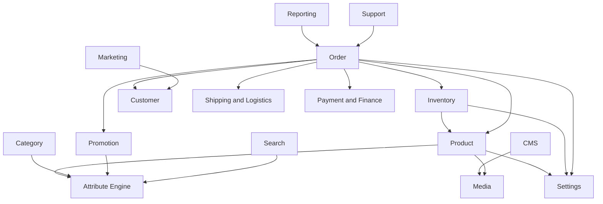
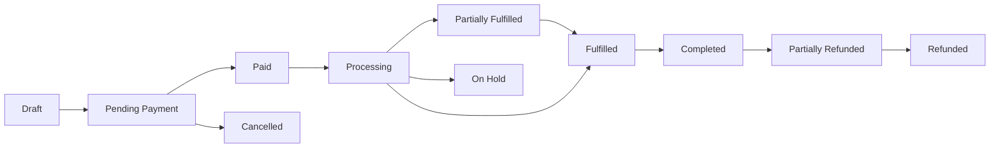
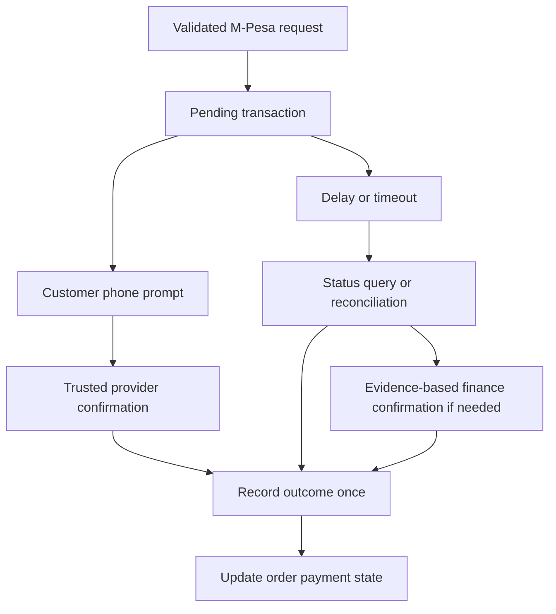

# E-commerce Platform: Backend Functional Specification (Business Edition)

## 0. Purpose and Reading Guide

This specification explains the platform's business engine: the information it retains, the rules it enforces, the connections between its responsibilities, and the automatic work that follows a business event. It is written for leadership, operational owners, business analysts and solution reviewers at a Kenyan retailer selling televisions, soundbars, washing machines and other appliances across a warehouse, seven or more showrooms and an online channel.

The factual basis is the 18 original source documents: README, navigation and administration experience requirements, the 14 numbered module specifications including the separate Attribute Engine document, and the consistency check. The earlier Admin Dashboard Business Document is a derivative explanation, not an additional authority for backend facts. Presentation-only requirements are outside this document, as requested. Their underlying business capabilities, such as saved preferences, authorized bulk work, ordered memberships, validation and background jobs, are retained without describing appearance.

Each formal module has the same twelve parts. Field tables use business labels and types. An entity is a distinct business record, such as an Order or Attribute Set. Every independently stored record has a unique system reference, even when its source outline does not repeat that field. Human-facing stock codes, order numbers and web addresses have their own uniqueness rules; they are not substitutes for a record's system identity.

“Required: Yes” means the source explicitly requires a field or it is essential to the stated source operation. “Conditional” means it is required only for a relevant operation, product type or policy. Where requiredness is unspecified, the table uses “Conditional — policy [To be agreed]” rather than making an unapproved rule. “No” means optional. Automatically assigned identifiers, dates and derived values can be required information without being manually entered.

**Proposed (to confirm)** marks sensible additions that are not established source facts. This label on a paragraph or subsection applies to everything within it. Proposed record structures for named but undefined entities are distinguished from source-defined structures. A proposed status is not an already approved operational policy. The sources specify complete status lists for some entities and leave others open; this document preserves that distinction.

Worked figures are illustrative, not approved selling prices, charges, statistics or forecasts. The consistent example is a TV at KES 58,000, soundbar at KES 11,600 and washer at KES 46,400, with a combo at KES 104,400. Unless stated otherwise, these are VAT-inclusive at Standard 16%. Illustrative combo allocation is KES 52,200, KES 10,440 and KES 41,760 respectively. Free delivery and ordinary eligible installation contribute no extra charge in this example. Specialist charges remain [To be agreed].

No release dates or costs are established. All phasing is Proposed (to confirm); durations, implementation effort and costs are [To be estimated]. Contracts, operating thresholds and accountable owners are [To be agreed]. Reading order is overview, Attribute Engine, Product, operational modules, connected workflows and dictionaries. Leadership can read Sections 1, 10, 11 and the final questions first, while recognizing that approval requires the detailed rules as well.

## 1. Executive Summary

The platform centralizes the retailer's catalog, showroom and warehouse stock, orders, customer relationships, payment evidence, tax compliance, delivery and installation, promotions, published content, communications, support, reporting and administrative security. Its purpose is consistent commercial behaviour across channels, not simply storing independent lists of products and orders.

The Attribute Engine defines what product characteristics mean and where they apply. Product uses those definitions to maintain sellable Simple items and non-sellable Variable parents. Every sellable variation is itself a Simple product with its own price and stock. A TV + soundbar + washer combo is recommended as a Simple commercial offer linked to components. Components retain independent stock, serial numbers, warranties and return identity.

Inventory holds stock by location and protects reservations when several buyers compete for the final unit. Order preserves the agreement made at purchase, including prices, tax treatment, component allocation and applied discounts. Finance decides whether money was actually received. Shipping decides what delivery or installation options match the destination, products, weight, value and branch availability. These responsibilities cooperate without treating delivery as proof of payment.

M-Pesa requests begin Pending. Verified provider confirmation, status checks and reconciliation resolve uncertainty. A timeout alone does not prove payment failed. Manual confirmation requires finance authority, reason and evidence. Refunds cannot exceed captured funds or the appropriate saved component allocation. KRA eTIMS submission creates permanent fiscal evidence; a failed submission creates a retryable compliance exception without destroying the commercial order.

Automatic work includes expiring stock holds, refreshing product search information, applying scheduled eligible prices and promotions, executing scheduled publication and campaign work, updating historical reporting after late financial events, suppressing unsubscribed marketing recipients, and retrying eligible external deliveries. Automatic business updates are documented; specific email/SMS/WhatsApp notices and their recipients are proposed unless the source explicitly establishes them.

Security checks each action and branch scope against actual records. Product management does not grant attribute management. Categories, brands, content publishing and public store-location management remain separate. Privileged identities require a second authentication factor. Stored secrets remain encrypted and cannot be revealed; an integration access key has a documented one-time creation handover, with no subsequent retrieval.

Leadership must agree the authoritative accounting or enterprise system for stock, costs and invoices; eTIMS mode and provider; managers' cross-branch visibility; and launch payment aggregator and installment partners. Other unresolved policies include refund/return windows, special-price exceptions, promotional tie-breaking, specialist installation, retention, reporting definitions and release scope. The system design provides decision points without inventing their answers.

## 2. System Overview

### 2.1 Module map

The following separates business ownership from supporting responsibilities. Authentication, Search, Notification and Media are explained as formal supporting modules; their separation as independent implementation units is Proposed (to confirm), because the sources distribute these capabilities across identity, settings, catalog and content. Dashboard analytics is included within Reporting, while its distinct access grants and measures are preserved.

| Module or responsibility | Ownership |
|---|---|
| Authentication | Identity verification, second factor, company sign-in and sessions |
| Attribute Engine | Definitions, options, groups, sets, membership and product field specifications |
| Product | Sellable identities, variations, combo composition, pricing, links, versions and catalog files |
| Category | Merchandise hierarchy, assignment rules, sorting, filtering and canonical addresses |
| Brand | Brand identity, presentation data and product association |
| Reviews and Q&A | Product feedback and moderation |
| Inventory | Location stock, movements, holds, transfers, purchasing, suppliers and serial/batch traceability |
| Order | Commercial agreement, lines, fulfilments, returns, exchanges, quotes, schedules and warranty registration |
| Customer | Identity/contact/address, grouping, segments, consent, privacy requests and merge |
| Payment and Finance | Verified money movements, refunds, settlement, reconciliation, disputes, tax and eTIMS |
| Shipping and Logistics | Service coverage, rates, carriers/fleet, pickup, installation and tracking |
| Promotion | Coupons, pricing rules, promotional campaigns, gift cards and loyalty/referral |
| CMS | Versioned content, navigation, public locations, services/leads, blog and address/discovery guidance |
| Marketing | Consent-aware broadcasts, subscribers, templates, popups, search metadata and tracking configuration |
| Customer Support and Warranty | Tickets, assignment, replies, timers, return coordination and warranty claims |
| Reporting | Historical reports, runs/schedules, dashboard metrics and real-time counters |
| Users, Roles and Permissions | Administrative identities, allowed actions and branch scopes |
| Settings | Operational configuration, encrypted secrets, integration subscriptions and monitoring |
| Search | Derived searchable catalog and filter information |
| Notification | Authorized automatic notices and delivery attempts |
| Media | Asset records, descriptive metadata, accessibility text and display versions |
| Comparison | Uses comparable attributes; governed through Attribute Engine/Product, not a new source-defined entity |
| Import/Export and Background Work | Cross-module job responsibilities, detailed where each module owns its operation |
| Audit | Permanent change evidence shared by every mutation |

### 2.2 Relationships and direction

An arrow below means “uses information or services owned by,” not “owns.” The original overview also illustrates the direction of information flow; this specification states dependency direction explicitly to avoid confusing those two meanings.

| Consumer | Owner it uses | Reason and boundary |
|---|---|---|
| Product | Attribute Engine | Validate meanings, options and applicable product fields; never reverse dependency |
| Category | Attribute Engine | Rule assignment/filter configuration uses governed characteristics |
| Search | Attribute Engine/Product/Category/Brand | Build derived search/filter information, never redefine source records |
| Promotion | Attribute Engine/Product | Read eligibility characteristics; cannot change attribute definitions |
| Comparison/Import/Export | Attribute Engine | Interpret fields consistently instead of inventing separate meanings |
| Inventory | Product | Identify sellable products/components; inventory owns quantities |
| Order | Customer/Inventory/Promotion/Shipping/Finance | Customer context, protected stock, applied offers, service quotation and financial evidence |
| Reporting | Order/Finance/Inventory and other sources | Derive permitted analysis without becoming transaction authority |
| Marketing | Customer | Determine audiences and consent |
| Support | Order/Customer/Inventory | Validate purchase, physical serial and customer context |
| CMS | Product/Category/Brand/Media | Publish valid referenced merchandising and assets |
| Operational modules | Settings | Use approved currency, providers, feature configuration and shared rules |
| Every mutation owner | Audit/Background Work | Preserve evidence and reliably notify dependent processing |
| Future storefront | Controlled catalog/order/content/configuration delivery | Consume approved information without access to administrative storage |

### 2.3 Shared information and rules

#### Audit Event

| Field | What it holds | Type | Required | Rules and example |
|---|---|---|---|---|
| Record Reference | Unique event identity | text | Yes | Assigned by system |
| Actor | Responsible administrator, if present | link to another record | No | Automatic events may have no human actor |
| Action | Business change performed | text | Yes | Product Price Changed |
| Record Type | Kind of affected entity | text | Yes | Product |
| Affected Record | Entity reference | link to another record | Yes | Specific TV |
| Branch | Relevant branch | link to another record | No | Showroom where action applies |
| Before / After | Meaningful prior/new values | list of values | No | Special Price changed; secrets excluded |
| Investigation Reference | Links related requests and processing | text | Yes | Trace aid, not customer identity |
| Network Origin | Origin address where available | text | No | Restricted investigation use |
| Device Information | Browser/device context where available | text | No | Restricted investigation use |
| Created At | Event time | date | Yes | Universal time stored; Nairobi interpretation |

#### Money and Result Collection

| Entity/field | What it holds | Type | Required | Rules and example |
|---|---|---|---|---|
| Money: Currency | Currency of amount | choice from a list | Yes | KES default |
| Money: Amount | Exact monetary value | money | Yes | KES 104,400.00 |
| Result Collection: Items | Matching permitted records | list of values | Yes | Only granted branch/fields |
| Result Collection: Page | Requested result segment | number | Yes | Whole-number page |
| Result Collection: Page Size | Number requested | number | Yes | Maximum 200 |
| Result Collection: Total | Total matching record count | number | Yes | Full permitted filtered set |

| Shared Query: Search / Sort / Filters | Supported result criteria | text / list of values | Conditional | Unknown criteria rejected, not silently ignored |
| Change Result: Record Reference / Version / Investigation Reference | Outcome of accepted change | text / number | Yes | New version confirms saved record |

Each record has a globally unique system-generated reference. This protects links even if names, labels or addresses change. Versions detect simultaneous edits: a change based on an old version is rejected as a conflict, preserving the first accepted change. A repeat-protection reference identifies the same attempted payment/refund/fulfilment/external notice so a retry does not create a second action. Transferring a received shipment twice likewise cannot double stock.

Business records used by orders/audit are retired rather than erased. Historical order prices, taxes, components and allocations are snapshots, meaning preserved copies of the agreement at that time. All money is kept exact rather than approximated; source monetary examples support two decimal places. Fractional stock quantities are supported where relevant. Nairobi date boundaries drive business periods while timestamps are consistently stored against universal time.

Background jobs return a trackable job reference instead of pretending long work finished immediately. A durable pending-notice record is saved together with a business change so the change cannot succeed while its dependent notice is silently lost. Delivery may still be delayed and retried. Prepared search/reporting records and cache, meaning temporary saved information used to improve speed, do not replace authoritative operational records.

Validation failures identify fields; access denial, missing records and edit conflicts are distinguished. External errors have stable business descriptions and investigation references while provider details/secrets stay protected. Saved query definitions belong to their creator unless explicitly shared by an administrator. Saved preferences and query changes are audited. Bulk work operates on an explicit record set; it must distinguish a current result page from all matching records and preserve permissions.

### 2.4 Roles and branch scope

| Responsibility | Source-based capability and boundary |
|---|---|
| Catalog manager | Owns catalog maintenance; attributes/groups/sets/categories/brands/moderation/files are separately granted |
| Marketing | Granted merchandising and communication; preparation does not imply publishing or sending |
| Warehouse staff | Read product identity and carry out separately granted inventory work |
| Finance | Owns money evidence/reconciliation/tax/compliance under action grants |
| Showroom manager | Proposed role package: permitted local stock/orders/service; cross-branch visibility [To be agreed] |
| Support agent | Ticket read/reply/assignment and warranty/returns independently granted |
| Leadership | Proposed analytical access, not implicit operational or sensitive-data authority |
| Access administrator | Proposed identity management; not an automatic right to every business module |

Authorization applies to the actual records retrieved or changed, including exports and scheduled work. A showroom-limited user cannot bypass scope by supplying another location reference. Categories, Brands, CMS and Store Locator are independently controlled. Details of combined-role scopes and emergency access are Proposed (to confirm), with policy [To be agreed].

## 3. Module Specifications

The following twenty-one formal module specifications use the same twelve parts. Source-defined fields are distinguished from proposed fields for records that the sources name but do not define. Every entity also follows the shared reference, audit, permission, money/time, version and duplicate-protection rules where relevant.

## 3.1 Attribute Engine

### 1. Purpose and responsibilities

The Attribute Engine owns the meaning of product characteristics. Its records establish what Screen Size means, what type of value it accepts, which choices are allowed, where it belongs, whether it can be searched or compared, and whether it can define a sellable variation. It also owns the ordered templates used to request product information. This central ownership prevents a television import, promotion and customer filter from interpreting the same characteristic differently.

Product, Category, Search, Promotion, Comparison and Import/Export use these definitions. The dependency is always from the consumer to the Attribute Engine. The engine does not depend on Product's business implementation and does not own product stock, prices, orders or payments. In business terms, the definition of Screen Size must remain valid even when no television currently carries a value. A product receives a value according to the definition; it does not rewrite the definition to accommodate an invalid entry.

A characteristic is not automatically present on every product. An Attribute Set selects the relevant definitions for a product family, and an Attribute Group organizes their interpretation. Television may need Screen Size; Washing Machine may need Capacity in kg. The same definition can be included in multiple sets without copying it. A common Warranty characteristic therefore has one governed meaning even if used for refrigerators, washers and televisions.

System attributes provide essential built-in information, while user-defined attributes extend the catalog under controlled rules. This distinction is important for future administration: catalog flexibility must not let a user remove product identity, pricing or other Base information that orders and customer experiences rely on. Governance covers creation, options, assignment, validation, version refresh, retirement and, only when safe, permanent deletion.

### 2. Information it holds (entities)

#### Attribute Definition

| Field | What it holds | Type | Required | Rules and example |
|---|---|---|---|---|
| Record Reference | Unique definition identity | text | Yes | System-assigned; remains stable |
| Attribute Code | Unique stable business reference | text | Yes | Cannot change after creation; example Screen Size Reference, without exposing an implementation identifier |
| Label | Readable name | text | Yes | Screen Size |
| Input Type | Permitted entry style | choice from a list | Yes | One of the fourteen supported types below |
| Unit | Meaning of numerical quantity | text | No | inch or kg |
| Scope | Global or Store View | choice from a list | Yes | Global is source default |
| Required | Whether applicable products need a value | yes/no | Yes | Default No unless configured otherwise |
| Unique | Whether repeated product values are disallowed | yes/no | Yes | Default No; uniqueness enforcement must be reliable |
| Searchable | Whether value contributes to search | yes/no | Yes | Default No |
| Filterable | Whether value contributes to narrowing product results | yes/no | Yes | Default No |
| Comparable | Whether value contributes to comparison | yes/no | Yes | Default No |
| Shown on Product Page | Whether value is exposed in customer specifications | yes/no | Yes | Default No |
| Usable in Promotion Rules | Whether eligibility conditions may refer to value | yes/no | Yes | Default No |
| Usable for Sorting | Whether products can be ordered by this value | yes/no | Yes | Default No |
| Use for Variations | Whether value can define sellable combinations | yes/no | Yes | Default No; strict eligibility rules |
| System Attribute | Built-in rather than user-created classification | yes/no | Yes | Protected from deletion |
| Validation | Constraints appropriate to input | list of values | No | Exact limits/conditions [To be agreed] where not source-defined |
| Default Value | Starting value where applicable | text / number / money / yes/no / date / list of values | No | Must fit configured input and constraints |
| Translated Labels | Labels by supported language | list of values | Yes | Collection may initially be empty; English-first/Swahili-ready |
| Reorderable | Whether a protected membership's position may change | yes/no | Conditional | Applicable to Base ordering; not every field qualifies |
| Retirement State | Whether a user definition is retired | choice from a list | Conditional | Retirement is source behaviour; exact state vocabulary not supplied |

#### Attribute Option

| Field | What it holds | Type | Required | Rules and example |
|---|---|---|---|---|
| Record Reference | Unique option identity | text | Yes | Assigned once |
| Attribute | Owning definition | link to another record | Yes | Screen Size |
| Option Value | Stable choice value | text | Yes | 55 as a size choice |
| Label | Readable option description | text | Yes | 55 inch |
| Sort Order | Relative option position | number | Yes | Default zero when no explicit order supplied |
| Swatch Value | Colour, image or text representation | text / file | Conditional | Optional generally; meaningful representation needed for swatch use |
| Retirement State | Whether choice can be newly selected | choice from a list | Conditional | Referenced values retire rather than disappear |

#### Attribute Group

| Field | What it holds | Type | Required | Rules and example |
|---|---|---|---|---|
| Record Reference | Unique group identity | text | Yes | Assigned by system |
| Group Code | Unique stable section reference | text | Yes | Business reference distinct from displayed name |
| Name | Readable grouping | text | Yes | Specifications |
| System Group | Whether built-in protection applies | yes/no | Yes | Default No; Base protected |

#### Attribute Set

| Field | What it holds | Type | Required | Rules and example |
|---|---|---|---|---|
| Record Reference | Unique template identity | text | Yes | System-assigned |
| Set Code | Unique template reference | text | Yes | Stable catalog reference |
| Name | Readable family template name | text | Yes | Television |
| Groups | Included groups and members | list of values | Yes | Ordered structure, including Base |
| Version | Revision of template | number | Yes | Starts at one and advances on accepted change |

#### Set Membership

| Field | What it holds | Type | Required | Rules and example |
|---|---|---|---|---|
| Attribute Set | Template being defined | link to another record | Yes | Television |
| Attribute Group | Destination grouping | link to another record | Yes | Specifications |
| Attribute | Included definition | link to another record | Yes | Screen Size |
| Sort Order | Position within template/group | number | Yes | Defined order |
| Locked | Whether membership may be removed | yes/no | Yes | Default No; all Base memberships locked |

An attribute can occur once within a set's memberships. Reusing the same definition in several sets is supported, but adding the same definition twice to one set must not create ambiguous duplicate product entry. Group placement and ordering belong to membership, so a shared definition can be organized appropriately in different templates.

#### Product Field Specification and Searchable Value

These are source-defined information structures produced or maintained by the engine, not separate commercially editable products.

| Field | What it holds | Type | Required | Rules and example |
|---|---|---|---|---|
| Set Reference / Version | Template and revision used to produce current field list | link to another record / number | Yes | Consumers know which definition revision applies |
| Requested Language | Language used for labels | choice from a list | Conditional | English or approved translated view |
| Group Reference / Group Label | Section identity/meaning | text | Yes | Specifications |
| Field Reference / Label / Input Type | Applicable attribute identity and entry rule | text / choice from a list | Yes | Screen Size, dropdown |
| Field Required / Unit / Options | Constraint and choices relevant to entry | yes/no / text / list of values | Conditional | Required size; inch; valid options |
| Searchable Value: Product / Attribute | Whose characteristic is represented | link to another record | Yes | Particular television and Screen Size |
| Searchable Value: Text / Numeric Value / Option | Value prepared for efficient matching | text / number / link to another record | Conditional | Type-appropriate representation, never conflicting values |
| Definition Revision / Set Revision | Revision used by prepared definition information | number | Conditional | Refresh after definition change |

The source's flexible default and validation information should not be mistaken for arbitrary free-form business policy. The owning definition still determines what values are legal. **Proposed (to confirm):** publish a controlled vocabulary of validation choices, such as minimum/maximum quantity or text length, before exposing additional constraints. The source does not supply those particular limits.

### 3. How entities relate

One Attribute Definition has many Options when its input supports choices. Each Option belongs to exactly one definition. One Attribute Set contains many memberships. Every membership connects one set, one group and one attribute, with its own order and locking rule. A Product chooses one Attribute Set; its characteristic values are interpreted only against the applicable definitions.

Groups organize meaning rather than duplicate values. General, Pricing, Media, Specifications, Dimensions, Warranty and SEO are documented defaults. SEO means search-engine optimization: controlled headings and descriptions that help a page be found and understood in search. Base is a special locked system group. A Television set may contain a Specifications group with Screen Size and other television-specific definitions. A Washing Machine set may contain Specifications with Capacity in kg.

The available template families are Default, Television, Washing Machine, Refrigerator, Air Conditioner and Small Appliance. These names express product-family intent, not a promise that every possible family specification has already been populated. The precise manufacturer data requirements per family are [To be agreed] beyond fields established in the source. Cloning a set copies memberships and ordering, not products or their values.

A filtered search result may use values derived from the definitions, but Search does not become their owner. A promotional condition may refer to an attribute's stable code, but Promotion cannot change its meaning. Comparison uses Comparable definitions and customer-ready values. Import/Export resolves supplied choice values against the same Options rather than creating a separate interpretation for a spreadsheet.

### 4. Statuses and lifecycles

| Entity/state | Meaning | What moves it here | What is allowed next |
|---|---|---|---|
| User-defined attribute, usable | Definition available for governed assignment | Valid creation; usable is descriptive, not source-enumerated label | Update/assign within constraints; impact-reviewed retirement |
| Retired definition | Preserved while references are migrated | Confirmed Unassign and Retire | Migration/recovery under policy; deletion only when no references/data remain |
| System attribute | Protected built-in definition | Platform setup | Permitted changes/reorder only; no deletion |
| Option in use | Choice referenced by a product | Product value assignment | Maintain label/order under rules; retire instead of silently deleting |
| Retired option | No longer intended for new selection, history retained | Retirement of referenced value | Migrate references under agreed policy |
| Set revision | Current saved template version | Valid membership/definition change | Further versioned change or clone |
| Hidden retained value | Product value no longer applicable to its current set | Set change excluding its attribute | Keep for recovery or authorized explicit discard |
| Discarded value | Explicitly removed retained information | Separate permission and destructive decision | Cannot be assumed recoverable without an agreed recovery process |

The source does not provide a full Active/Draft/Approved lifecycle for definitions, groups or sets. Such labels must not be assumed. **Proposed (to confirm):** where a future approval process is needed, keep proposed definitions distinct from live definitions and make approval authority explicit. This additional process is not necessary to understand the documented create/update/retire operations.

A membership change alters a template revision, not the historical prices or specifications stored on past orders. A set clone starts a new template identity with copied memberships. It does not turn original products into members of the clone automatically. These distinctions prevent administrative template maintenance from accidentally changing commercial history.

### 5. Business rules and validations

1. **Stable references cannot be renamed after creation.** Labels can express revised business wording, but the Attribute Code remains immutable. This protects imports, rules and product links. For example, changing “Screen Size” to “Screen Diagonal” must not invalidate existing television selections or a promotion targeting that characteristic.

2. **Variation eligibility is strict.** Use for Variations requires dropdown or swatch input, Global scope, Required set to Yes, and at least one option. A text description, ordinary number or multiple-selection attribute cannot generate a variation matrix. This restriction makes each combination precise rather than allowing ambiguous wording.

3. **Global variation values are essential.** Store View scope allows presentation-specific information, but the identity of a physical sellable variation cannot differ between language or store views. A 55-inch television must remain that sellable size irrespective of translated labels. Language changes labels, not the identity of the option.

4. **Base membership is non-removable.** Every set contains Title, SKU, Model, URL Key, Status, Short Description, Description, Price, Special Price, Special Price Start Date, Special Price End Date, Tax Class, Brand, Categories, Media, Visibility, Weight, Length, Width, Height, HS Code, Warranty Policy, SEO Title and SEO Description. All these memberships are locked.

5. **Fixed positions remain fixed.** Title, SKU, Status and Price are identity/system-critical and cannot be reordered. Other Base attributes can be reordered only if specifically marked Reorderable. No rule grants blanket reorder rights for all Base attributes. Having an editing grant is not permission to bypass the membership's lock.

6. **Requiredness is separate from membership.** A field included in Base or a family set is not automatically required unless its definition says so or its source operation requires it. For example, Brand is an optional product link in the product structure even though every set contains the Brand field. This prevents false rejection of permitted incomplete records.

7. **Set change must identify absent attributes before acceptance.** If a product leaves Television for Default and Default lacks Screen Size, the system identifies that affected value. Default behaviour is Retain Hidden. The value stays available for recovery but is excluded from current entry requirements, customer data, filters and promotional conditions.

8. **Destructive discard needs a separate grant.** An administrator may explicitly discard absent values only with the dedicated capability. Retaining is the recommended source choice because it permits recovery if a wrong template was selected. A general product-edit grant cannot silently erase data by changing templates.

9. **Delete-in-use is blocked.** System definitions cannot be deleted. A user attribute referenced by sets, products or rules cannot be ordinarily erased. Unassign and Retire requires an impact review and explicit confirmation; definition remains until references migrate. Permanent deletion is only permitted when no references or data remain.

10. **Referenced choices retire.** A size option used by an existing product cannot vanish silently. Removing “55 inch” from future offers must not make old product values or order descriptions unintelligible. Retirement preserves the identity and allows a deliberate migration.

11. **Input changes after values exist are restricted.** Changing a populated dropdown to an unrelated number field is blocked unless an approved conversion can preserve all values without loss. A lossless migration is a controlled change that preserves meaning and data. Approval conditions and migration ownership are [To be agreed].

12. **Unique values need authoritative enforcement.** If Unique is enabled, search information alone cannot decide whether a value is already taken. The core validation and reliable typed matching prevent duplicates, including simultaneous submissions. The source does not specify which business characteristics should be unique; that policy remains [To be agreed].

13. **Option values are unique within their definition.** Two Screen Size choices cannot share the same stable value under different labels. Option sort order defaults to zero unless specified; the final ordering rule for tied positions is **Proposed (to confirm)** and should be agreed rather than guessed.

14. **Flexible values remain typed.** Numeric quantities must remain numeric where comparisons matter. **Proposed (to confirm):** consistently use decimal capacity values in kg where fractional capacity is needed, rather than mixing “8kg,” “8 KG” and “eight.” This proposed data-entry convention improves comparison but does not invent valid capacity ranges.

### 6. How it works, step by step

**When Screen Size is created**, the system does the following. First, it accepts a new stable definition reference and label. Second, it validates dropdown input and inch units if configured. Third, it records Scope, Required, search/filter/comparison/product-page/promotion/sort flags independently. Fourth, it validates Use for Variations if enabled. Fifth, it stores valid options and their order. Sixth, it records Television as the target set and Specifications as the destination group. Seventh, it saves definition and membership consistently. Finally, it advances affected revisions and notifies consumers to obtain current information.

In this example, the definition is assigned to Television only. It does not automatically appear in Washing Machine or Refrigerator. If the business later uses screen size for another suitable family, it can assign the same definition to that set without copying it. The original stable reference still identifies the characteristic, and each membership establishes its own grouping/order.

**When Capacity in kg is created**, the same process validates a numeric or decimal characteristic with kg units and assigns it to Washing Machine > Specifications only. If Capacity were used as a variation-defining choice, the ordinary numeric input would not qualify. The business would need a governed dropdown or swatch definition with Global scope, Required Yes and explicit choices. This distinction separates a measured specification from a precise variation identity.

**When a set is requested for product information**, the engine identifies the set and current revision, selects the requested language labels, orders groups and memberships, includes applicable field types/units/options/requiredness/constraints, and produces one authoritative field specification. Local entry checks can be derived from that specification, but the system still validates submitted values independently. An outdated client cannot bypass current constraints simply because it retained an earlier field list.

**When a template is cloned**, the engine creates a new identity/reference/name and copies the groups, memberships and ordering under the same Base protections. It does not copy any products, stock, customer prices or historical orders. The resulting template can be adapted without changing the source template's identity.

**When a live product's set changes**, the system compares old and target memberships. Shared attributes remain applicable. Attributes absent from the new set are identified as affected values. The administrator chooses default hidden retention or authorized explicit discard. The system saves the product's new set and data decision, updates applicable projections and preserves audit evidence. Recovery by returning to a compatible set is supported by retention; exact automated restoration mechanics are **Proposed (to confirm)**.

### 7. Automatic actions and notifications

Any accepted definition, option, group or set change advances affected definition/template revisions. Temporary saved definitions and product field specifications are refreshed or removed so consumers do not keep using obsolete labels/options/constraints. A change notice prompts Product and other consumers to obtain the new definition revision. Consumers do not directly alter the Attribute Engine's temporary saved information.

Search/filter information is rebuilt as needed from valid current product values. A hidden retained value is automatically excluded from customer-facing specifications, search filters and promotional evaluation. This exclusion is part of the source's business rule, not an optional cleanup. A retirement or membership change can therefore affect eligibility even though the underlying historical value is retained.

**Proposed (to confirm):** notify the catalog owner when a retirement affects live products or active promotion conditions, and report completion/failure of large refresh work through operational notification. These are sensible ownership notices, but exact recipients, delivery channels and escalation timing are not supplied. The documented automatic change notice is a system-to-system update, not necessarily an email to staff.

**Proposed (to confirm):** a scheduled reconciliation of stale definition revisions could detect missed consumer refreshes. This is an additional reliability measure, not a source-mandated periodic job. Its frequency and exception owner are [To be agreed], and no processing-time estimate is assumed.

### 8. Integrations

The Attribute Engine has no independently contracted external manufacturer feed in the sources. It exchanges definitions, options, memberships, language labels, constraints and revision notices with Product, Category, Search, Promotion, Comparison and Import/Export. These internal exchanges must use the central interpretation instead of duplicating rule ownership.

Search receives type-appropriate derived information for frequently filtered or unique attributes. Import receives valid options and requiredness before committing a catalog file. Promotion reads stable definitions for eligibility and cannot alter them. The future storefront consumes approved product/search data built from definitions; it does not inspect administrative storage directly.

**Proposed (to confirm):** if a manufacturer supplies specifications, an approved mapping should translate manufacturer terminology into governed attributes/options before product import. A feed should not create unknown choices automatically without agreed governance. Provider selection, ownership and cost are [To be agreed] or [To be estimated], as appropriate.

### 9. Edge cases and failure handling

A set change can leave orphaned values, meaning values no longer included in the product's current template. Retain Hidden is the documented default and recommended approach. Discard is explicitly destructive. The source does not promise an immediate undo for discarded values; restoration must not be invented as a standard behaviour.

A stale revision can lead two catalog specialists to reorder the same template. Version checking detects that the second change was based on older information. The system rejects the conflicting update, preserves the accepted order and returns a traceable conflict. Proposed resolution policy: compare current memberships before resubmitting rather than automatically blending potentially contradictory ordering.

A used option cannot be removed merely to shorten the available choice list. It must retire or migrate references. A populated definition cannot change type casually. Unique-value checks must remain correct during simultaneous product saves. Definition refresh failure must not make old temporary information authoritative; the consumer should refetch the current governing specification or report a controlled inability to validate.

The source defines the recommended storage approach because neither extreme alone meets governance and scale needs. Keeping every characteristic as a rigid fixed field makes repeated structural changes necessary whenever product families change; that comparison is **Proposed (to confirm)** as business explanation. Keeping every value as a separate generic characteristic entry gives maximum flexibility but makes combining product details more expensive and operationally complex. Keeping all flexible values together makes writes simpler but weakens selective matching and uniqueness governance if not supported by stronger checks.

The recommended hybrid separates governed definitions/options/sets from flexible product values, while maintaining typed prepared information for high-value filters and unique characteristics. Hybrid means combining structured core information with controlled flexible information. This preserves adaptability without treating every imported value as ungoverned text. Search uses derived matching information for speed, while operational validation remains authoritative. The trade-off is maintaining those derived representations consistently; change events, versions and refresh rules are therefore part of the business contract.

### 10. Who can do what

| Responsibility | Allowed action | Boundary |
|---|---|---|
| Attribute reader | Read definitions/options | No creation/change implied |
| Definition creator | Create valid attributes | Must assign target sets/groups under workflow |
| Definition editor | Update allowed settings/options | Cannot change immutable reference or bypass populated-type restriction |
| Retirement specialist | Retire/unassign with impact decision | Cannot delete system attributes |
| Group manager | Manage group definitions | Base protection remains |
| Set manager | Manage memberships/order/clone | Locked membership/fixed positions remain |
| Hidden-value discard authority | Explicitly remove orphaned values | Separate from product edit/set change |
| Product/catalog manager without above grants | Consume valid definitions | Cannot redefine attributes |
| Promotion manager | Read usable definitions | Cannot modify engine-owned meaning |

Exact staff assignments and approval limits are [To be agreed]. Permissions are enforced in the actual operation, not by assuming the requesting user had a particular job title. A privileged administrator still cannot violate an invariant such as deleting a System Attribute; privilege does not turn a prohibited business action into a normal maintenance step.

### 11. Effect on other modules and on the future storefront

Attributes establish product specifications, comparison characteristics, filter choices, sort eligibility, promotional criteria and variation selectors. A change can therefore affect more than product entry. Turning Filterable off removes eligibility for filter representation; turning Usable in Promotion Rules off must be assessed against existing referenced rules. The source establishes dependency and reference protection; the exact policy for pausing affected active rules is **Proposed (to confirm)** and [To be agreed].

Product obtains one current set-based field specification. Category uses definitions for governed assignment/filter behaviour. Search prepares values appropriate to their type so “55” is not compared as arbitrary text where numeric meaning matters. Import resolves choices instead of guessing. Comparison uses Comparable and Shown on Product Page independently, because a characteristic can be suitable for comparison without being shown in every ordinary specification context.

The future storefront receives approved derived data, not administrative records. Variations use globally consistent required dropdown/swatch definitions. A translated label changes what a customer reads while preserving option identity. Hidden retained values do not leak into customer filters or offer eligibility simply because they remain stored for recovery.

### 12. Activity history

Creation, update and retirement of definitions, options, groups and sets are recorded. Membership assignment/unassignment/reordering is recorded with its affected set/group/attribute. Revision and temporary-definition refresh changes are recorded. Destructive hidden-value discard is recorded separately so an investigator can distinguish lost applicability from actual removal.

History identifies the actor, time, affected records, meaningful before/after settings and investigation reference. For example, turning Required or Use for Variations on is a different business decision from merely changing a translated label. Both are changes, but the audit summary should make their impact intelligible. Definition references remain stable so historical evidence can be traced even after labels change.

The audit record preserves the retirement impact decision and final action; **Proposed (to confirm):** attach the approved migration/evidence reference where a populated input type changes without loss. No historical order or component warranty should be rewritten because an attribute label, grouping or eligibility flag changed later.

## 3.2 Product

### 1. Purpose and responsibilities

Product owns the retailer's commercial merchandise identities, product-family links, descriptive information, prices, presentation eligibility, variation relationships, component combos, associated merchandise, catalog revisions and catalog-file processing. It defines what is sold and under which current catalog terms. It does not own location quantities, confirmed money, fiscal evidence or delivery execution.

The only product types are Simple and Variable. A Simple product is one sellable stock identity with price and inventory linkage. A Variable product is a non-sellable parent whose children are complete Simple products. A TV family available in several sizes can therefore share a merchandising parent without pretending that the parent is another physical stock item.

The recommended TV + soundbar + washer combo is a Simple product representing one commercial offer, with linked components and required quantities. It is not a third product type. Product owns which items form the offer and their price allocation; Inventory owns whether those items can be reserved at a location. Order preserves what the combo contained when sold. Support and Warranty use each component's serial/product/purchase evidence rather than relying only on the combo name.

Catalog managers own this work. Marketing may manage authorized merchandising information. Warehouse users receive read-only product identity alongside their separate inventory grants. Attribute definitions remain owned by the Attribute Engine even when product values are being entered or imported. A product editor cannot bypass option governance by storing an unrecognized value as a new definition.

Product changes produce current catalog data for future customer browsing, detailed descriptions, search, variation choice, related items, category and brand merchandising. The commercial history on existing orders is independent: a price reduction today cannot rewrite the price agreed yesterday. This responsibility is important when catalog teams make scheduled changes around Black Friday or clone similar appliance models.

### 2. Information it holds (entities)

#### Product: complete shared core

The following applies to Simple records, Variable parents and Simple children as appropriate. Required fields are information requirements; derived or default values do not imply manual entry.

| Field | What it holds | Type | Required | Rules and example |
|---|---|---|---|---|
| Record Reference | Unique product identity | text | Yes | Stable system reference |
| Product Type | Simple or Variable | choice from a list | Yes | No third combo type |
| SKU | Unique stock/merchandising code | text | Yes | Cannot duplicate another product code |
| Title | Product name | text | Yes | Illustrative 55-inch TV |
| URL Key | Unique readable address ending | text | Yes | One product address identity |
| Status | Draft, Active, Disabled | choice from a list | Yes | Independent from stock and visibility |
| Attribute Set | Applicable family template | link to another record | Yes | Television |
| Parent Product | Variable parent for a child | link to another record | Conditional | No parent for standalone Simple |
| Brand | Manufacturer/brand | link to another record | No | Governed brand record |
| Regular Price | Normal commercial price | money | Yes | Source initial stored default zero; zero is not proof of approved free sale |
| Special Price | Scheduled/current promotional price | money | No | Normally no higher than regular |
| Special Price Start Date | Beginning of special eligibility | date | Conditional | Needed when start is scheduled |
| Special Price End Date | End of special eligibility | date | Conditional | Must follow start when both provided |
| Cost | Internal buying cost | money | No | Financially sensitive |
| Tax Class | Standard 16%, Zero-rated, Exempt | choice from a list | Yes | Standard 16% default |
| Attribute Values | Set-governed characteristic values | list of values | Yes | May initially be empty; current required fields still validated |
| Visibility | Catalog and Search; Catalog Only; Search Only; Hidden | choice from a list | Yes | Not the same as Active/Disabled |
| Version | Accepted record revision | number | Yes | Initial revision one |
| Created At | Original creation time | date | Yes | Assigned by system |
| Updated At | Last accepted update | date | Conditional | Supported update-based filtering; assigned by system |
| Model | Manufacturer model designation | text | Conditional | Requiredness by definition/policy [To be agreed] |
| Barcode | Scan identity | text | Conditional | Child-owned where used |
| Short Description | Brief product explanation | text | Conditional | Set/policy requiredness |
| Description | Full merchandising details | text | Conditional | Set/policy requiredness |
| Categories | Merchandise placements | list of values | Conditional | Links to Category records |
| Media | Approved assets | list of values | Conditional | Asset references; inherited default possible |
| Weight | Shipping weight | number | Conditional | Unit and requiredness [To be agreed] |
| Length / Width / Height | Product/shipping dimensions | number | Conditional | Each a distinct measurement; units [To be agreed] |
| HS Code | International goods-classification reference | text | Conditional | Relevant trade/administrative requirement |
| Warranty Policy | Manufacturer/retailer coverage reference | link to another record / text | Conditional | Exact policy record structure not supplied |
| SEO Title | Search-engine heading | text | Conditional | Requiredness by agreed catalog policy |
| SEO Description | Search-engine summary | text | Conditional | SEO defined in Attribute Engine |
| Related Products | Relevant associated products | list of values | No | Product links |
| Cross-sell Products | Complements to purchase | list of values | No | Soundbar alongside TV |
| Up-sell Products | Higher-specification alternatives | list of values | No | Higher-specification TV |
| Scheduling | Applicable catalog timing information | date / list of values | Conditional | Beyond specials/badges, detailed lifecycle policy unspecified |
| Inventory Linkage | Product's associated stock records | list of values | Conditional | Quantity authority remains Inventory |

Grouping dimensions in one row is only to save repetition: Length, Width and Height are separate fields, and none may replace another. Similarly, Related, Cross-sell and Up-sell are separate relationship lists with different commercial purposes. Their exact maximum counts and cycles policy are **Proposed (to confirm)** rather than invented source limits.

#### Variant Relationship and Variant-owned values

| Field | What it holds | Type | Required | Rules and example |
|---|---|---|---|---|
| Parent Product | Non-sellable Variable family | link to another record | Yes | Television family |
| Child Product | Full Simple sellable item | link to another record | Yes | 55-inch option |
| Variation Values | Selected option value for each defining attribute | list of values | Yes | Exact Screen Size and any other eligible choice |
| Selected Variation Attributes | Definitions used to generate children | list of values | Conditional | Only eligible global required dropdown/swatch |
| Selected Option Values | Chosen options per defining attribute | list of values | Conditional | At least one valid choice per selected attribute |
| Combination Count | Number of all chosen combinations | number | Conditional | Calculated before creation |
| Child-code Pattern | Optional stock-code template | text | No | Parent stock code plus option references |
| Child SKU | Child's unique sellable code | text | Yes | Never inherited as parent identity |
| Child Price / Special Price | Child-specific sale terms | money | Yes / No | Price belongs to child |
| Child Stock | Location records for that child | list of values | Conditional | Inventory owned |
| Child Barcode / Images / Status | Child's scan identity, media and availability | text / list of values / choice from a list | Conditional / Conditional / Yes | Explicit child values prevail |

Each child also carries the full applicable Product fields, including its own version, tax class and catalog data. The separate relationship records clarify which selected values distinguish the child. A parent's general description is not an adequate substitute for those precise values.

#### Combo Component

| Field | What it holds | Type | Required | Rules and example |
|---|---|---|---|---|
| Combo Product | Simple commercial offer | link to another record | Yes | TV + soundbar + washer |
| Component Product | Included sellable merchandise | link to another record | Yes | The washer |
| Component Quantity | Units required for one combo | number | Yes | Greater than zero |
| Price Allocation | Commercial value allocated to this component | money | Conditional | Source supports allocation; complete refund policy requires agreed allocation |
| Split Fulfilment Allowed | Explicit cross-location permission | yes/no | Conditional | Opt-in, not default assumption |
| Reference Price / Was / Now / Savings | Values used to explain offer | money / number | Conditional | Was derived from components; Now commercial combo price |
| Component Snapshot | Components/quantities/allocation preserved on an order | list of values | Conditional | Saved at order creation, owned thereafter by Order |

One component product occurs once in the composition relationship; quantities express multiples instead of duplicate ambiguous rows. The source explicitly constrains component quantity above zero. **Proposed (to confirm):** prohibit a combo containing itself, cyclic nested composition or a non-sellable Variable parent. These are sensible composition safeguards but are additional business validations requiring confirmation.

#### Tier Price and Badge — record structure Proposed (to confirm)

These capabilities are documented, but their detailed record fields are not. The following is proposed to make their operation reviewable.

| Entity/field | What it holds | Type | Required | Rules and example |
|---|---|---|---|---|
| Tier Price: Product | Sellable item | link to another record | Yes | Source capability: customer/group tier pricing |
| Tier Price: Customer / Group | Eligible customer or grouping | link to another record | Conditional | Scope policy [To be agreed] |
| Tier Price: Minimum Quantity | Quantity threshold | number | Conditional | Needed for quantity-based tiers |
| Tier Price: Price | Eligible commercial price | money | Yes | No actual approved tier amount invented |
| Tier Price: Schedule | Eligibility period | date | No | Not an established source field |
| Badge: Product / Rule | Manual association or condition | link to another record | Conditional | Manual or rule-driven capability documented |
| Badge: Label | Sale, New Arrival, Best Seller, Black Friday or custom | text | Yes | Labels documented |
| Badge: Mode | Manual or Rule-based | choice from a list | Yes | Modes documented |
| Badge: Start / End | Display eligibility period | date | Conditional | Scheduling documented |
| Badge: Rule Conditions | Rule eligibility | list of values | Conditional | Details [To be agreed] |

#### Product Version, Clone and Catalog Job

| Field | What it holds | Type | Required | Rules and example |
|---|---|---|---|---|
| Product Version: Product / Version / Snapshot | Meaningful catalog state | link to another record / number / list of values | Yes | Source capability; detailed metadata proposed |
| Product Version: Actor / Created At | Origin of revision | link to another record / date | Conditional | Shared audit rules apply |
| Clone: Source Product / New Product | Copy relationship | link to another record | Yes | New identity required |
| Clone: New SKU / New URL Key | New unique commercial/address values | text | Yes | No stock/history copied |
| Catalog Job: Reference / Type / Requester / Submitted At | Background import/export identity | text / choice from a list / link to another record / date | Yes | Trackable job required; detailed labels proposed |
| Catalog Job: File | CSV or XLSX import input | file | Conditional | Import file required |
| Catalog Job: Dry Run | Validate without committing | yes/no | Conditional | Documented capability |
| Catalog Job: Matching SKU / Operation | Create or update target by SKU | text / choice from a list | Conditional | Documented matching |
| Catalog Job: Option Resolution / Media References | Valid choices/assets used by rows | list of values | Conditional | Governed definitions/assets |
| Catalog Job: Filters / Export Fields / Branch Scope | Permitted output selection | list of values | Conditional | Access restrictions apply |
| Catalog Job: State / Progress / Results / History | Work and outcome information | choice from a list / number / list of values | Yes | Exact job-state labels proposed |
| Row Error: Row / Column / Explanation | Precise rejected-entry location/reason | number / text | Conditional | Supplied on validation failure |

### 3. How entities relate

One Product belongs to one Attribute Set. It may belong to many categories and one brand. One Variable parent has many Simple children through variation relationships. Each child links to its parent and carries all fields necessary for independent sale. Stock exists for the sellable child, never as independent stock on the Variable parent.

One Simple combo has many component relationships. Each component relationship identifies one sellable item, required quantity and supported price allocation. A component may also sell independently and may occur in several commercial combos. Those offers therefore compete for the same physical stock. Selling a washer independently can reduce availability of every combo that requires that washer at the same location.

Product links to Media assets rather than embedding uncontrolled duplicate files. Category and Brand own their definitions; Product maintains assignments under granted catalog authority. Related/cross-sell/up-sell relationships link merchandise with distinct purposes. Historical Order Lines retain a snapshot of the product agreement, not a live reference that recalculates the sale whenever Product changes.

Tier prices depend on Customer/Group context, and rule-based badges/discounts depend on Promotion and governed attributes. Product remains owner of current Regular and Special Prices. Finance owns captured money, tax/compliance evidence and refunds. Shipping evaluates measurements/flags and eligibility but does not decide whether a TV belongs to a Variable family.

### 4. Statuses and lifecycles

| State | Meaning | Entry trigger | Allowed next |
|---|---|---|---|
| Draft | Catalog work not yet actively offered | Creation or clone | Valid editing; activation when agreed readiness satisfied; disable |
| Active | Enabled catalog product | Authorized valid status change | Update or disable subject to references/rules |
| Disabled | Product not actively offered | Authorized disabling/retirement | Retain history; permitted reactivation policy [To be agreed] |
| Catalog and Search | Eligible for both discovery channels | Visibility assignment | Other permitted visibility |
| Catalog Only | Eligible for catalog discovery | Visibility assignment | Other permitted visibility |
| Search Only | Eligible for search discovery | Visibility assignment | Other permitted visibility |
| Hidden | Excluded from ordinary catalog/search discovery | Visibility assignment | Other permitted visibility |
| Scheduled Special | Special exists but is not yet eligible | Start in future; descriptive state | Become eligible at start |
| Eligible Special | Scheduled conditions presently match | Agreed schedule evaluation | End/reset when time expires |
| Ended Special | Scheduled special no longer applies | End reached | Regular/other eligible rule price applies |
| Catalog Job states | Queued, Running, Completed, Completed with Errors, Failed | Proposed job lifecycle | Retry/correction/retention under agreed policy |

Visibility states are documented choices, not substitutes for product status. An Active but Hidden product is different from a Disabled product. The source does not explicitly define whether Hidden products can be purchased through direct references; **Proposed (to confirm):** require explicit approved channel eligibility before such sale.

Schedule descriptions explain business timing, not source-enumerated stored statuses. Exact inclusion of the start/end instant is **Proposed (to confirm)**: treat start as inclusive and end as exclusive consistently in Nairobi business interpretation. Product readiness checks beyond explicit required fields, such as a minimum number of photographs, remain [To be agreed].

A Variable parent can be Active as merchandising information without becoming directly purchasable. Every child has its own status and availability. **Proposed (to confirm):** parent price-range and aggregate-stock calculations use only children actually eligible for the relevant customer/channel, rather than including disabled or hidden offers blindly. The source establishes aggregation and exact selected price but does not define every eligibility detail.

### 5. Business rules and validations

1. **Only Simple and Variable types exist.** This keeps physical merchandise identity explicit. A combo remains Simple with components; a child remains Simple linked to a Variable parent. Introducing an unapproved Bundle type would contradict the source and is not a permissible interpretation.

2. **SKU and URL Key are unique.** Shared product names may be reasonable across models, but stock-code/address collisions are rejected. Unique checks must operate on authoritative records, including concurrent imports, rather than relying on an earlier search result. The exact case-sensitivity/normalization policy is [To be agreed].

3. **Special Price is normally no higher than Regular Price.** At an illustrative Regular Price of KES 58,000 and Special Price KES 52,200, reduction is KES 5,800. Percentage saving is 5,800 divided by 58,000, multiplied by 100: 10%. A higher Special Price is rejected unless explicit policy allows it. No exception is assumed at launch.

4. **Schedules have valid order.** An end must be later than start. A schedule ending before it begins is rejected. If one boundary is absent, intended open-ended behaviour is [To be agreed]; the system must not invent a duration. Late background processing should evaluate actual effective time rather than extend an expired offer merely because work was delayed, **Proposed (to confirm)**.

5. **VAT-inclusive prices separate gross, net and tax.** Standard 16% net equals gross divided by 1.16. TV gross KES 58,000 gives net KES 50,000 and tax KES 8,000. Soundbar gross KES 11,600 gives net KES 10,000 and tax KES 1,600. Washer gross KES 46,400 gives net KES 40,000 and tax KES 6,400. Zero-rated/exempt prices have no standard-rate tax but retain distinct treatment/reasons.

6. **Discount percentage has a defined reference.** The source requires a calculated discount percentage. The worked calculation uses Regular Price as reference for ordinary specials. **Proposed (to confirm):** if the reference price is zero, leave percentage undefined rather than divide by zero or invent a saving; if a permitted price exceeds reference, do not label it a saving. Rounding precision is [To be agreed].

7. **Variations require eligible attributes.** Required, Global dropdown/swatch attributes with choices qualify. Text, number and multiple-selection fields do not. This rule prevents arbitrary descriptions from defining commercial identity and protects reproducible all-combination generation.

8. **All selected combinations are counted.** With two Screen Size choices and three Colour choices, the full matrix contains two multiplied by three, or six child combinations. This is a Cartesian combination: every selected size is paired with every selected colour. A preview identifies the count before child creation. Exact maximum generation size is [To be agreed], not an invented performance limit.

9. **Each child has independent commercial fields.** It owns SKU, Price, Special Price, location Stock, Barcode, Images and Status. Defining variation values never inherit. A parent does not make a missing child size valid merely because another child has that size.

10. **Combo component quantities are positive.** Required quantity zero would claim an included product without actually providing it. Quantities can support fractional stock precision where relevant, although indivisible appliance units are an agreed retail convention, **Proposed (to confirm)**. The physical appliance example uses one of each component.

11. **Combo Was, Now and Savings are consistent.** Was is KES 58,000 plus 11,600 plus 46,400, or KES 116,000. Now is KES 104,400. Savings are KES 11,600, or 10% of Was. Illustrative allocation: TV KES 52,200, soundbar KES 10,440 and washer KES 41,760, totaling KES 104,400. This allocation is a worked proposal, not a mandated formula in the source.

12. **Component stock controls combo availability.** At one showroom, five TVs, three soundbars and two washers, each requiring one unit, support at most two complete combos. The smallest component availability is the limit. If two soundbars are needed per combo, three salable soundbars support only one complete combo. Whole-combo rounding is a logical worked interpretation; allowable fractional commercial quantities are [To be agreed].

13. **Missing component means unavailable unless split handling is explicit.** Five TVs and three soundbars at a showroom with no washer do not create a complete local combo. A warehouse washer may help only with opted-in split fulfilment and transparent service handling. This is not automatic cross-location aggregation.

14. **Refund identity remains at component level.** Returning only the soundbar in the example uses its saved KES 10,440 allocation, subject to actual captured funds and prior refunds. Current standalone soundbar price KES 11,600 does not replace the original allocation. Component serial and warranty evidence remains its own.

15. **Past orders are immutable commercial snapshots.** Today's price, badge, category or component change cannot recalculate an old order. If Special Price later becomes KES 49,000, yesterday's TV sold at KES 52,200 remains that sale. The exact mechanisms for correcting an incorrectly created historical invoice are separate Finance policy, not a Product overwrite.

16. **Set changes preview orphan data.** Retain Hidden is default; dedicated permission is needed for discard. Product adopts the new field specification while preserving affected values safely under the Attribute Engine's rules. Hidden retained values cannot still trigger promotions or customer filters.

17. **Clone creates a new Draft without stock/history.** Copying an existing TV must require a new SKU and URL Key. The clone's stock starts with its own Inventory records, not the original television's quantities. Exact cloning of tier prices, linked children and combo composition is **Proposed (to confirm)** and must be specified before implementation.

18. **Imports validate before commit.** A file cannot bypass required fields, option validity, unique SKU/address, special-price ordering, variation constraints or permissions. Row and column errors identify the issue. Dry Run changes nothing. The accepted commitment policy for a file with some invalid rows is [To be agreed]; no all-or-nothing/partial assumption is hidden.

### 6. How it works, step by step

**When a Simple product is created**, the system validates type and Attribute Set, obtains current field definitions, validates unique identity and required values, records commercial price/tax/visibility, links categories/brand/media and other data, assigns initial version and preserves audit. It then issues reliable catalog-change work to refresh search and dependent current catalog information. Stock is established through Inventory, not by pretending catalog identity creates physical goods.

**When a Variable family is created**, Product records the non-sellable parent and its set. The system checks selected variation definitions, verifies options and computes all combinations. It reports the number before generating children. It creates full Simple child records, optionally using an agreed code pattern. Each child is then independently validated for code, price, tax, status and identity. The parent provides merchandising defaults but no stock quantity.

Consider two sizes and three colours. Six child identities are possible; each size/colour pairing occurs once. **Proposed (to confirm):** repeated generation requests recognize existing combinations and report them instead of creating duplicate children. The source requires unique stock codes and combination generation but does not explicitly define incremental generation policy. Regeneration should therefore be agreed before large imports depend on it.

**When the future customer chooses a variation**, the approved delivery of product information supplies valid dropdown/swatch choices. The exact selected child's price applies. Before selection, the parent may communicate a range or “From KES” value; those are derived from appropriate child prices rather than a fictional parent selling price. Parent stock presentation aggregates sellable child availability, never a separately adjustable parent quantity.

#### Inheritance and override rules

| Information | Parent default | Child behaviour | Governing rule |
|---|---|---|---|
| Short/Full Description | May supply shared description | Unset child uses default; explicit child overrides | Source inheritance |
| Media | May supply shared assets | Unset child uses default; explicit media overrides | Source inheritance plus child ownership |
| Shipping information | May supply measurements/related defaults | Unset child uses default; explicit override wins | Source inheritance |
| Warranty Policy | May supply common coverage | Unset child uses default; explicit policy wins | Source inheritance |
| Variation-defining values | Cannot substitute child identity | Always child-specific | Never inherit |
| SKU | Parent identifies family | Child has unique SKU | Child ownership |
| Price / Special Price | No independently purchasable parent offer | Child-specific price | Child ownership |
| Stock | No directly assigned parent stock | Child location stock | Inventory authority |
| Barcode | Cannot stand for all children | Child-owned where used | Source ownership |
| Status | Parent merchandising state | Child owns state | Exact parent-child availability policy [To be agreed] |
| Other unspecified fields | No blanket inheritance assumed | Follow explicit source/policy | Additional inheritance Proposed (to confirm) |

**When a combo is created**, Product links the commercial Simple record to the TV, soundbar and washer with positive quantities. It establishes current offer price and supported component allocation. Inventory checks each component at the chosen location. At order creation, Order preserves the component list, quantities and allocation. Reservation/deduction occurs independently per component so selling the combo cannot leave all component stock unchanged.

The alternative virtual promotion assembles independent products at discount time rather than selling a single commercial combo identity. This can support faster experiments with which products participate or how discounts apply. The trade-off is weaker combined identity for the order, warranty and component-return interpretation. The source recommends the commercial Simple combo because physical stock and service evidence remain tractable while marketing still has a clear offer.

**When a special starts or ends**, effective price evaluation uses the saved schedule and current time. Current product/customer information is refreshed as necessary so an ended special does not remain indefinitely authoritative through temporary data. Historical orders continue using their original price snapshots. The sources specify scheduled specials but not a dedicated email announcing every start/end; staff/customer notification is proposed separately.

**When a catalog import is requested**, the system registers a job, checks file format, resolves row SKU targets, obtains applicable set definitions, checks options and asset references, validates rows and reports precise errors. Dry Run stops before changes. Commit applies the approved acceptance policy, records revisions/audit and queues catalog refresh. Job history preserves what was requested and the outcome. Export selects only allowed fields/branches from the requested filtered set and runs in the background.

### 7. Automatic actions and notifications

Accepted product changes generate search refresh and temporary-information invalidation. Variation creation produces child records and relationship data with audit. Effective Special Price and scheduled badge eligibility change according to time. Rule-driven badges reflect their configured eligibility rather than assuming every product with a badge qualifies forever.

The supported badge labels are Sale, New Arrival, Best Seller, Black Friday and custom. A manual badge is an explicit catalog decision; a rule-driven badge uses governed conditions. The source does not specify what sales threshold makes a Best Seller or how long New Arrival lasts. Those numbers must be [To be agreed], not invented from the label. **Proposed (to confirm):** require manual claims to be reviewed against an agreed merchandising policy.

Catalog job processing updates job progress/history and makes row/column errors available. Export honours field/branch permission even when processed later. **Proposed (to confirm):** notify the requester when a catalog job completes or fails and notify the catalog owner when a large set change leaves important attributes hidden. Recipient/channel/escalation policy remains open.

Combo availability updates when any component's salable stock changes. The actual quantity authority remains Inventory; Product must not store a conflicting manually maintained “combo stock” independent of components. **Proposed (to confirm):** when split fulfilment is enabled, current service information clearly identifies component locations and separate appointments if necessary. No silent branch borrowing is allowed.

### 8. Integrations

Product uses Attribute Engine for definitions and current field specifications, Category and Brand for merchandising links, Media for asset references, Inventory for location availability, Promotion for active offer eligibility and Customer for supported targeted pricing context. Search consumes approved current data as a derived representation. Settings supplies currency/tax defaults and relevant feature policy.

There is no confirmed manufacturer, enterprise or accounting feed in the source. **Proposed (to confirm):** any future product feed uses approved attribute/brand/category mappings and the same import validation rather than writing around catalog rules. Leadership must decide whether an external system owns buying cost, commercial identity or stock before an integration treats its updates as authoritative.

Manufacturer warranty is represented through product coverage and component serial evidence used by Order/Support. Automatic registration with manufacturer portals is not established. **Proposed (to confirm):** if a manufacturer requires external registration, record submission/result and retry safely without claiming warranty registration succeeded merely because an order completed.

### 9. Edge cases and failure handling

Product status, visibility and salable stock can disagree legitimately. Active may mean enabled while a showroom has no stock. Hidden may mean excluded from ordinary discovery while preserving historical identity. A non-sellable Variable parent may have Active merchandising data even though all its children are disabled. Exact customer-facing fallback in that situation is **Proposed (to confirm)**, and must not imply purchasable parent inventory.

A partially available combo cannot be completed locally by reserving only two required items and claiming the commercial offer is fulfilled. Explicit split handling may resolve the situation, but inventory locations and service commitments must remain visible in the business record. Component snapshots preserve what the buyer was promised even if catalog composition later changes.

A unique-code collision during import returns an actionable row/column error. An unknown option must be resolved through approved definitions, not silently invented. A missing media reference is a validation problem under the agreed asset policy, not permission to erase all existing photographs. Exact handling of blank import cells—leave unchanged versus clear—is **Proposed (to confirm)** and requires explicit import mode rules.

A changed set revision between validation and commit must be rechecked. A Dry Run is not a permanent guarantee that stock, permissions or uniqueness will still match at later commit. A conflicting catalog edit returns the newest record/version context and preserves the accepted change. Background search failure leaves the saved product intact with retryable refresh work; stale search never becomes permission to overwrite the authoritative product.

Special/tier/promotion interactions need one agreed pricing precedence. The source establishes the Promotion conflict order but does not completely define precedence between every product Special Price, targeted tier and campaign. **Proposed (to confirm):** simulate the final payable offer across these sources and preserve the selected rule/allocation on the order. No undocumented promise that “lowest price always wins” is made.

### 10. Who can do what

| Responsibility | Allowed action | Limit |
|---|---|---|
| Product reader | Read permitted catalog data | Cost/branch-sensitive fields remain restricted |
| Creator | Create valid records | Type/set/identity constraints |
| Editor | Update permitted catalog values | No attribute-definition ownership implied |
| Deletion authority | Soft-remove/disable eligible records | Historical children retained |
| Bulk authority | Enable/disable/prices/categories/set changes | Explicit permitted selection |
| Import authority | Dry Run/commit catalog files | Same validation as individual changes |
| Export authority | Allowed filtered field/branch output | No extra sensitive-data access |
| Category/Brand/Moderation specialists | Their separately granted work | Product management does not imply these grants |
| Marketing | Authorized merchandising fields | No broad catalog/security powers assumed |
| Warehouse | Product identity read | Inventory changes separately authorized |

Detailed job titles and required approvals are [To be agreed]. An import permission cannot bypass unique identity or special-price rules. A general administrator does not get silent authority to discard hidden values without the dedicated grant.

### 11. Effect on other modules and on the future storefront

Inventory receives product/component identity while retaining quantity ownership. Order receives current commercial information and freezes it at sale. Finance uses saved tax classes/allocations rather than current catalog prices to calculate fiscal evidence and permissible refunds. Shipping uses weight, dimensions, flags and warranty/service-related eligibility without taking over commercial identity.

The future storefront receives current approved products, category/brand association, search data, variation selectors, price ranges/exact selected prices, availability and relevant merchandising links. “From” pricing must not mislead customers by presenting a parent as directly purchasable. The exact selected child determines final price and availability. Related/cross-sell/up-sell serve different shopping purposes and should not be treated as interchangeable links.

**Proposed (to confirm):** savings claims use a documented genuine reference-price policy rather than arbitrary Was values. The source defines Was as the sum of component reference prices; it does not establish advertising-law evidence, retention period or promotional claims approval. Those business controls remain leadership decisions, not invented legal guidance.

### 12. Activity history

Product creation, updates, status changes, set changes, variation generation, brand assignment, import commit and clone are audited. Category moves and moderation are recorded by their respective owners. Meaningful product snapshots preserve revisions. Clone receives a new history; it does not copy the original event log.

A price audit distinguishes Regular Price, Special Price, schedule, tax class and targeted tier changes. Combo history records component/quantity/allocation changes so current offer maintenance remains understandable separately from old order snapshots. **Proposed (to confirm):** record the approved price-policy exception reference when a Special Price above Regular Price is explicitly allowed.

Import history links the request, source file context, Dry Run/commit mode, results, row/column errors and resulting accepted changes. Export history records requester, scope and output operation without exposing forbidden fields. Stored asset references and specification links remain traceable through stable identities. Investigation references allow catalog, search-refresh and downstream processing failures to be correlated without leaking credentials.

## 3.3 Category

### 1. Purpose and responsibilities

Category owns the merchandise hierarchy, category identity/content, product assignment criteria, presentation-eligibility data, category sorting and filtering, and each category's main public address. It supplies governed category information to Product, Promotion, Search, Shipping and CMS. It does not own product prices or stock, and its navigation composition data is not permission to publish the entire website.

The tree supports three or more levels. A hierarchy such as Appliances, Laundry and Washing Machines expresses a parent-child relationship. The system must support that relationship without allowing a category to become its own descendant. Moving a category is a business change with effects on its address and menu relationships, not merely renaming an isolated classification.

### 2. Information it holds (entities)

#### Category

| Field | What it holds | Type | Required | Rules and example |
|---|---|---|---|---|
| Record Reference | Unique identity | text | Yes | Stable despite address changes |
| Parent Category | Position in tree | link to another record | Conditional | Root has no parent |
| Name | Readable category name | text | Yes | Televisions |
| URL Key | Readable address segment | text | Yes | Address uniqueness governed with canonical rule |
| Description | Category explanation | text | Conditional | Requiredness [To be agreed] |
| Image | Category asset | file | No | Media reference |
| Icon | Small identifying asset | file | No | Media reference |
| Status | Availability classification | choice from a list | Yes | Complete source list not supplied |
| Include in Menu | Navigation eligibility | yes/no | Yes | Does not independently publish navigation |
| Display Mode | Category-content presentation policy | choice from a list | Conditional | Allowed values [To be agreed] |
| SEO Title / Description | Search heading and summary | text | No | Distinct fields |
| Assignment Mode | Manual or Rule-based | choice from a list | Yes | Source supports both |
| Assigned Products | Explicit merchandise links | list of values | Conditional | Manual mode |
| Assignment Conditions | Governed membership rules | list of values | Conditional | Rule mode |
| Sorting | Product-order policy | list of values | Conditional | Allowed criteria [To be agreed] |
| Filter Configuration | Attributes used to narrow merchandise | list of values | Conditional | Uses Attribute Engine |
| Menu Columns | Expanded-menu composition data | list of values | No | CMS publishes related navigation |
| Promotional Tiles | Linked promotion/content assets | list of values | No | References need validation |
| Brand Logos | Selected brand references/assets | list of values | No | Brand/Media ownership |
| Canonical Address | The one main public address | text | Yes | Exactly one per category |
| Ordering / Version | Tree position and mutable revision | number | Conditional | Shared revision rule; detailed tree ordering proposed |

#### Category Membership and Address Change

| Field | What it holds | Type | Required | Rules and example |
|---|---|---|---|---|
| Membership: Category / Product | Linked records | link to another record | Yes | TV belongs to Televisions |
| Membership: Assignment Origin | Manual/rule determination | choice from a list | Conditional | Source capability; record detail proposed |
| Address Change: Old / New Address | Migration impact | text | Conditional | Required when path changes |
| Address Change: Redirect | Link to explicit redirect record | link to another record | Conditional | CMS owns redirection |
| Move Impact | Affected URL/menu relationships | list of values | Conditional | Must assess before acceptance |

### 3. How entities relate

One parent category can have many children; a child has one parent within the tree. Products can be assigned to categories manually or through rules. A Product may have multiple category assignments. The category's canonical address remains singular despite those merchandise relationships.

Filtering and rule-based assignment use Attribute Engine definitions. Brand logos refer to Brand/Media, and promotional tiles refer to governed content or offers. CMS uses these references to publish navigation. Shipping and Promotion can use category eligibility without gaining category-management rights.

### 4. Statuses and lifecycles

| State | Meaning | Entry trigger | Allowed next |
|---|---|---|---|
| Configured category | Valid classification record | Valid creation/update | Edit, move, assign products |
| Active / Inactive | Proposed availability labels | Proposed authorized status change | Restore or retire under agreed rules |
| Address migration pending | Proposed impact-review stage | Requested tree/address change | Review/accept/reject |
| Redirected old address | Historic address points to current canonical address | Accepted migration | Maintain explicit redirect |

Status values are not fully supplied in the sources. Include in Menu is an independent yes/no choice. It must not be interpreted as proof that all referenced products, brands and promotional tiles are published.

### 5. Business rules and validations

1. The tree must remain acyclic. If Televisions already sits under Electronics, moving Electronics beneath Televisions is rejected because every record would indirectly contain itself.
2. Exactly one canonical address exists per category. Multiple menu references may lead there, but they do not create competing main identities.
3. Old paths create explicit redirects after moves. This preserves earlier links without making the old address another canonical identity.
4. Manual assignment records selected products; rule assignment evaluates governed conditions. Promotion or Search cannot invent a separate category membership meaning.
5. Filter configuration refers to applicable, eligible definitions. Hidden orphaned values from product set changes do not continue to qualify.
6. Product sorting is independent of category-tree ordering. Sorting TVs by an agreed product criterion does not move Televisions within the hierarchy.
7. Proposed (to confirm): when rule assignment and manual inclusion/exclusion overlap, use an explicit precedence policy. The source does not decide whether a manual exception always wins.

### 6. How it works, step by step

When a category is created, the system validates identity and parent, records content/status/navigation eligibility, establishes a single canonical address and stores assignment/sort/filter configuration. It retains category references so Product and CMS can use the same classification.

When a category moves, the system checks that the new parent does not create a cycle, calculates address/menu impact, requires the authorized impact decision, changes tree membership and creates explicit redirection for old paths. It then triggers category/search refresh work. Proposed (to confirm): include descendant path impacts in the preview and migration plan; the source mandates URL/menu impact but does not enumerate every descendant strategy.

When a rule-based category is evaluated, the system reads governed characteristic definitions and current applicable product values, applies the saved conditions, and derives membership without modifying the products' underlying characteristics. Exact reevaluation frequency and manual override policy are [To be agreed].

### 7. Automatic actions and notifications

Category changes queue search refresh and invalidate obsolete current information. Address migration produces explicit redirects. Consumer refresh follows accepted record changes rather than making an unaccepted proposed move customer-visible.

Proposed (to confirm): notify the catalog owner of rejected cycles, broken linked promotional content or category migration completion. Human recipients/channels are unspecified; the documented automatic effect is updating dependent catalog/search information.

### 8. Integrations

Information exchanged with another module retains its owning record reference and business meaning. The consuming module must not silently redefine the owner's values or treat a derived copy as authority. An external connection is used only where supported by the sources or expressly labelled Proposed (to confirm). Provider names, charges, operational commitments and contractual responsibilities remain [To be agreed]; implementation cost and duration are [To be estimated].

Category uses Attribute Engine and exchanges classifications with Product, Promotion, Search, Shipping and CMS. Media supplies image/icon assets; Brand supplies logos. A manufacturer or external enterprise taxonomy feed is not confirmed. Proposed (to confirm): map any imported taxonomy into stable existing categories and review migrations rather than replacing the full hierarchy automatically.

### 9. Edge cases and failure handling

The shared reliability rules apply to this module's accepted operations. Each change carries an investigation reference so the business record, dependent background work and any provider failure can be traced together. Validation problems identify the affected information; an access failure is different from a missing record, and both are different from a simultaneous-edit conflict. These distinctions prevent an operator from treating every rejected operation as a reason to resubmit blindly.

Where a mutable record has a revision, the system checks that the submitted change still refers to the current revision. A stale change must not silently replace an already accepted decision. Where the operation causes an external financial, stock or delivery side effect, repeating the same submission must recognize the existing attempt instead of creating another effect. An unknown outcome requires investigation before a new business attempt is created.

Saved search information, reporting summaries and temporary values support the operation but do not establish authority over the underlying record. Background failure may delay a dependent update; it does not justify erasing an accepted record. The durable change notice must remain available for retry. Exact retry limits, retention, escalation recipients and restoration procedures are [To be agreed] unless this module states a source-defined rule.

A broken or unpublished linked category can prevent CMS navigation publication unless an explicit override is permitted. A rejected tree move leaves existing category/address relationships intact. A search refresh delay cannot create a second canonical address. Deletion of referenced categories follows shared historical protection; the source does not define a category-specific permanent-deletion procedure.

### 10. Who can do what

Permissions are checked for the requested action and the actual records involved. Reading does not imply creating, editing, deleting, bulk changing, exporting, publishing or sending. Branch restrictions continue to apply when work is processed later in a job or requested by an integration. A saved selection or query cannot grant access to a record outside the user's current authorized scope. Specific role packages are Proposed (to confirm), while the action separations stated here are source requirements.

| Responsibility | Actions | Limit |
|---|---|---|
| Category manager | Create/update/move/assign/configure | Independent from product management |
| Product reader/editor | Use permitted assignments | No category-definition changes implied |
| CMS publisher | Publish valid navigation references | Cannot silently rewrite category hierarchy |
| Attribute specialist | Define eligible characteristics | Category manager cannot redefine them |

### 11. Effect on other modules and on the future storefront

Category membership and canonical addresses drive browsing, product classification, search and menu composition. Promotional and service conditions may respond to classification. A move must therefore be treated as an interconnected merchandising change, not an isolated record correction. Historical order identity is not rewritten by today's category move.

### 12. Activity history

All accepted changes follow the permanent shared audit structure: responsible actor where present, action, affected record type/reference, relevant branch, before-and-after summary, time, origin/device information where available and investigation reference. Connection secrets are excluded. A retained historical record must remain intelligible even when its current label or operational status changes. An unsuccessful attempt can retain safe diagnostic evidence without falsely recording a successful business outcome.

Proposed (to confirm): associate the approved reason or supporting evidence reference with any exceptional manual decision. Record retention periods, investigation access and archive policy are [To be agreed]. Background notifications distinguish recorded business success from successful delivery to a recipient, so a notice failure does not retroactively change an accepted business decision.

Creation/update, tree moves, assignment/sorting/filter changes and address impacts are recorded. Category-move audit identifies prior/new parent and affected canonical address. CMS separately records navigation publication and redirects, providing complementary evidence rather than duplicate ownership.

## 3.4 Brand

### 1. Purpose and responsibilities

Brand owns the retailer's manufacturer or brand identity records and associated merchandising data. Product links to a brand rather than storing inconsistent independent brand names. CMS and the future storefront use brand identity to support shop-by-brand discovery and governed landing content.

Brand does not own product stock, selling prices, tax classes or warranty claims. A manufacturer name may be important to warranty interpretation, but warranty eligibility still requires the actual product, purchase, serial and coverage policy. The existence of a brand logo is not proof that a particular claim is covered.

Catalog managers are the documented business owners. Marketing can use brand data for authorized merchandising. Brand management is independently permissioned from Product and Category, which prevents a product-price editor from unexpectedly altering the retailer's public manufacturer identity.

### 2. Information it holds (entities)

#### Brand

| Field | What it holds | Type | Required | Rules and example |
|---|---|---|---|---|
| Record Reference | Stable brand identity | text | Yes | System-assigned |
| Name | Readable brand name | text | Yes | Actual approved manufacturer name |
| URL Key | Brand address identity | text | Yes | Source supplies field; uniqueness policy [To be agreed] |
| Logo | Brand-mark asset | file | No | Media reference |
| Banner | Brand merchandising image | file | No | Media reference |
| Description | Brand explanation | text | Conditional | Requiredness [To be agreed] |
| Status | Availability | choice from a list | Yes | Source does not enumerate labels |
| SEO Title | Search heading | text | No | Search metadata |
| SEO Description | Search summary | text | No | Distinct from ordinary description |
| Landing Configuration | Rules/content governing brand destination | list of values | Conditional | Detailed structure not supplied |
| Version | Mutable revision | number | Conditional | Shared simultaneous-edit rule |

#### Brand Assignment and Brand Placement

The source supports bulk product assignment and shop-by-brand blocks. Detailed assignment/placement metadata below is Proposed (to confirm); links themselves are established capabilities.

| Field | What it holds | Type | Required | Rules and example |
|---|---|---|---|---|
| Assignment: Brand | Chosen manufacturer record | link to another record | Yes | Target for bulk assignment |
| Assignment: Products | Explicit selected merchandise | list of values | Yes | Allowed matching product set |
| Assignment: Result / Reason | Successful/rejected changes | list of values / text | Conditional | Proposed per-product outcomes |
| Placement: Brand | Referenced brand | link to another record | Yes | Shop-by-brand content |
| Placement: Logo / Landing Reference | Display asset and destination | file / link to another record | Conditional | Published-reference validation |
| Placement: Order / Eligibility | Content selection conditions | number / list of values | Conditional | CMS placement policy |

### 3. How entities relate

One Brand can be linked to many Products. A Product's Brand link is optional in the source Product structure, even though brand is part of every Attribute Set's locked Base membership. This distinction avoids inventing a mandatory brand requirement for every product before the business approves it.

A brand can be referenced by several published content blocks or promotional tiles. Logo/banner assets belong to Media; the Brand owns their intended association. CMS owns the publication of placements and homepage references. Search derives brand matching information; it cannot rename or merge brands independently.

Customer orders preserve sold product identity and commercial terms. A later brand-description change does not rewrite original order pricing or manufacturer warranty coverage. Proposed (to confirm): store the relevant manufacturer/brand description in order snapshots where legal or service records need it; the exact snapshot field is not supplied.

### 4. Statuses and lifecycles

| State | Meaning | Entry trigger | Allowed next |
|---|---|---|---|
| Brand record | Governed identity exists | Valid creation | Update/assign/use in permitted content |
| Active | Proposed currently usable identity | Proposed authorized enablement | Edit/inactivate |
| Inactive / Retired | Proposed withdrawal from new merchandising | Proposed authorized change | Preserve references, review reactivation |
| Referenced placement | Brand used by content/products | Assignment/publication | Edit with impact review |
| Removed unused brand | Proposed permanent removal if safe | No references and approved deletion policy | Historical audit retained |

The source requires a Status field and maintenance capabilities but does not specify the exact status vocabulary or deletion-in-use rule beyond shared historical protection. These proposed labels must be confirmed. Inactivation of a brand must not automatically erase all associated products, stock or completed orders.

### 5. Business rules and validations

1. Brand identity is centrally maintained. Equivalent manufacturer names must not be silently created by Product, Search or CMS. Proposed (to confirm): normalize agreed spelling and review suspected duplicates before merging.
2. Product assignments must reference an existing permitted Brand record. A batch request cannot use an arbitrary text value to bypass brand governance.
3. Bulk assignment is authorized separately through relevant catalog capabilities. Each selected product must remain within permitted fields and scope.
4. Media associations must reference valid assets. Deleting a referenced logo or banner is prevented by the source's media-reference safeguard.
5. Landing configuration remains distinct from brand identity. CMS publication checks referenced content rather than treating a saved brand record as automatically published.
6. Brand Status cannot substitute for individual Product Status. A withdrawn brand's impact on existing active products is Proposed (to confirm), with policy [To be agreed].
7. Unique URL rules and redirects for brand address changes are Proposed (to confirm). Product and category source rules establish uniqueness/canonical behaviour specifically; this must not be overextended without labelling the brand policy.
8. Proposed (to confirm): a bulk brand reassignment records old/new Brand and affected products so corrections remain reviewable rather than behaving like an irreversible hidden rename.

No source-defined brand-specific financial calculation exists. Product/Finance retain their respective pricing and tax responsibilities. A brand landing total or popularity metric must come from Reporting rather than an invented brand-record statistic.

### 6. How it works, step by step

When a Brand is created, the system validates the permitted identity and supplied content, links approved logo/banner assets, records Status and landing/search configuration, assigns its reference and preserves the change history. It then triggers catalog/search refresh work appropriate to the saved change.

When products are bulk-assigned, the system resolves the explicit product selection, checks relevant catalog authority, validates the Brand reference, changes allowed product associations and records each accepted change. Exact all-or-nothing behaviour is [To be agreed]; Proposed (to confirm): make rejected records and reasons available when partial processing is allowed.

When CMS publishes shop-by-brand content, it resolves the referenced Brand and asset, applies content publication rules and delivers approved current information. Brand maintenance does not independently publish a homepage campaign or override CMS's publish grant.

### 7. Automatic actions and notifications

Brand creation/update/assignment queues catalog-search refresh and invalidates stale derived information. Linked product records can then be found under the current brand association. Existing order snapshots remain unaffected.

Proposed (to confirm): notify the catalog owner when a withdrawn brand is referenced by published content, and notify a batch requester of assignment results. Exact recipient and channel policy are not specified. A refreshed search representation is automatic system work, not a promise of immediate externally visible delivery.

### 8. Integrations

Information exchanged with another module retains its owning record reference and business meaning. The consuming module must not silently redefine the owner's values or treat a derived copy as authority. An external connection is used only where supported by the sources or expressly labelled Proposed (to confirm). Provider names, charges, operational commitments and contractual responsibilities remain [To be agreed]; implementation cost and duration are [To be estimated].

Brand exchanges identity/asset links with Product, Media, Search and CMS. External manufacturer feeds or logo-licensing services are not confirmed. Proposed (to confirm): store approved source/evidence for manufacturer imagery if such governance is adopted; the source does not define licensing fields or retention.

Enterprise/accounting integration must use stable brand references or approved mappings. It must not become brand authority solely because it has manufacturer text in a product feed. That authority remains a leadership decision.

### 9. Edge cases and failure handling

The shared reliability rules apply to this module's accepted operations. Each change carries an investigation reference so the business record, dependent background work and any provider failure can be traced together. Validation problems identify the affected information; an access failure is different from a missing record, and both are different from a simultaneous-edit conflict. These distinctions prevent an operator from treating every rejected operation as a reason to resubmit blindly.

Where a mutable record has a revision, the system checks that the submitted change still refers to the current revision. A stale change must not silently replace an already accepted decision. Where the operation causes an external financial, stock or delivery side effect, repeating the same submission must recognize the existing attempt instead of creating another effect. An unknown outcome requires investigation before a new business attempt is created.

Saved search information, reporting summaries and temporary values support the operation but do not establish authority over the underlying record. Background failure may delay a dependent update; it does not justify erasing an accepted record. The durable change notice must remain available for retry. Exact retry limits, retention, escalation recipients and restoration procedures are [To be agreed] unless this module states a source-defined rule.

A missing asset prevents correct brand presentation and is handled through media-reference validation. A concurrent update must not overwrite another editor's accepted content. A delayed search refresh leaves current Brand authoritative while dependent work remains traceable. A referenced brand cannot be treated as a safe deletion simply because no stock is currently available; past orders and content may still depend on its identity.

### 10. Who can do what

Permissions are checked for the requested action and the actual records involved. Reading does not imply creating, editing, deleting, bulk changing, exporting, publishing or sending. Branch restrictions continue to apply when work is processed later in a job or requested by an integration. A saved selection or query cannot grant access to a record outside the user's current authorized scope. Specific role packages are Proposed (to confirm), while the action separations stated here are source requirements.

| Responsibility | Actions | Boundary |
|---|---|---|
| Brand manager | Create/update/remove under retention rules | Separate category/product grants |
| Product editor | Assign a permitted Brand where authorized | Cannot redefine Brand |
| Marketing | Use approved brand merchandising | Only granted editing |
| CMS publisher | Publish shop-by-brand placements | Independent publication authority |
| Warehouse reader | Read product/brand identity as allowed | No manufacturer-data changes implied |

### 11. Effect on other modules and on the future storefront

Brand association supports filtering, customer browsing, product information and shop-by-brand placements. Catalog/search refresh keeps current product association synchronized. Product-specific warranty and order evidence remain separate, so a changed brand banner cannot alter coverage eligibility.

### 12. Activity history

All accepted changes follow the permanent shared audit structure: responsible actor where present, action, affected record type/reference, relevant branch, before-and-after summary, time, origin/device information where available and investigation reference. Connection secrets are excluded. A retained historical record must remain intelligible even when its current label or operational status changes. An unsuccessful attempt can retain safe diagnostic evidence without falsely recording a successful business outcome.

Proposed (to confirm): associate the approved reason or supporting evidence reference with any exceptional manual decision. Record retention periods, investigation access and archive policy are [To be agreed]. Background notifications distinguish recorded business success from successful delivery to a recipient, so a notice failure does not retroactively change an accepted business decision.

Brand creation/update and product brand assignment are audited. Shared before/after evidence distinguishes a simple description change from a mass manufacturer reassignment. Media deletion and content publication are separately recorded by their owning modules. Proposed (to confirm): record impact/evidence for brand retirement or merge.

## 3.5 Reviews and Q&A

### 1. Purpose and responsibilities

Reviews and Q&A owns the moderation of product-related feedback and questions. It establishes whether submitted material is Pending, Approved or Rejected. It supplies permitted moderated information for future product experiences without changing product specifications, stock, order agreements or manufacturer warranty.

The catalog manager is the source-based owner of review/question moderation. The exact submission model, rating scale, verified-purchase policy, response workflow and customer notification are not defined. Those gaps matter: moderation authority must not be mistaken for permission to invent star ratings, identify anonymous contributors or promise automatic message replies.

A question asking whether the washer includes free installation may refer to Product and Shipping information, but a moderator's answer cannot override specialist paid-installation rules. A review mentioning a warranty issue may be linked to Support under an agreed process rather than silently converting every negative review into a financial refund.

### 2. Information it holds (entities)

The source names Reviews and Questions and their moderation statuses without a complete field model. The following structures are Proposed (to confirm), except the documented product association/moderation capability.

#### Review

| Field | What it holds | Type | Required | Rules and example |
|---|---|---|---|---|
| Record Reference | Review identity | text | Yes | Shared record rule |
| Product | Merchandise reviewed | link to another record | Yes | Product-related capability |
| Customer / Contributor | Submitter where identified | link to another record / text | Conditional | Privacy/identity policy [To be agreed] |
| Review Text | Submitted feedback | text | Yes | Proposed content requirement |
| Rating | Optional scoring value | number | No | Scale not source-defined |
| Submitted At | Receipt time | date | Yes | Proposed system metadata |
| Moderation Status | Pending, Approved, Rejected | choice from a list | Yes | Documented states |
| Moderator / Moderated At | Decision identity/time | link to another record / date | Conditional | Shared audit |
| Decision Reason | Why accepted/refused | text | Conditional | Proposed policy |
| Purchase Evidence | Optional relationship to actual purchase | link to another record | No | Verified-purchase rules not defined |

#### Question and Answer

| Field | What it holds | Type | Required | Rules and example |
|---|---|---|---|---|
| Question Reference | Identity | text | Yes | Shared record rule |
| Product | Referenced merchandise | link to another record | Yes | Source capability |
| Contributor / Contact | Submitter context | text / link to another record | Conditional | Data minimization policy |
| Question Text | Submitted query | text | Yes | Proposed necessary content |
| Moderation Status | Pending, Approved, Rejected | choice from a list | Yes | Documented |
| Submitted At / Decision Evidence | Receipt and moderation metadata | date / list of values | Conditional | Shared audit |
| Answer Reference / Question | Reply identity/link | text / link to another record | Conditional | Answer entity proposed |
| Answer Text / Author / Created At | Approved response information | text / link to another record / date | Conditional | Reply workflow proposed |
| Answer Approval | Whether response can be public | choice from a list | Conditional | Approval model [To be agreed] |

### 3. How entities relate

Each review or question concerns a Product. If contributor identity is retained, it links to Customer under the agreed privacy policy. A question may have answer records only if that proposed response model is adopted. Review/question moderation is independent from Product Status: an active TV can have pending feedback.

Order evidence may support a verified-purchase check if agreed, but the source does not mandate it. Support may handle linked service issues under separate ticket/warranty grants. Search/product delivery may expose approved content, while raw pending/rejected material remains subject to access and privacy controls.

### 4. Statuses and lifecycles

| Status | Meaning | Entry trigger | Allowed next |
|---|---|---|---|
| Pending | Awaiting moderation decision | New submitted material or agreed re-review | Approve or Reject |
| Approved | Accepted by moderator | Authorized approval | Proposed later re-review if policy allows |
| Rejected | Refused for accepted use | Authorized rejection | Proposed correction/re-review under policy |

New-submission initialization and re-review transitions are descriptive/proposed because the source enumerates the states but not every transition. Approved does not mean every claim is factually proven or that the content has been delivered successfully to all customer information. Publication/data-delivery behaviour should be explicit.

### 5. Business rules and validations

1. Moderation uses only the three documented source states unless an additional policy is approved.
2. A decision requires moderation authority; product editing alone is insufficient.
3. Product association must remain stable so an approved review is not accidentally reassigned to a different appliance.
4. Proposed (to confirm): reject empty content and require a reason when rejecting or withdrawing material.
5. Proposed (to confirm): keep original submitted wording and distinguish a moderated correction from the customer's original contribution. This avoids presenting staff-written claims as untouched customer feedback.
6. Proposed (to confirm): do not expose personal contact details in public answers or reviews merely because the backend retains them for follow-up.
7. Proposed (to confirm): refer warranty/refund issues to Support/Order instead of allowing moderation to execute financial remedies.
8. A rating calculation is not defined in the source. If adopted, averaging rules, eligible reviews, rounding and minimum-display policy must be [To be agreed].

For illustration only, if a future approved rating policy used scores of four and five, their arithmetic mean would be 4.5. This is **Proposed (to confirm)**, not an existing required score calculation. The source provides no five-point scale and no customer rating statistics.

### 6. How it works, step by step

When submitted material arrives through an approved future product channel, the system validates its product reference, records submitted content/identity under the agreed model, assigns the moderation state and retains a traceable record. Submission channels themselves are not implemented in the admin-only source scope.

When an authorized moderator decides, the system checks the current record/version, applies Approved or Rejected, records the decision and updates permitted product feedback information. Proposed (to confirm): only Approved material is publicly eligible, with explicit handling of corrected or withdrawn material. This is sensible moderation practice but not a detailed publication contract supplied in the source.

When a product question requires service information, the system can associate appropriate product/shipping/warranty context under authorization. A proposed answer workflow records the author and content, evaluates public eligibility and preserves history. It does not change the actual installation policy or warranty coverage.

### 7. Automatic actions and notifications

Moderation decisions are auditable. Product-related approved data may be refreshed with current catalog information under the agreed delivery policy. The source does not define automatic emails to reviewers, unanswered-question reminders, rating recalculation or abusive-content detection.

Proposed (to confirm): notify the assigned moderator of new material, the contributor of a permitted decision/answer, and Support when a reviewed question is explicitly escalated. Recipient consent, available contact and channel rules apply. No external message is sent merely because content is Pending unless that notification policy is adopted.

### 8. Integrations

Information exchanged with another module retains its owning record reference and business meaning. The consuming module must not silently redefine the owner's values or treat a derived copy as authority. An external connection is used only where supported by the sources or expressly labelled Proposed (to confirm). Provider names, charges, operational commitments and contractual responsibilities remain [To be agreed]; implementation cost and duration are [To be estimated].

The module uses Product and may use Customer/Order/Support through approved relationships. External review networks, manufacturer forums and social feeds are not confirmed. Proposed (to confirm): imports from another review service must preserve source identity and original submission evidence and pass the same moderation rules.

Public review/question submission and moderated product delivery belong to the future storefront scope. They should exchange permitted product association, content and state, not unrestricted administrative history or personal information.

### 9. Edge cases and failure handling

The shared reliability rules apply to this module's accepted operations. Each change carries an investigation reference so the business record, dependent background work and any provider failure can be traced together. Validation problems identify the affected information; an access failure is different from a missing record, and both are different from a simultaneous-edit conflict. These distinctions prevent an operator from treating every rejected operation as a reason to resubmit blindly.

Where a mutable record has a revision, the system checks that the submitted change still refers to the current revision. A stale change must not silently replace an already accepted decision. Where the operation causes an external financial, stock or delivery side effect, repeating the same submission must recognize the existing attempt instead of creating another effect. An unknown outcome requires investigation before a new business attempt is created.

Saved search information, reporting summaries and temporary values support the operation but do not establish authority over the underlying record. Background failure may delay a dependent update; it does not justify erasing an accepted record. The durable change notice must remain available for retry. Exact retry limits, retention, escalation recipients and restoration procedures are [To be agreed] unless this module states a source-defined rule.

A deleted or disabled Product may still be referenced by historic feedback. General retirement rules prevent destructive loss of meaning. An unverified shared phone cannot automatically identify or merge two contributors. A stale moderation decision must not overwrite another moderator's accepted result. A response claiming free specialist installation is a content error requiring correction, not a reason to alter Shipping's rule.

### 10. Who can do what

Permissions are checked for the requested action and the actual records involved. Reading does not imply creating, editing, deleting, bulk changing, exporting, publishing or sending. Branch restrictions continue to apply when work is processed later in a job or requested by an integration. A saved selection or query cannot grant access to a record outside the user's current authorized scope. Specific role packages are Proposed (to confirm), while the action separations stated here are source requirements.

| Responsibility | Actions | Boundary |
|---|---|---|
| Catalog moderator | Review/approve/reject | Separate moderation grant |
| Product editor | Read permitted associated feedback | No moderation assumed |
| Proposed answer author | Draft response | Final response authority [To be agreed] |
| Support agent | Handle linked case with grants | No silent refund or content-approval right |
| Customer contributor | Future controlled submission | Public capability outside implemented scope |

### 11. Effect on other modules and on the future storefront

Moderated material enriches product information and may help customers understand appliances. It must not substitute for governed specifications, availability or fiscal/payment evidence. Proposed rating or verified-purchase features require explicit definitions before reporting them as platform facts.

### 12. Activity history

All accepted changes follow the permanent shared audit structure: responsible actor where present, action, affected record type/reference, relevant branch, before-and-after summary, time, origin/device information where available and investigation reference. Connection secrets are excluded. A retained historical record must remain intelligible even when its current label or operational status changes. An unsuccessful attempt can retain safe diagnostic evidence without falsely recording a successful business outcome.

Proposed (to confirm): associate the approved reason or supporting evidence reference with any exceptional manual decision. Record retention periods, investigation access and archive policy are [To be agreed]. Background notifications distinguish recorded business success from successful delivery to a recipient, so a notice failure does not retroactively change an accepted business decision.

Moderation decisions are documented audit events. Proposed detailed evidence includes original submission, prior/new state, moderator, time, reason, answer revisions and explicit support escalation. Retaining history must respect the Customer privacy workflow and legal-retention policy rather than treating public feedback as an exemption from data protection.

## 3.6 Inventory

### 1. Purpose and responsibilities

Inventory owns physical and reserved quantities at the central warehouse and seven or more showrooms, stock movements, transfers, reservations, purchasing/suppliers and serial/batch traceability. It identifies what can be sold at a particular location. It does not decide product descriptions, current price, whether a payment truly succeeded or whether an eTIMS invoice was accepted.

Available-to-sell stock must be consistent during peak demand. Two simultaneous orders competing for the final washer cannot both receive a successful independent reservation. For combos, each component is protected individually at the chosen fulfilment location. Cross-location handling is explicitly opted in; the system cannot pretend warehouse stock is local showroom stock.

### 2. Information it holds (entities)

#### Location, Stock Item and Stock Movement

Location is required by the source stock relationships, while its detailed administrative identity fields are Proposed (to confirm). A public Store Location is separately owned by CMS.

| Field | What it holds | Type | Required | Rules and example |
|---|---|---|---|---|
| Location: Reference | Warehouse/showroom identity | text | Yes | Shared link target |
| Location: Name / Type | Human identity and Warehouse/Showroom | text / choice from a list | Conditional | Proposed detail |
| Stock: Product / Location | Quantity owner and place | link to another record | Yes | Unique product-location pair |
| Stock: On Hand | Recorded physical quantity | number | Yes | Default zero; normally non-negative |
| Stock: Reserved | Held quantity | number | Yes | Default zero; non-negative |
| Stock: Salable | Available-to-sell quantity | number | Yes | Derived availability |
| Stock: Reorder Point | Replenishment threshold | number | Yes | Default zero |
| Movement: Reference | Unique change record | text | Yes | Permanent trace |
| Movement: Product / Location | Affected item/place | link to another record | Yes | Particular washer/showroom |
| Movement: Quantity | Signed change | number | Yes | Damage adjustment minus one |
| Movement: Reason | Business justification | text | Yes | Damage is source example |
| Movement: Reference Type / Related Record | Context kind/link | text / link to another record | No | Transfer or order |
| Movement: Created At | Event time | date | Yes | Nairobi business interpretation |

#### Reservation and Transfer

| Field | What it holds | Type | Required | Rules and example |
|---|---|---|---|---|
| Reservation: Reference | Hold identity | text | Yes | Assigned by system |
| Reservation: Order / Product / Location | Protected sale/item/place | link to another record | Yes | One order's washer |
| Reservation: Quantity | Units held | number | Yes | Cannot double-allocate last unit |
| Reservation: Expires At | Hold release time | date | Yes | Duration [To be agreed] |
| Transfer: Reference | Movement identity | text | Yes | Assigned once |
| Transfer: Origin / Destination | Locations involved | link to another record | Yes | Warehouse to showroom |
| Transfer: Status | Draft, In Transit, Received, Cancelled | choice from a list | Yes | Documented |
| Transfer Lines: Product / Quantity | Items moving | link to another record / number | Conditional | Proposed detailed structure necessary for execution |

#### Purchase Order, Supplier, Serial/Batch and Alert — detailed fields Proposed (to confirm)

| Field | What it holds | Type | Required | Rules and example |
|---|---|---|---|---|
| Purchase Order: Reference / Supplier / Destination | Buying identity/context | text / link to another record | Yes | Source capability; details proposed |
| Purchase Order: Products / Quantities / Expected Receipt / Status | Purchase agreement and progress | list of values / date / choice from a list | Conditional | Buying policy [To be agreed] |
| Supplier: Reference / Name / Contacts | Counterparty | text / list of values | Yes / Conditional | Detailed fields proposed |
| Serial/Batch: Reference / Product / Location | Tracked unit/lot context | text / link to another record | Yes | Source tracking capability |
| Serial Number / Batch Reference | Physical identity | text | Conditional | Required for configured tracking |
| Serial Status / Order Link / Warranty Link | Availability and service trace | choice from a list / link to another record | Conditional | Exact states [To be agreed] |
| Low-stock Alert: Product / Location / Threshold / Observed Quantity | Replenishment exception | link to another record / number | Conditional | Alert capability documented |
| Adjustment Import: File / Job / Errors | Batch stock correction | file / link to another record / list of values | Conditional | Import adjustment capability |

### 3. How entities relate

One sellable Product has Stock Items at multiple Locations. Each Stock Item identifies exactly one product-location pair. Many movements explain its quantity changes. Reservations link Order to Product and Location. Transfers connect origin/destination and product quantities. Suppliers and purchase orders support incoming stock, but external accounting authority is unresolved.

A combo's commercial identity refers to several components. Inventory reserves and deducts the component quantities, not a separate fictional physical combo unit. Serial/warranty evidence remains per TV, soundbar and washer. A Variable parent has no independently adjustable stock.

### 4. Statuses and lifecycles

| Status | Meaning | Entry trigger | Allowed next |
|---|---|---|---|
| Transfer Draft | Not dispatched | Valid creation | Ship or Cancel |
| In Transit | Dispatched toward destination | Authorized shipment | Receive; exceptional cancellation policy [To be agreed] |
| Received | Destination receipt recorded | Authorized receipt | History; repeated receipt must not add stock |
| Cancelled | Stopped transfer | Authorized cancellation | Retained history |
| Reservation Active / Expired / Released / Consumed | Proposed hold lifecycle labels | Creation/time/release/fulfilment | Rules [To be agreed]; expiry release documented |
| Purchase Draft / Submitted / Partially Received / Received / Cancelled | Proposed buying lifecycle | Proposed buying/receiving process | Approval/discrepancy rules [To be agreed] |
| Serial Available / Reserved / Sold / Returned / Quarantined | Proposed traceability states | Physical transaction | Exact model [To be agreed] |

### 5. Business rules and validations

1. On Hand and Reserved are normally non-negative. Negative On Hand requires privileged override; the source also states a non-negative core constraint, so an exception cannot be silently enabled. Leadership must agree whether such overrides are implemented.
2. Proposed (to confirm): ordinary Salable equals On Hand minus Reserved, subject to any additional agreed blocked-stock policies. Five units on hand and two reserved gives three salable.
3. Combo capacity uses every required component at the selected location. Five TVs, three soundbars and two washers at one unit each gives two complete combos.
4. Simultaneous reservations protect the same quantity atomically, meaning the check and hold succeed as one inseparable action.
5. Expired reservations release automatically through background work.
6. Transfer receipt is duplicate-safe. Receiving two washers twice must still add only the accepted two.
7. Imported adjustments require product/location/quantity/reason and the same grants as individual correction. Detailed file acceptance is Proposed (to confirm).
8. Reorder thresholds and serial status support searching/filtering; they do not themselves prove stock arrived.

### 6. How it works, step by step

When an order needs stock, Inventory resolves eligible sellable items/components, chooses the permitted fulfilment location, checks availability and records reservations consistently. When a hold expires, background processing releases its quantity and publishes changed availability. Proposed (to confirm): specify the business rule for extending a hold during unresolved payment rather than indefinitely blocking stock.

When a transfer is shipped, the system validates origin/destination and lines, records movement and In Transit. When received, it checks the transfer has not already been posted, accepts receipt and records destination changes once. Partial receipt and damaged-transfer treatment are proposed policies requiring agreement.

When damage is recorded, Inventory validates the affected item/location and privileged limits, creates a signed movement with reason, revises salable availability and retains history. When a combo fulfils, each component is deducted independently and its serial remains associated with the corresponding order component.

### 7. Automatic actions and notifications

Expiry releases stock holds. Stock changes publish location availability and salable quantity updates for future product/cart/pickup use. Low-stock alerts are documented capability; threshold crossing and recipient/channel detail are Proposed (to confirm). Bulk adjustment, transfer, threshold update and export are supported inventory capabilities.

Proposed (to confirm): notify the affected showroom/warehouse manager of low stock, transfers requiring receipt or adjustment-import failures. The source does not specify email/SMS thresholds or escalation times. Reservation release is system work even if no person is notified.

### 8. Integrations

Information exchanged with another module retains its owning record reference and business meaning. The consuming module must not silently redefine the owner's values or treat a derived copy as authority. An external connection is used only where supported by the sources or expressly labelled Proposed (to confirm). Provider names, charges, operational commitments and contractual responsibilities remain [To be agreed]; implementation cost and duration are [To be estimated].

Product supplies identity/components; Order supplies reservation/fulfilment context; Shipping uses branch stock for service/pickup eligibility; Reporting consumes movements/availability. ERP or accounting exchange is unresolved: leadership must decide authoritative stock/cost/invoice ownership before two systems both post quantities.

### 9. Edge cases and failure handling

The shared reliability rules apply to this module's accepted operations. Each change carries an investigation reference so the business record, dependent background work and any provider failure can be traced together. Validation problems identify the affected information; an access failure is different from a missing record, and both are different from a simultaneous-edit conflict. These distinctions prevent an operator from treating every rejected operation as a reason to resubmit blindly.

Where a mutable record has a revision, the system checks that the submitted change still refers to the current revision. A stale change must not silently replace an already accepted decision. Where the operation causes an external financial, stock or delivery side effect, repeating the same submission must recognize the existing attempt instead of creating another effect. An unknown outcome requires investigation before a new business attempt is created.

Saved search information, reporting summaries and temporary values support the operation but do not establish authority over the underlying record. Background failure may delay a dependent update; it does not justify erasing an accepted record. The durable change notice must remain available for retry. Exact retry limits, retention, escalation recipients and restoration procedures are [To be agreed] unless this module states a source-defined rule.

A combo missing one component is unavailable locally unless split fulfilment is explicit. A late payment after reservation expiry requires stock re-evaluation under proposed order policy; money receipt cannot create nonexistent stock. Receipt retries do not double stock. Purchase-order and serial correction rules are not fully supplied and must not be represented as approved financial or traceability policy.

### 10. Who can do what

Permissions are checked for the requested action and the actual records involved. Reading does not imply creating, editing, deleting, bulk changing, exporting, publishing or sending. Branch restrictions continue to apply when work is processed later in a job or requested by an integration. A saved selection or query cannot grant access to a record outside the user's current authorized scope. Specific role packages are Proposed (to confirm), while the action separations stated here are source requirements.

| Responsibility | Actions | Boundary |
|---|---|---|
| Stock reader | Permitted quantities | Scope enforced |
| Stock adjustment authority | Signed corrections | Reason and privileged override rules |
| Transfer manager | Create/ship/receive | Duplicate-safe receipt |
| Purchasing manager | Purchase orders | Separate supplier grant |
| Supplier manager | Counterparty records | Not product pricing authority |
| Serial manager | Unit/batch traceability | Warranty decisions separately granted |

### 11. Effect on other modules and on the future storefront

Availability events support product availability, basket eligibility and pickup. Order relies on protected component quantities; Support relies on serial history. Stock changes cannot rewrite order price or payment evidence. Reporting remains a derived view of these records.

### 12. Activity history

All accepted changes follow the permanent shared audit structure: responsible actor where present, action, affected record type/reference, relevant branch, before-and-after summary, time, origin/device information where available and investigation reference. Connection secrets are excluded. A retained historical record must remain intelligible even when its current label or operational status changes. An unsuccessful attempt can retain safe diagnostic evidence without falsely recording a successful business outcome.

Proposed (to confirm): associate the approved reason or supporting evidence reference with any exceptional manual decision. Record retention periods, investigation access and archive policy are [To be agreed]. Background notifications distinguish recorded business success from successful delivery to a recipient, so a notice failure does not retroactively change an accepted business decision.

Quantity corrections, reservations, expiry release, transfers and receipts retain movement/audit evidence. Combo deduction is traceable per component/location. Purchasing/supplier/serial changes follow shared audit. Proposed exception evidence includes discrepancy and privileged adjustment authorization.

## 3.7 Order

### 1. Purpose and responsibilities

Order owns the commercial agreement and its execution context: order identity, preserved lines/prices/tax/discounts, overall state, separate payment/fulfilment state, drafts, quote conversion, notes/address changes, fulfilments, partial shipment, returns, exchanges, cancellation, service schedules, pickup/POD collection and warranty registration.

Finance owns actual money evidence and fiscal submissions. Inventory owns protected quantities. Shipping owns rate/eligibility rules. Order coordinates their information without treating one domain's success as another's. A delivered washer can remain unpaid under POD, and a paid order can have an unresolved eTIMS submission.

### 2. Information it holds (entities)

#### Order and Order Line

| Field | What it holds | Type | Required | Rules and example |
|---|---|---|---|---|
| Order Reference | Stable identity | text | Yes | System-assigned |
| Order Number | Unique readable commercial reference | text | Yes | Cannot duplicate |
| Customer | Buyer profile | link to another record | No | Guest policy [To be agreed] |
| Commercial Status | Overall lifecycle | choice from a list | Yes | Source states below |
| Payment Status | Financial state | choice from a list | Yes | Independent |
| Fulfilment Status | Goods/service progress | choice from a list | Yes | Independent |
| Currency | Amount currency | choice from a list | Yes | KES |
| Subtotal | Recorded commercial subtotal | money | Yes | Definition/discount-charge basis [To be agreed] |
| Tax Total | Recorded line tax sum | money | Yes | VAT-inclusive interpretation |
| Grand Total | Payable order value | money | Yes | No double tax addition |
| Branch | Associated location | link to another record | No | Scope still applies |
| Version / Created At | Revision and creation time | number / date | Yes | Initial version one |
| Line Reference / Order / Product | Line identity/context | text / link to another record | Yes | Stable links |
| Line SKU / Name | Sold-item identity snapshot | text | Yes | Historical identity |
| Quantity / Unit Price / Tax Amount | Agreed quantity/value/tax | number / money | Yes | Snapshot |
| Combo Parent Line | Related commercial combo line | link to another record | Conditional | Component line |
| Line Tax Class / Zero-Exempt Reason | Original fiscal treatment | choice from a list / text | Conditional | Preserve at order creation |
| Applied Rules / Discount Allocation | Original discounts and their split | list of values / money | Conditional | Source promotion contract |
| Component Snapshot / Price Allocation | Included items/quantities/refund limits | list of values / money | Conditional | Combo sale |

#### Supporting commercial records — detail Proposed (to confirm)

The capabilities are documented; the complete record structures are not.

| Entity/field | What it holds | Type | Required | Rules and example |
|---|---|---|---|---|
| Address: Recipient / Contact / Address / County / Town / Postal Detail | Service destination | text | Conditional | Exact required address model [To be agreed] |
| Note: Order / Author / Text / Time | Internal context | link to another record / text / date | Conditional | Notes audited |
| Fulfilment: Reference / Order / Location / Items / Quantities | Goods execution | text / link to another record / list of values | Yes for fulfilment | Cannot exceed remainder |
| Shipment: Tracking / Carrier / Serial Links | Transport/unit identity | text / link to another record / list of values | Conditional | Relevant physical items |
| Return: Reference / Order / Component / Quantity / Reason / Condition / Outcome | Returned goods | text / link to another record / number / list of values | Conditional | Detailed policy proposed |
| Exchange: Original Line / Replacement / Quantity / Value Difference | Replacement agreement | link to another record / number / money | Conditional | Exact adjustment policy [To be agreed] |
| Cancellation: Order / Reason / Impact | Stopped commercial work | link to another record / text / list of values | Conditional | Proposed detailed evidence |
| Quote: Reference / Customer or Contact / Items / Prices / Validity / Status | Hotel or customer offer | text / link to another record / list of values / date / choice from a list | Conditional | Conversion documented |
| Service Schedule: Order / Delivery Time / Installation Time / Assigned Service | Appointments | link to another record / date / list of values | Conditional | Eligibility from Shipping |
| Pickup: Order / Location / Appointment / Handover Evidence | Collection context | link to another record / date / list of values | Conditional | Capacity from Shipping |
| POD Collection: Order / Due / Collected / Collection Status / Evidence | Money at delivery | link to another record / money / choice from a list / list of values | Conditional | Collection separate from delivery |
| Warranty Registration: Order / Product or Component / Serial / Policy / Result | Sold-unit coverage context | link to another record / text / list of values | Conditional | Manufacturer coverage, not parent-only evidence |
| Invoice Link / Compliance Exception / Retry Task | Fiscal work related to sale | link to another record / list of values | Conditional | Finance owns immutable requests/responses |

### 3. How entities relate

One Order has many Lines, optional Customer and Branch, and related payments/fulfilments/returns. One commercial combo line relates to component lines/snapshots. Fulfilments identify location and remaining quantities. Returns can select one component independently. Notes/address changes relate to the Order and retain their own audit context.

A Quote converts into an Order, but final stock/payment eligibility is still checked. Exact honoring of old quote prices is Proposed (to confirm). Warranty registration links the actual appliance serial/product/order/policy. A commercial combo reference alone does not validate all manufacturer coverage.

### 4. Statuses and lifecycles

#### Source-defined commercial lifecycle

| Status | Meaning | Entry trigger | Allowed next |
|---|---|---|---|
| Draft | Agreement not finalized | Create draft | Pending Payment; cancellation policy |
| Pending Payment | Awaiting required money recognition | Finalize/payment required | Paid; hold/cancel |
| Paid | Recognized required payment | Finance confirmation | Processing; permitted refund/hold |
| Processing | Preparing goods/services | Authorized preparation | Partially Fulfilled/Fulfilled; hold |
| Partially Fulfilled | Some required quantity completed | Partial shipment | Further fulfilment |
| Fulfilled | Required goods fulfilled | Final required fulfilment | Completed; eligible returns |
| Completed | Commercial workflow finished | Completion criteria [To be agreed] | Eligible return/refund under policy |
| Cancelled | Stopped order | Authorized cancellation | History; financial handling separately |
| Refunded | Fully refunded commercial outcome | Accepted full financial refund | History/remaining goods issues |
| Partially Refunded | Some captured value returned | Accepted partial refund | Further eligible refund |
| On Hold | Progress paused | Authorized hold | Resume to appropriate state [To be agreed] |

Specific side-path transitions are not fully enumerated; this table preserves named states while marking unresolved criteria.

#### Payment and fulfilment models — Proposed (to confirm)

The source requires separate models but does not enumerate their full state labels. These proposed models make the interaction explicit.

| Model/status | Meaning | Entry trigger | Allowed next |
|---|---|---|---|
| Payment Unpaid | No recognized collection | Order requiring payment | Pending/Authorized/Paid under method |
| Pending | Attempt unresolved | M-Pesa/provider request | Paid/Failed after confirmed resolution |
| Authorized | Collection allowed, not captured | Provider authorization | Paid or Voided |
| Paid | Required capture recognized | Confirmed funds | Partially Refunded/Refunded/Disputed |
| Failed | Definitive provider failure | Verified result, not mere timeout | New authorized attempt |
| Voided | Authorization stopped before capture | Authorized void | New attempt if allowed |
| Partially Refunded / Refunded | Some/all recognized funds returned | Confirmed refunds | Remaining eligible action |
| Disputed | Money challenged | Provider dispute | Resolved outcome under Finance |
| Fulfilment Unfulfilled | No goods completed | New order | Reserved/Preparing |
| Reserved | Stock protected | Inventory hold | Preparing/release |
| Preparing | Goods being readied | Authorized work | Partially Fulfilled/Fulfilled |
| Partially Fulfilled / Fulfilled | Some/all goods completed | Recorded shipments | Remaining shipments/Delivered |
| Delivered | Goods handed over | Delivery proof | Service/return handling |
| Cancelled | Remaining goods stopped | Authorized cancellation | History/returns if some shipped |
| Returned / Partially Returned | Goods returned | Accepted receipt | Stock/refund disposition |
| POD Uncollected / Partially Collected / Collected | Independent handover-money state | Collection evidence | Finance reconciliation |

The diagram illustrates the source main sequence and representative side paths, not every approved transition. Paid plus Unfulfilled is normal before dispatch. Delivered plus Uncollected can be normal for unresolved POD. Fiscal Retry Required is separate from both.

### 5. Business rules and validations

1. Never refund above captured amount. With KES 104,400 captured and KES 10,440 already refunded, remaining total ceiling is KES 93,960.
2. Never ship above unfulfilled quantity. For three washers with two already fulfilled, at most one remains.
3. A single combo component can return. Soundbar allocation KES 10,440, not today's KES 11,600 standalone price, is the worked component ceiling.
4. Price/tax/rule/component/allocation snapshots remain fixed after order creation.
5. eTIMS failure leaves the commercial order intact and creates a retryable compliance exception.
6. POD collection remains independent from delivery progress.
7. Order totals must not double-count VAT. For a Standard 16% combo gross KES 104,400, net is KES 90,000 and tax KES 14,400. Free eligible services add zero; they do not add VAT again to gross.
8. Proposed (to confirm): explicitly define subtotal convention, delivery charges, discount order and rounding before reconciling mixed-tax-class orders.
9. Proposed (to confirm): cancellation/return/exchange windows and stock disposition require approved policy rather than inferred state names.
10. Quote conversion cannot bypass inventory/payment rules. Hotel payment terms and honoring quotation price remain [To be agreed].

### 6. How it works, step by step

When an order is finalized, Order validates permitted buyer/branch/items, resolves product prices/promotions/tax and service options, snapshots the agreement, requests location reservations and establishes independent commercial/payment/fulfilment state. Exact ordering of hold versus provider request is Proposed (to confirm), with duplicate-safe failure handling.

When money is confirmed, Finance supplies evidence; Order updates payment recognition and appropriate commercial progress. When goods ship, Order checks remaining quantities, captures serials where required, records fulfilment and tells Inventory to deduct components once. Partial shipment changes goods progress without claiming the entire order completed.

When a return arrives, Order links original lines/components, validates quantity/eligibility, records inspection/outcome, requests eligible refund or exchange and coordinates stock disposition. When an invoice fails, the system preserves sale and financial evidence while tracking the compliance retry separately.

### 7. Automatic actions and notifications

Status/fulfilment/payment changes propagate to permitted reporting and future customer status/tracking/warranty/return information. Fiscal exception work is generated automatically on eTIMS failure. Duplicate-safe submission protects refund/fulfilment actions.

Proposed (to confirm): send order/payment/delivery/pickup/install updates through approved Email/SMS/WhatsApp, and notify assigned operational owners of holds/exceptions. The source does not specify customer message templates or universal send obligations.

### 8. Integrations

Information exchanged with another module retains its owning record reference and business meaning. The consuming module must not silently redefine the owner's values or treat a derived copy as authority. An external connection is used only where supported by the sources or expressly labelled Proposed (to confirm). Provider names, charges, operational commitments and contractual responsibilities remain [To be agreed]; implementation cost and duration are [To be estimated].

Order coordinates Product, Inventory, Customer, Promotion, Shipping, Finance and Support. M-Pesa/cards/BNPL and KRA eTIMS are exchanged through Finance; delivery carriers through Logistics. Manufacturer external warranty registration remains Proposed (to confirm), not an established contracted integration.

### 9. Edge cases and failure handling

The shared reliability rules apply to this module's accepted operations. Each change carries an investigation reference so the business record, dependent background work and any provider failure can be traced together. Validation problems identify the affected information; an access failure is different from a missing record, and both are different from a simultaneous-edit conflict. These distinctions prevent an operator from treating every rejected operation as a reason to resubmit blindly.

Where a mutable record has a revision, the system checks that the submitted change still refers to the current revision. A stale change must not silently replace an already accepted decision. Where the operation causes an external financial, stock or delivery side effect, repeating the same submission must recognize the existing attempt instead of creating another effect. An unknown outcome requires investigation before a new business attempt is created.

Saved search information, reporting summaries and temporary values support the operation but do not establish authority over the underlying record. Background failure may delay a dependent update; it does not justify erasing an accepted record. The durable change notice must remain available for retry. Exact retry limits, retention, escalation recipients and restoration procedures are [To be agreed] unless this module states a source-defined rule.

Late payment after released stock is not automatic permission to fulfil; availability must be rechecked under agreed resolution policy. Partial cancellation must account for already shipped goods and collected money. A failed invoice cannot erase a sale. Resubmitted refunds and fulfilments must return the existing outcome instead of repeating effects.

### 10. Who can do what

Permissions are checked for the requested action and the actual records involved. Reading does not imply creating, editing, deleting, bulk changing, exporting, publishing or sending. Branch restrictions continue to apply when work is processed later in a job or requested by an integration. A saved selection or query cannot grant access to a record outside the user's current authorized scope. Specific role packages are Proposed (to confirm), while the action separations stated here are source requirements.

| Responsibility | Action | Boundary |
|---|---|---|
| Order reader/creator/editor | Separate order actions | Actual branch scope |
| Cancellation authority | Stop eligible order | Separate grant |
| Fulfilment manager | Partial/full shipment | Quantity ceiling |
| Return/refund managers | Goods/financial handling | Separate grants and captured limit |
| Quote manager | Quote/conversion | Stock/payment rules remain |
| eTIMS authority | Invoice/retry | Finance evidence preserved |

### 11. Effect on other modules and on the future storefront

Order supplies commercial history for finance, reporting, service and warranty. Future customer delivery includes permitted status, tracking, pickup, coverage and return eligibility. Independent states prevent misleading conclusions such as “delivered therefore paid” or “paid therefore fiscal invoice accepted.”

### 12. Activity history

All accepted changes follow the permanent shared audit structure: responsible actor where present, action, affected record type/reference, relevant branch, before-and-after summary, time, origin/device information where available and investigation reference. Connection secrets are excluded. A retained historical record must remain intelligible even when its current label or operational status changes. An unsuccessful attempt can retain safe diagnostic evidence without falsely recording a successful business outcome.

Proposed (to confirm): associate the approved reason or supporting evidence reference with any exceptional manual decision. Record retention periods, investigation access and archive policy are [To be agreed]. Background notifications distinguish recorded business success from successful delivery to a recipient, so a notice failure does not retroactively change an accepted business decision.

Status transitions, notes, address edits, cancellation/refund, fulfilment, invoice generation and manual payment confirmation are explicitly audited. Component quantity/allocation and serial links remain traceable. Proposed schedule/exchange/quote evidence follows the same permanent history rules.

## 3.8 Customer

### 1. Purpose and responsibilities

Customer owns identity, contacts, addresses, consent, customer groups, dynamic segments, relationship summaries, privacy requests and explicit duplicate-identity handling. Order owns the sale; Customer provides the buyer context. Marketing consumes consent/audience data but cannot redefine consent through a campaign.

Kenya Data Protection Act 2019 workflows support access/export and deletion/anonymization subject to legal retention. This specification translates the source workflow, not an independent legal opinion or retention schedule. Tax/fraud records that must remain are anonymized where appropriate instead of being erased indiscriminately.

### 2. Information it holds (entities)

#### Customer and Consent

| Field | What it holds | Type | Required | Rules and example |
|---|---|---|---|---|
| Customer Reference | Stable identity | text | Yes | Assigned by system |
| Email | Contact identity | text | No | Unique when supplied; case-insensitive source treatment |
| Phone | Contact number | text | No | Never sole basis for automatic merge |
| First Name / Last Name | Personal identity | text | Yes | Source business structure; initial-entry policy [To be agreed] |
| Group | Assigned customer classification | link to another record | No | Pricing/relationship context |
| Status | Active or Blocked | choice from a list | Yes | Documented |
| Marketing Consent | Recorded permission | yes/no | Yes | Default No |
| Created At | Original registration time | date | Yes | Nairobi interpretation |
| Consent Time / Source | When/from where consent changed | date / text | Conditional | Every consent change is timestamped/source-attributed |
| Addresses / Segments | Linked relationship information | list of values | Conditional | Source capability |
| Order History / Lifetime Value | Purchase relationship summaries | list of values / money | Conditional | LTV means lifetime value; definition [To be agreed] |
| Wishlist / Abandoned-cart Summaries | Interests/unfinished purchases | list of values | No | Source capability |
| Notes / Tags | Internal context/classification | list of values | No | Tags supported by bulk action |

#### Privacy Request

| Field | What it holds | Type | Required | Rules and example |
|---|---|---|---|---|
| Request Reference | Unique identity | text | Yes | System-assigned |
| Customer | Data subject | link to another record | Yes | Verified person |
| Type | Export or Delete | choice from a list | Yes | Access/export; delete/anonymize |
| Status | Open, Verified, Processing, Completed, Rejected | choice from a list | Yes | Documented |
| Created At | Receipt time | date | Yes | Source stored metadata |
| Verification / Outcome / Retention Reason | Supporting decision evidence | list of values / text | Conditional | Detailed record fields Proposed (to confirm) |

#### Address, Group, Segment, Cart, Wishlist, Note and Merge — detailed structures Proposed (to confirm)

| Field | What it holds | Type | Required | Rules and example |
|---|---|---|---|---|
| Address: Reference / Customer / Recipient / Contact / Location Details | Delivery/contact identity | text / link to another record / list of values | Conditional | Exact county/postal/town requiredness [To be agreed] |
| Group: Reference / Name / Description | Customer grouping | text | Yes / Conditional | Detailed policy proposed |
| Segment: Reference / Name / Conditions | Dynamic membership definition | text / list of values | Yes | Source dynamic capability |
| Segment Membership: Customer / Matching Rule | Derived inclusion | link to another record | Conditional | Consent independently evaluated |
| Cart: Reference / Customer or Session / Items / Value / Last Activity | Unfinished purchase | text / link to another record / list of values / money / date | Conditional | Inactivity/recovery threshold not source-defined |
| Wishlist: Customer / Products | Interested merchandise | link to another record / list of values | Conditional | Privacy/access apply |
| Note: Customer / Author / Text / Time | Internal context | link to another record / text / date | Conditional | Permanent change audit |
| Merge: Candidate Customers / Survivor / Evidence / Decision | Explicit identity consolidation | list of values / link to another record / text | Conditional | Must not auto-merge by phone |
| Export/Anonymization Job: Customer / Request / Result / Retained Items | Rights-processing evidence | link to another record / list of values | Conditional | Proposed detailed structure |

### 3. How entities relate

One Customer may have many addresses, orders, notes and interests. The source customer structure permits one assigned Group link, while dynamic segments can classify customers according to changing criteria. Customer summaries derive from related records rather than taking over transaction ownership.

One Privacy Request belongs to one Customer. Merge compares identities deliberately; it does not assume shared phone implies the same person. Marketing uses consent independently from group/segment membership. A hotel buyer can belong to an agreed commercial group without automatically consenting to broadcasts.

### 4. Statuses and lifecycles

| Status | Meaning | Entry trigger | Allowed next |
|---|---|---|---|
| Customer Active | Profile usable under rules | Creation/authorized activation | Update/block/privacy processing |
| Blocked | Account restricted | Authorized block | Review/reactivation under policy |
| Privacy Open | Request received | Valid request | Verify/reject |
| Verified | Identity validated | Authorized evidence review | Process |
| Processing | Rights work underway | Approved execution | Complete or documented exception |
| Completed | Requested outcome fulfilled | Successful processing | Retain evidence |
| Rejected | Cannot proceed | Authorized reason | Proposed review/resubmission |

Exact blocking reasons and privacy transition exceptions are [To be agreed]. Proposed segment Active/Paused, cart Open/Recovered/Expired and group Active/Retired states require confirmation; they are not enumerated in the source.

### 5. Business rules and validations

1. Email identity is unique when present. Source case-insensitive treatment prevents differently capitalized email from being mistaken for a distinct address.
2. A phone number alone never triggers automatic merge. Shared household/hotel contacts can represent different buyers.
3. Consent changes retain timestamp and source. Marketing suppresses unsubscribed contacts even if a saved segment still contains them.
4. Deletion anonymizes legally retained tax/fraud records rather than destroying obligatory history.
5. Customer export is separately permissioned, including bulk export.
6. Supported customer bulk actions are Assign Group, Tag, Export and Marketing Opt-out.
7. Proposed (to confirm): verify requester before executing sensitive export/deletion; the source includes Verified state but does not specify evidence standards.
8. Proposed (to confirm): define Lifetime Value gross/net/refund basis before using it for segmentation. A KES 104,400 sale and KES 10,440 refund could yield KES 93,960 net relationship value under that proposed definition, not an approved universal LTV formula.

### 6. How it works, step by step

When a profile changes, the system validates identity constraints and allowed fields, saves the change and timestamps/source-attributes any consent change. Related orders remain their own records. When a segment evaluates, it derives membership from agreed rules without granting send authority.

When a deletion request arrives, the system records Open, verifies identity, determines retained records under approved legal policy, processes allowed removal/anonymization, preserves necessary evidence and records Completed or Rejected. Retention durations are [To be agreed] with responsible legal/compliance owners.

When duplicates are suspected, an authorized process compares identities and order/contact evidence, chooses an approved survivor, preserves links/history and applies a deliberate merge. Survivor selection, reversal and conflict handling are Proposed (to confirm); automatic phone-based consolidation is prohibited.

### 7. Automatic actions and notifications

Consent changes update eligibility consumed by Marketing. Dynamic segments are evaluated according to their rules; exact refresh schedule is unspecified. Export/anonymization can use trackable background work under the shared contract.

Proposed (to confirm): notify privacy staff of verified requests/processing failure and provide the requester an approved completion outcome. Recovery marketing for abandoned carts is not automatically promised; consent, message authority and channel policy must be agreed.

### 8. Integrations

Information exchanged with another module retains its owning record reference and business meaning. The consuming module must not silently redefine the owner's values or treat a derived copy as authority. An external connection is used only where supported by the sources or expressly labelled Proposed (to confirm). Provider names, charges, operational commitments and contractual responsibilities remain [To be agreed]; implementation cost and duration are [To be estimated].

Order uses customer identity/groups; Marketing uses audiences/consent; Support uses permitted purchase/customer context; Reporting consumes authorized relationship data. No customer relationship platform is confirmed. Any external identity sync requires agreed authority and duplicate/consent mapping, Proposed (to confirm).

### 9. Edge cases and failure handling

The shared reliability rules apply to this module's accepted operations. Each change carries an investigation reference so the business record, dependent background work and any provider failure can be traced together. Validation problems identify the affected information; an access failure is different from a missing record, and both are different from a simultaneous-edit conflict. These distinctions prevent an operator from treating every rejected operation as a reason to resubmit blindly.

Where a mutable record has a revision, the system checks that the submitted change still refers to the current revision. A stale change must not silently replace an already accepted decision. Where the operation causes an external financial, stock or delivery side effect, repeating the same submission must recognize the existing attempt instead of creating another effect. An unknown outcome requires investigation before a new business attempt is created.

Saved search information, reporting summaries and temporary values support the operation but do not establish authority over the underlying record. Background failure may delay a dependent update; it does not justify erasing an accepted record. The durable change notice must remain available for retry. Exact retry limits, retention, escalation recipients and restoration procedures are [To be agreed] unless this module states a source-defined rule.

A deletion request cannot erase immutable tax evidence arbitrarily. A shared phone must not merge unrelated people. A changed consent status between audience selection and sending must be honored by suppression; exact send-time recheck is Proposed (to confirm). An export failure retains request state/evidence without falsely recording delivery completed.

### 10. Who can do what

Permissions are checked for the requested action and the actual records involved. Reading does not imply creating, editing, deleting, bulk changing, exporting, publishing or sending. Branch restrictions continue to apply when work is processed later in a job or requested by an integration. A saved selection or query cannot grant access to a record outside the user's current authorized scope. Specific role packages are Proposed (to confirm), while the action separations stated here are source requirements.

| Responsibility | Actions | Boundary |
|---|---|---|
| Customer reader/editor | Separate permitted view/update | Branch/personal-field limits |
| Customer exporter | Allowed data export | Not implied by read |
| Segment manager | Dynamic audience criteria | Not send authority |
| Privacy manager | Rights processing | Identity/retention policy |
| Merge/group manager | Proposed detailed grants | Assignment [To be agreed] |

### 11. Effect on other modules and on the future storefront

Future account services use profile/group/consent information. Pricing may use group context; marketing must still honor opt-out. Order/warranty/fraud history stays intelligible through retained references even when personal details are anonymized.

### 12. Activity history

All accepted changes follow the permanent shared audit structure: responsible actor where present, action, affected record type/reference, relevant branch, before-and-after summary, time, origin/device information where available and investigation reference. Connection secrets are excluded. A retained historical record must remain intelligible even when its current label or operational status changes. An unsuccessful attempt can retain safe diagnostic evidence without falsely recording a successful business outcome.

Proposed (to confirm): associate the approved reason or supporting evidence reference with any exceptional manual decision. Record retention periods, investigation access and archive policy are [To be agreed]. Background notifications distinguish recorded business success from successful delivery to a recipient, so a notice failure does not retroactively change an accepted business decision.

Profile, consent, group/tag and privacy changes follow permanent audit. Consent time/source are specifically retained. Merge and anonymization record affected identities and outcome without republishing removed personal data. Export audit identifies requester/scope and safeguards.

## 3.9 Payment and Finance

### 1. Purpose and responsibilities

Finance owns transaction truth, refunds, reconciliation, settlement, disputes, tax and KRA eTIMS integration state. KRA eTIMS is Kenya Revenue Authority's electronic tax-invoice management system. A commercial sale exists independently of whether its electronic fiscal submission has yet been accepted.

Supported methods are M-Pesa STK Push through Daraja, cards through an aggregator, optional Stripe/PayPal, bank transfer, Pay on Delivery and installment providers. STK Push is a payment prompt sent to the customer's phone. Daraja is the M-Pesa integration service. BNPL means buy now, pay later through an agreed provider. Provider launch contracts are unconfirmed.

### 2. Information it holds (entities)

#### Payment Transaction and Reconciliation Item

| Field | What it holds | Type | Required | Rules and example |
|---|---|---|---|---|
| Transaction Reference | Unique internal identity | text | Yes | System-assigned |
| Order | Commercial sale | link to another record | Yes | Combo order |
| Provider | Payment service | text | Yes | M-Pesa |
| Provider Reference | External receipt/attempt identity | text | No | Stored when supplied |
| Type | Authorization, Capture, Refund, Void | choice from a list | Yes | Separate financial actions |
| Status | Provider-mapped outcome | choice from a list | Yes | Pending documented for M-Pesa; full map proposed |
| Amount / Currency | Exact financial value | money / choice from a list | Yes | KES 104,400 |
| Repeat-protection Reference | Recognizes the same attempted action | text | Yes | Unique, prevents duplicate effects |
| Provider Response Evidence | Retained provider outcome | list of values | Conditional | Safe, restricted evidence |
| Created At | Transaction time | date | Yes | Assigned by system |
| Reconciliation Reference | Statement comparison identity | text | Yes | Assigned |
| Reconciliation Provider / External Reference | Statement origin/item | text | Yes | Provider receipt |
| Internal Transaction | Matched retailer record | link to another record | No | Empty while unmatched |
| Reconciliation Status | Matched, Unmatched, Mismatch | choice from a list | Yes | Documented states |

#### Manual Confirmation, Fiscal Evidence and Other Finance Records

| Field | What it holds | Type | Required | Rules and example |
|---|---|---|---|---|
| Manual Confirmation: Transaction / Reason / Evidence Reference | Verified manual decision | link to another record / text | Yes | Finance grant required |
| Fiscal Record: Order / Request / Response / Retry State | Immutable eTIMS evidence | link to another record / list of values / choice from a list | Yes / Conditional | Response when available |
| Tax Detail: Line Class / Net / Tax / Gross | Preserved fiscal treatment | choice from a list / money | Yes | Standard 16%, Zero-rated, Exempt |
| Zero-rated / Exempt Reason | Special-class justification | text | Conditional | Retained |
| Refund: Transaction / Amount / Provider Outcome | Return of captured funds | link to another record / money / list of values | Conditional | No excess capture/component allocation |
| Settlement: Provider / Reference / Expected / Received / Period / State | Funds transferred by provider | text / money / date / choice from a list | Conditional | Detailed fields Proposed (to confirm) |
| Dispute: Provider Case / Order / Amount / Evidence / Outcome | Challenged payment | text / link to another record / money / list of values | Conditional | Detailed fields Proposed (to confirm) |
| Statement Import: File / Job / Comparison Results | Reconciliation intake | file / link to another record / list of values | Conditional | Import documented; file schema [To be agreed] |
| Tax Rule: Class / Rate / Reasons | Calculation treatment | choice from a list / number / text | Conditional | Source capability; effective timing proposed |

### 3. How entities relate

An Order can have multiple attempted transactions, captures and refunds. Each transaction retains its type/reference and repeat protection. Statement items link external evidence to internal transactions. Settlement summarizes actual provider transfers but does not replace individual customer captures.

Fiscal evidence links to the sale and line tax snapshots. A refund relates to captured funds and original component allocations. Disputes link the provider case and relevant order/payment/service evidence. Inventory fulfilment is independent of financial truth.

### 4. Statuses and lifecycles

| State/type | Meaning | Entry trigger | Allowed next |
|---|---|---|---|
| Pending M-Pesa | Request made; outcome unresolved | STK request | Verified success/failure; query/reconcile |
| Authorization | Permission to collect money | Provider authorization | Capture/Void |
| Capture | Money recognized as collected | Verified provider/evidence | Refund/dispute |
| Refund | Captured money returned | Allowed refund operation | Outcome tracking |
| Void | Uncompleted authorization cancelled | Provider void | New attempt under policy |
| Matched | Statement/internal evidence aligned | Approved matching | History/review |
| Unmatched | No linked internal evidence | Import/unresolved reference | Investigate/match |
| Mismatch | Evidence disagrees | Comparison | Resolve with evidence |
| Fiscal Retry Required / Accepted | Proposed submission labels | Failure/verified acceptance | Retry/history |

Complete payment labels use the proposed independent model in Order. Timeout remains uncertainty, not definitive Failed. Proposed settlement Awaiting/Received/Exception and dispute Open/Submitted/Won/Lost require provider/policy mapping.

### 5. Business rules and validations

1. STK request creates Pending transaction; trusted provider confirmation finalizes it.
2. Timeout is not failure until status query or reconciliation resolves the attempt.
3. Manual confirmation requires finance permission, reason and evidence reference.
4. Repeated action uses one repeat-protection reference. Two callbacks for the same capture cannot double order funds.
5. Refund cannot exceed capture minus prior accepted refunds. KES 104,400 captured less soundbar refund KES 10,440 leaves KES 93,960 total refundable ceiling.
6. Component refund uses original allocation, not current standalone price.
7. VAT-inclusive gross divided by 1.16 gives net for Standard 16%. Combo KES 104,400 gives KES 90,000 net and KES 14,400 VAT.
8. Saved component allocations KES 52,200/10,440/41,760 give net KES 45,000/9,000/36,000 and VAT KES 7,200/1,440/5,760.
9. Zero-rated and Exempt remain distinct with reasons; no silent standard tax applied.
10. eTIMS requests/responses are immutable. A retry creates traceable attempt evidence; it does not rewrite an earlier failed response or erase the sale.
11. Proposed (to confirm): define rounding, settlement fees, disputed-fund handling and provider-specific refund routing before finance automation assumes them.

### 6. How it works, step by step

When M-Pesa payment is requested, Finance validates order/amount/provider and repeat-protection identity, records Pending, sends the approved provider request and waits for trusted outcome. The customer receives the provider's phone prompt; a provider/customer confirmation message is evidence to investigate, while the system relies on verified callback/query/reconciliation. Source does not specify retailer SMS text.

When provider confirmation arrives, Finance verifies its authenticity and relation to the attempt, recognizes duplicates, records outcome/reference and informs Order of financial truth. If delayed or timed out, the system keeps unresolved evidence and queries/reconciles rather than creating a fresh charge automatically. Manual resolution requires authorized evidence/reason.

When a refund is requested, the system checks captured/prior refunded funds and component limits, creates a protected refund attempt, exchanges provider data, records result and updates order/reconciliation information once. When fiscal submission fails, the commercial order remains intact and compliance retry work is recorded.

### 7. Automatic actions and notifications

Trusted callbacks update payment state and affected reporting periods. Retryable fiscal exceptions generate compliance work. Duplicate detection suppresses repeat monetary effects. Reconciliation imports produce comparison states.

Proposed (to confirm): notify finance of persistent uncertainty/mismatch and the customer of verified payment/refund results through approved channel/templates. Provider-native confirmation remains provider behaviour, not an invented retailer notification promise.

### 8. Integrations

Information exchanged with another module retains its owning record reference and business meaning. The consuming module must not silently redefine the owner's values or treat a derived copy as authority. An external connection is used only where supported by the sources or expressly labelled Proposed (to confirm). Provider names, charges, operational commitments and contractual responsibilities remain [To be agreed]; implementation cost and duration are [To be estimated].

M-Pesa, agreed card aggregator, optional Stripe/PayPal, bank and approved installment providers exchange amount/currency/order/attempt references and results. KRA eTIMS exchanges fiscal sale/tax details and acceptance/error evidence. External accounting authority and exact contracts remain open.

### 9. Edge cases and failure handling

The shared reliability rules apply to this module's accepted operations. Each change carries an investigation reference so the business record, dependent background work and any provider failure can be traced together. Validation problems identify the affected information; an access failure is different from a missing record, and both are different from a simultaneous-edit conflict. These distinctions prevent an operator from treating every rejected operation as a reason to resubmit blindly.

Where a mutable record has a revision, the system checks that the submitted change still refers to the current revision. A stale change must not silently replace an already accepted decision. Where the operation causes an external financial, stock or delivery side effect, repeating the same submission must recognize the existing attempt instead of creating another effect. An unknown outcome requires investigation before a new business attempt is created.

Saved search information, reporting summaries and temporary values support the operation but do not establish authority over the underlying record. Background failure may delay a dependent update; it does not justify erasing an accepted record. The durable change notice must remain available for retry. Exact retry limits, retention, escalation recipients and restoration procedures are [To be agreed] unless this module states a source-defined rule.

Late confirmation after stock expiry requires Order/Inventory resolution; it is not permission to claim delivery. Conflicting manual/provider evidence must be investigated without double capture. A refund timeout requires checking existing attempt before retry. Failed eTIMS leaves a visible compliance exception and retained sale.

### 10. Who can do what

Permissions are checked for the requested action and the actual records involved. Reading does not imply creating, editing, deleting, bulk changing, exporting, publishing or sending. Branch restrictions continue to apply when work is processed later in a job or requested by an integration. A saved selection or query cannot grant access to a record outside the user's current authorized scope. Specific role packages are Proposed (to confirm), while the action separations stated here are source requirements.

| Responsibility | Action | Boundary |
|---|---|---|
| Finance transaction reader | Read evidence | Sensitive fields restricted |
| Refund manager | Return eligible captured value | Separate grant/ceiling |
| Reconciliation manager | Import/match/investigate | Evidence required |
| Tax manager | Tax rules | Historical snapshots unchanged |
| eTIMS manager | Submission/retry | Immutable fiscal history |
| Manual confirmer | Evidence-backed confirmation | Finance permission/reason/reference mandatory |

### 11. Effect on other modules and on the future storefront

Order receives verified money state, not a guessed timeout outcome. Future checkout receives enabled methods and status. Reporting updates historical periods for late callbacks/refunds. Customer service can explain unresolved compliance independently from fulfilled goods.

### 12. Activity history

All accepted changes follow the permanent shared audit structure: responsible actor where present, action, affected record type/reference, relevant branch, before-and-after summary, time, origin/device information where available and investigation reference. Connection secrets are excluded. A retained historical record must remain intelligible even when its current label or operational status changes. An unsuccessful attempt can retain safe diagnostic evidence without falsely recording a successful business outcome.

Proposed (to confirm): associate the approved reason or supporting evidence reference with any exceptional manual decision. Record retention periods, investigation access and archive policy are [To be agreed]. Background notifications distinguish recorded business success from successful delivery to a recipient, so a notice failure does not retroactively change an accepted business decision.

Every financial mutation, manual confirmation, refund and fiscal attempt retains safe evidence. Matching/settlement/dispute decisions follow audit. Secrets/raw credentials never appear in logs; provider references remain available for authorized investigation.

## 3.10 Shipping and Logistics

### 1. Purpose and responsibilities

Shipping owns service zones, rate rules, carrier/own-fleet configuration, delivery and installation eligibility, pickup availability, labels, tracking and service targets. It answers which service is available for a destination and order, at what configured charge and under which conditions. It does not own captured payment or catalog price.

Free delivery and installation are explicit eligibility outcomes, not universal promises. Specialist paid installation remains protected from a broad free-installation rule. Showroom pickup also depends on location/day capacity and stock rather than merely an address existing in the retailer's store directory.

### 2. Information it holds (entities)

#### Shipping Zone and Rate Rule

| Field | What it holds | Type | Required | Rules and example |
|---|---|---|---|---|
| Zone Reference | Stable identity | text | Yes | Assigned |
| Zone Name | Coverage label | text | Yes | Nairobi service area |
| Counties | Covered counties | list of values | Yes | Source structure |
| Postal Patterns | Optional postal matching | list of values | No | Unsupported address policy |
| Service Target in Hours | Agreed timing promise | number | Yes | Actual target [To be agreed] |
| Zone Definition | Complete coverage conditions | list of values | Yes | Includes supported geography |
| Zone Status | Availability | choice from a list | Yes | Labels not supplied |
| Rate Reference | Rule identity | text | Yes | Assigned |
| Zone | Applicable service area | link to another record | Yes | Existing zone |
| Method | Delivery/service choice | text | Yes | Approved method |
| Priority | Rule evaluation precedence | number | Yes | Highest-priority matching explicit rule wins |
| Conditions | Eligibility criteria | list of values | Yes | Destination/category/flags/value/weight/install/stock |
| Price | Configured charge | money | Conditional | When charged rather than free |
| Free | Whether no charge applies | yes/no | Yes | Default No |
| Manual Quote Enabled | Unsupported-location fallback | yes/no | Conditional | Source capability; detailed field proposed |

#### Carrier, Fleet, Pickup, Installation, Tracking and Quote — details Proposed (to confirm)

| Field | What it holds | Type | Required | Rules and example |
|---|---|---|---|---|
| Carrier/Fleet: Reference / Name / Type / Services / Credentials Link | Delivery provider context | text / choice from a list / list of values / link to another record | Conditional | Own fleet or carrier |
| Pickup: Location / Day / Capacity / Appointment | Collection availability | link to another record / date / number | Conditional | Throttled by location/day |
| Installation: Name / Eligible Products / Specialist Requirement / Free-Paid / Charge | Service conditions | text / list of values / yes/no / choice from a list / money | Conditional | Specialist paid treatment retained |
| Shipment: Order / Carrier / Tracking Reference / Label / State | Movement evidence | link to another record / text / file / choice from a list | Conditional | Source labels/tracking capability |
| Quote: Destination / Category / Flags / Subtotal / Weight / Installation / Branch Stock | Evaluation inputs | text / list of values / money / number / link to another record | Conditional | Only relevant conditions needed |
| Quote: Winning Rule / Price / Explanation | Result | link to another record / money / text | Yes for successful quote | Explain match |
| Service Exception: Reference / Reason / Affected Order | Failed/ineligible service context | text / link to another record | Conditional | Detailed record proposed |

### 3. How entities relate

One Zone has multiple rate rules. A rule chooses a method and evaluates eligible conditions against an order/destination. Carriers/fleet execute shipments; Order owns commercial fulfilment/schedules. Pickup refers to Inventory Location and capacity. Installation refers to product/category eligibility and specialist needs.

CMS public locations can describe services but do not define actual stock or delivery rates. Finance records POD collection separately from physical tracking. Product measurements supply evaluation data without Shipping changing those specifications.

### 4. Statuses and lifecycles

| State | Meaning | Entry trigger | Allowed next |
|---|---|---|---|
| Zone/rule configured | Source-defined record exists | Valid maintenance | Change under grant |
| Active / Inactive | Proposed availability labels | Authorized enable/disable | Reconfigure |
| Pickup Available / At Capacity / Unavailable | Proposed capacity result | Location/day evaluation | Reserve slot/review |
| Shipment Preparing / Dispatched / In Transit / Delivered / Exception | Proposed transport model | Carrier/fleet events | Method-specific next stage |
| Installation Scheduled / In Progress / Completed / Needs Reschedule | Proposed service states | Appointment/execution result | Agreed handling |

The source does not enumerate transport or installation status labels. Provider mapping must be confirmed; Delivery status does not establish payment collection.

### 5. Business rules and validations

1. Highest-priority matching explicit rate rule wins. Evaluation must explain the match rather than choose an undocumented cheapest rate.
2. Conditions may use destination zone, category, product flags, subtotal, weight, installation eligibility and branch stock.
3. Unsupported address/postcode uses manual quotation only when fallback is enabled.
4. Free installation cannot silently override specialist paid requirements.
5. Pickup capacity can be limited by location/day.
6. Proposed (to confirm): validate duplicate/overlapping zone definitions and equal-priority tie handling before activating rules.
7. Proposed (to confirm): a Free rule yields KES zero charge rather than a conflicting stored nonzero fee. A KES 104,400 eligible combo with free delivery/ordinary installation remains KES 104,400; specialist charge is [To be agreed].
8. Service targets are configured promises, not invented standard durations.

### 6. How it works, step by step

When a quote is requested, the system resolves permitted destination/order data, evaluates applicable explicit rules by priority, verifies installation and stock conditions, records the selected outcome and returns an explanation. If no area matches, it reports unsupported service or the enabled manual-quote fallback.

When pickup is scheduled, the system checks relevant location/day capacity and inventory context, then coordinates the order appointment. Exact slot-reservation concurrency is Proposed (to confirm); it should avoid booking more than agreed capacity.

When carrier/fleet tracking arrives, Logistics records transport evidence and informs Order of goods progress. Payment collection remains a separate Finance/POD event. Installation outcomes update service context without silently changing commercial prices.

### 7. Automatic actions and notifications

Rate evaluation supplies current eligible options. Tracking changes propagate to permitted order/customer information. Capacity evaluation limits offered pickup availability. Source does not specify proactive delivery SMS or driver notification templates.

Proposed (to confirm): notify assigned logistics staff of service exceptions and customers of agreed delivery/install/pickup changes. Retries and missing-provider updates must distinguish unconfirmed movement from Delivered.

### 8. Integrations

Information exchanged with another module retains its owning record reference and business meaning. The consuming module must not silently redefine the owner's values or treat a derived copy as authority. An external connection is used only where supported by the sources or expressly labelled Proposed (to confirm). Provider names, charges, operational commitments and contractual responsibilities remain [To be agreed]; implementation cost and duration are [To be estimated].

Carriers and own-fleet processes exchange shipment references, labels and tracking outcomes. Product/Inventory/Order supply conditions. Exact transport partners, geographic coverage, labels and data contracts are [To be agreed]. No route-optimization vendor is confirmed.

### 9. Edge cases and failure handling

The shared reliability rules apply to this module's accepted operations. Each change carries an investigation reference so the business record, dependent background work and any provider failure can be traced together. Validation problems identify the affected information; an access failure is different from a missing record, and both are different from a simultaneous-edit conflict. These distinctions prevent an operator from treating every rejected operation as a reason to resubmit blindly.

Where a mutable record has a revision, the system checks that the submitted change still refers to the current revision. A stale change must not silently replace an already accepted decision. Where the operation causes an external financial, stock or delivery side effect, repeating the same submission must recognize the existing attempt instead of creating another effect. An unknown outcome requires investigation before a new business attempt is created.

Saved search information, reporting summaries and temporary values support the operation but do not establish authority over the underlying record. Background failure may delay a dependent update; it does not justify erasing an accepted record. The durable change notice must remain available for retry. Exact retry limits, retention, escalation recipients and restoration procedures are [To be agreed] unless this module states a source-defined rule.

Unsupported destinations cannot receive a guessed price. A specialist requirement cannot vanish under a free-service promotion. A delayed carrier update does not prove non-delivery or delivery. Provider failure retains shipment/order identity and exception evidence. Incorrect product dimensions require correction in Product rather than hidden Logistics overrides.

### 10. Who can do what

Permissions are checked for the requested action and the actual records involved. Reading does not imply creating, editing, deleting, bulk changing, exporting, publishing or sending. Branch restrictions continue to apply when work is processed later in a job or requested by an integration. A saved selection or query cannot grant access to a record outside the user's current authorized scope. Specific role packages are Proposed (to confirm), while the action separations stated here are source requirements.

| Responsibility | Action | Boundary |
|---|---|---|
| Zone manager | Coverage | Separate grant |
| Rate manager | Conditions/prices/evaluation policy | No product pricing authority |
| Carrier manager | Fleet/provider configuration | Restricted credentials |
| Installation manager | Service eligibility | Specialist protection |
| Order scheduler | Granted appointments | Uses configured rules/capacity |

### 11. Effect on other modules and on the future storefront

Future checkout consumes quotes and eligible pickup/install options. Order uses service schedules/tracking. Product/Promotion may communicate free-service eligibility only where actual rules support it. Reporting can measure configured service compliance.

### 12. Activity history

All accepted changes follow the permanent shared audit structure: responsible actor where present, action, affected record type/reference, relevant branch, before-and-after summary, time, origin/device information where available and investigation reference. Connection secrets are excluded. A retained historical record must remain intelligible even when its current label or operational status changes. An unsuccessful attempt can retain safe diagnostic evidence without falsely recording a successful business outcome.

Proposed (to confirm): associate the approved reason or supporting evidence reference with any exceptional manual decision. Record retention periods, investigation access and archive policy are [To be agreed]. Background notifications distinguish recorded business success from successful delivery to a recipient, so a notice failure does not retroactively change an accepted business decision.

Zone/rate/provider/installation changes, quote decisions where retained, tracking/service outcomes and capacity changes follow audit. Proposed decision evidence identifies winning rule/version so later disputes can explain the agreed service rather than applying current rules retroactively.

## 3.11 Promotion

### 1. Purpose and responsibilities

Promotion owns coupons, cart/catalog/combo price rules, promotional campaigns, scheduled specials coordination, automatic discounts, tiers, flash sales, gift cards and loyalty/referral capabilities. Product owns commercial identities and supported direct prices; Order preserves actual applied rules/discount allocations.

Promotion reads Attribute Engine definitions for eligibility and never changes them. A rule based on Screen Size must use that governed definition, not reinterpret a retired value or treat an arbitrary import phrase as a qualifying option. Publication/activation authority is separate from preparation.

### 2. Information it holds (entities)

#### Promotion Rule

| Field | What it holds | Type | Required | Rules and example |
|---|---|---|---|---|
| Rule Reference | Stable identity | text | Yes | Assigned |
| Name | Readable offer identity | text | Yes | Black Friday Combo |
| Type | Cart, Catalog, Combo | choice from a list | Yes | Source types |
| Priority | Precedence | number | Yes | Competing non-stackable rules |
| Stackable | Whether it can combine | yes/no | Yes | Default No |
| Conditions | Qualifying characteristics/context | list of values | Yes | Governed attributes |
| Actions | Price/discount effect | list of values | Yes | Source structure |
| Start / End | Optional effective times | date | No | Valid scheduling policy |
| Usage Limit | Maximum applicable uses if configured | number | No | Source capability |
| Status | Availability | choice from a list | Yes | Labels not supplied |
| Exclusions | Disqualifying criteria | list of values | Conditional | Evaluation first |
| Applied Rule References / Discount Allocation | Actual order-line application evidence | list of values / money | Conditional | Saved on Order Lines |

#### Coupons, Campaigns, Gift Cards and Loyalty — detail Proposed (to confirm)

| Field | What it holds | Type | Required | Rules and example |
|---|---|---|---|---|
| Coupon: Reference / Redemption Value / Rule / Usage / Schedule / State | Redemption identity/eligibility | text / link to another record / number / date / choice from a list | Conditional | Source capability; detailed code policy [To be agreed] |
| Campaign: Reference / Name / Offers / Schedule / State | Grouped promotional activity | text / list of values / date / choice from a list | Conditional | Separate from Marketing send campaign |
| Combo Offer: Product / Components / Rule | Promotional commercial context | link to another record / list of values | Conditional | Simple combo model remains |
| Gift Card: Reference / Original Value / Balance / Expiry / State | Stored-value agreement | text / money / date / choice from a list | Conditional | Liability/redemption terms [To be agreed] |
| Gift-card Entry: Card / Movement / Reason / Time | Balance history | link to another record / money / text / date | Conditional | Proposed ledger |
| Loyalty Program: Name / Eligibility / Earning / Redemption / Limits | Reward policy | text / list of values | Conditional | Rates not supplied |
| Referral: Referrer / Referred Party / Qualification / Reward | Referral evidence | link to another record / list of values | Conditional | Anti-abuse/reward policy open |
| Simulation: Context / Eligible and Excluded Rules / Allocations / Final Price | Explain result | list of values / money | Conditional | Source simulation capability |

### 3. How entities relate

A rule can refer to products, governed attributes and cart/customer context. Coupons invoke eligible rules. Campaigns group offers; Marketing may advertise them but does not own discount evaluation. Product combos link physical components, while Promotion defines eligible price effects.

Order lines preserve applied rule identities and allocation, protecting returns/refunds from later campaign changes. Gift-card and loyalty/referral relationships are proposed detailed models because the source names these capabilities without complete entities.

### 4. Statuses and lifecycles

| State | Meaning | Entry trigger | Allowed next |
|---|---|---|---|
| Draft / Scheduled / Active / Paused / Expired | Proposed rule/campaign lifecycle | Creation/schedule/authorized activation/time/pause | Agreed next eligible action |
| Flash Activation Queued / Applied / Failed | Proposed background states | Activation request/work outcome | Retry/correct |
| Coupon Available / Used or Limit Reached / Expired | Proposed redemption state | Usage/time | Policy-specific continuation |
| Gift Card Active / Used / Expired / Suspended | Proposed balance lifecycle | Issue/redemption/time/manual restriction | Terms [To be agreed] |
| Loyalty/Referral Pending / Qualified / Rewarded / Reversed | Proposed incentive lifecycle | Agreed qualification/reward | Reversal policy |

The source supplies a Status field but not full rule labels. These proposed models must be confirmed before business policy relies on them.

### 5. Business rules and validations

1. Evaluate exclusions first.
2. Evaluate non-stackable rules by priority next.
3. Evaluate stackable rules afterward.
4. Persist actual rule identity and discount allocation on order lines.
5. Attribute conditions read stable central definitions; Promotion cannot mutate them.
6. Flash-sale activation uses background work and refreshes stale pricing information.
7. Proposed (to confirm): equal-priority ties, usage-limit concurrency, negative-total prevention and start/end boundary convention.
8. Product special/tier versus promotional precedence is not fully supplied and must be simulated under agreed policy.
9. Worked example: source combo Was KES 116,000 and Now KES 104,400 has KES 11,600 saving, or 10%. An additional proposed 5% eligible stackable discount on KES 104,400 would be KES 5,220, leaving KES 99,180. This extra discount is an arithmetic illustration, not an approved campaign.
10. Proposed (to confirm): gift-card issue/redemption/refund/expiry must keep auditable balances and distinguish tender from discount. No fee, redemption ratio or expiry term is invented.

### 6. How it works, step by step

When a price context is evaluated, the system resolves current governed product/customer/cart information, excludes disqualified rules, selects eligible non-stackable rules by priority, applies eligible stackable rules, calculates allocations and returns an explained result. At order creation, actual rules and allocations are preserved.

When a scheduled flash campaign activates, authorized work records the requested change, applies current eligibility and refreshes dependent pricing data. Ending the campaign removes its current eligibility without rewriting old order discounts. Exact activation/end state vocabulary is proposed.

When a coupon is presented, the system resolves its rule and configured limits, checks eligibility and returns the appropriate result. Detailed redemption concurrency and failure rollback are Proposed (to confirm). Gift cards and rewards require separately agreed balance/qualification policies before automatic financial effects are assumed.

### 7. Automatic actions and notifications

Eligible rules and scheduled specials affect current price. Flash activation is queued and propagates refreshed information. Order-line applied-rule evidence is preserved. Proposed expiry/suspension operations and loyalty reward issuance require approved policy, not just a feature label.

Proposed (to confirm): notify merchandising owners of activation failures, impending limit exhaustion or inconsistent linked definitions. Customer campaign announcements belong to Marketing and its consent/send authority, not automatic Promotion sending.

### 8. Integrations

Information exchanged with another module retains its owning record reference and business meaning. The consuming module must not silently redefine the owner's values or treat a derived copy as authority. An external connection is used only where supported by the sources or expressly labelled Proposed (to confirm). Provider names, charges, operational commitments and contractual responsibilities remain [To be agreed]; implementation cost and duration are [To be estimated].

Attribute Engine/Product supply eligibility; Order consumes result; Search/current catalog delivery uses active pricing/badges; Marketing/CMS advertise approved offers. Gift-card or installment vendors are not automatically confirmed by this module. External loyalty networks are Proposed (to confirm).

### 9. Edge cases and failure handling

The shared reliability rules apply to this module's accepted operations. Each change carries an investigation reference so the business record, dependent background work and any provider failure can be traced together. Validation problems identify the affected information; an access failure is different from a missing record, and both are different from a simultaneous-edit conflict. These distinctions prevent an operator from treating every rejected operation as a reason to resubmit blindly.

Where a mutable record has a revision, the system checks that the submitted change still refers to the current revision. A stale change must not silently replace an already accepted decision. Where the operation causes an external financial, stock or delivery side effect, repeating the same submission must recognize the existing attempt instead of creating another effect. An unknown outcome requires investigation before a new business attempt is created.

Saved search information, reporting summaries and temporary values support the operation but do not establish authority over the underlying record. Background failure may delay a dependent update; it does not justify erasing an accepted record. The durable change notice must remain available for retry. Exact retry limits, retention, escalation recipients and restoration procedures are [To be agreed] unless this module states a source-defined rule.

Retired/hidden attributes cannot continue qualifying through stale copies. A campaign refresh failure does not authorize indefinite stale pricing. Conflicting simultaneous activation requires current version checking. A retry must not issue a reward or redeem a card twice. Exact reward reversal on return is [To be agreed].

### 10. Who can do what

Permissions are checked for the requested action and the actual records involved. Reading does not imply creating, editing, deleting, bulk changing, exporting, publishing or sending. Branch restrictions continue to apply when work is processed later in a job or requested by an integration. A saved selection or query cannot grant access to a record outside the user's current authorized scope. Specific role packages are Proposed (to confirm), while the action separations stated here are source requirements.

| Responsibility | Action | Boundary |
|---|---|---|
| Rule manager | Configure cart/catalog/combo | No attribute changes |
| Coupon manager | Coupon records | Limits/evidence |
| Gift-card manager | Stored-value capability | Financial terms open |
| Promotion publisher | Activate offers | Separate preparation/release |
| Marketing sender | Advertise approved offer | No price-rule ownership |

### 11. Effect on other modules and on the future storefront

Pricing/cart services use active compiled rules, meaning prepared eligible rule definitions ready for evaluation, and approved badges. Order snapshots protect refunds and fiscal history. Physical combo availability remains Inventory's decision.

### 12. Activity history

All accepted changes follow the permanent shared audit structure: responsible actor where present, action, affected record type/reference, relevant branch, before-and-after summary, time, origin/device information where available and investigation reference. Connection secrets are excluded. A retained historical record must remain intelligible even when its current label or operational status changes. An unsuccessful attempt can retain safe diagnostic evidence without falsely recording a successful business outcome.

Proposed (to confirm): associate the approved reason or supporting evidence reference with any exceptional manual decision. Record retention periods, investigation access and archive policy are [To be agreed]. Background notifications distinguish recorded business success from successful delivery to a recipient, so a notice failure does not retroactively change an accepted business decision.

Rule/coupon/campaign/gift-card changes and activation follow shared audit. Actual discount application is preserved on orders. Proposed detailed records include simulation result, approval reference, gift-card movements and reward qualification/reversal.

## 3.12 CMS

### 1. Purpose and responsibilities

CMS, or content management system, owns versioned pages, reusable content, homepage section definitions, navigation relationships, public store locations, services/enquiries, blog, redirects and search-crawler guidance. It publishes approved information for future website delivery while retaining administrative versions. Media owns assets and display variants; CMS owns how content references them.

Publication and delivery refresh are separate. A published version remains successfully published if refreshing the customer-facing copy is temporarily unavailable; retries handle delivery. No direct access to administrative storage is granted to the future storefront.

### 2. Information it holds (entities)

#### Page, Block and Content Version

| Field | What it holds | Type | Required | Rules and example |
|---|---|---|---|---|
| Page Reference / URL Key / Title | Identity and unique address | text | Yes | Collision rejected |
| Page Status | Draft, Scheduled, Published, Archived | choice from a list | Yes | Source lifecycle |
| Blocks / Content | Ordered page material | list of values | Yes | Permitted empty-draft policy [To be agreed] |
| SEO Title / Description | Search metadata | text | No | Collection may be empty |
| Publish At | Planned release | date | No | Required when scheduled |
| Page Version | Current revision | number | Yes | Initial one |
| Block Reference / Type | Content identity/kind | text | Yes | Source structure |
| Block Data | Type-appropriate content | list of values | Yes | Governed fields by type |
| Device Visibility | Mobile, Tablet, Desktop eligibility | list of values | No | Content rule, not admin appearance |
| Block Schedule / Targeting / Order / Preview State | Publication eligibility and content composition | date / list of values / number / choice from a list | Conditional | Source builder capabilities |
| Version Reference / Record Type / Affected Record | Historic revision identity | text / link to another record | Yes | Unique revision per record |
| Version Number / Preserved Content / Created By / Created At | Immutable version evidence | number / list of values / link to another record / date | Yes | Source fields |

#### Store Location and Redirect

| Field | What it holds | Type | Required | Rules and example |
|---|---|---|---|---|
| Public Location Reference / Name / City / Address | Public showroom/warehouse context | text | Yes | Seven or more supported |
| Latitude / Longitude | Coordinates | number | No | Separate values |
| Phone | Public contact | text | No | Approved contact |
| Hours / Services | Opening and service information | list of values | Yes | Requiredness detail [To be agreed] |
| Location Status | Public availability | choice from a list | Yes | Source labels unspecified |
| Redirect Reference | Address migration identity | text | Yes | Assigned |
| Source / Target Address | Old/current destination | text | Yes | Source unique |
| Redirect Type | Permanent 301 or Temporary 302 | choice from a list | Yes | Business redirect meanings; these are source choices |

#### Navigation, Homepage, Service, Enquiry, Blog and Delivery

| Field | What it holds | Type | Required | Rules and example |
|---|---|---|---|---|
| Homepage Sections | Hero, category grid, offers, rule-selected products, shop-by-brand, locator, services | list of values | Conditional | Order/schedule/device rules |
| Product Selection Conditions | Carousel eligibility rules | list of values | Conditional | Store conditions, not copied product presentation |
| Navigation Tree / Columns / Category Links / Promo Tiles / Brand Logos | Published navigation data | list of values | Conditional | Header/footer destinations; reference checks |
| Service Definitions | Offered service meaning | list of values | Conditional | Detailed name/description model proposed |
| Enquiry: Reference / Service / Contact / Lead Status | Incoming service opportunity | text / link to another record / choice from a list | Conditional | Detail proposed; states documented |
| WhatsApp Destination / Template Parameters | Approved click-to-chat target/context | text / list of values | Conditional | Approved parameters only |
| Blog: Author / Category / Tags / Schedule / SEO | Editorial context | link to another record / list of values / date / text | Conditional | Source fields; body/title identity governed as content |
| Sitemap / Crawler Guidance | Search discovery/access instructions | list of values / text | Conditional | Syntax validation |
| Delivery: Content Version / Published At / Change Token | Read-only published-information metadata | number / date / text | Yes | Change token identifies freshness |
| Publication Notice: Event / Record Type / Record / Affected Addresses / Version / Time | Refresh instruction | text / link to another record / list of values / number / date | Yes | Refresh exact affected pages/tags |
| Delivery Status / Retry Evidence | Publication-refresh result | choice from a list / list of values | Conditional | Separately recorded |
| Preview Credential / Expiry | Temporary draft access | text / date | Conditional | Short-lived; non-indexable |

### 3. How entities relate

A Page contains Blocks; reusable Blocks can occur in many published placements. Versions preserve record content. Homepage and navigation refer to Product/Category/Brand/Media/Services/Locations rather than owning those business definitions. Store Locations are public information, distinct from Inventory quantity locations.

Enquiries relate to service opportunities, not automatically completed orders. Blog posts carry editorial identity and search metadata. Redirects connect old addresses to targets. Published delivery records carry content version/time/change token so consumers identify current approved information.

### 4. Statuses and lifecycles

| Status | Meaning | Entry trigger | Allowed next |
|---|---|---|---|
| Draft | Not released | Create/edit draft | Schedule/publish |
| Scheduled | Waiting release time | Valid scheduled publication | Publish at time/change schedule |
| Published | Released immutable version | Authorized publication | Update new version/unpublish/archive |
| Archived | Preserved outside active publication | Authorized archive | Restore/release under policy |
| Lead New / Contacted / Qualified / Won / Lost | Received/followed up/suitable/successful/unsuccessful | Recorded lead progress | Next stage under service policy |
| Delivery Pending / Delivered / Retry Required | Proposed refresh states | Notice/confirmed delivery/failure | Retry/history |

### 5. Business rules and validations

1. Page URL Keys are unique; collisions rejected.
2. Redirect loops rejected; chains avoided where possible.
3. Deleting referenced Media or reusable Blocks is blocked.
4. Reusable-block update assesses affected published placements before release.
5. Broken/unpublished menu references block publication unless explicit override is authorized.
6. Preview access is short-lived and excluded from search indexing.
7. Scheduled times are stored consistently and interpreted in Nairobi business time.
8. Product carousels store declarative eligibility rules, meaning saved conditions, rather than frozen copied product presentation.
9. Successful publish remains successful during temporary delivery-refresh failure.
10. Proposed (to confirm): confirm who authorizes broken-reference overrides and how content expiry/interdependent publication is coordinated.

### 6. How it works, step by step

When content is saved, CMS validates identity and references, records draft/configuration and revision. When publication is authorized, it creates permanent version evidence, records publication time and emits a notice containing affected addresses/tags/version. Delivery refreshes only the affected published information.

When refresh fails, CMS records delivery status and retains retry work without changing the successful publication outcome. When a reusable block changes, impact assessment resolves all published placements before release. When a prior version is restored, the restore is recorded and follows controlled publication rather than erasing history.

When an enquiry progresses, the system records the lead status. Won does not prove a commercial order or captured payment exists unless a separate linked order process is completed.

### 7. Automatic actions and notifications

Scheduled publication executes at effective time. Published changes trigger exact customer-information refresh and retries. Version/change metadata supports efficient read-only delivery. Enquiry state changes are auditable.

Proposed (to confirm): notify content owners of refresh failures, broken references or scheduled-publication failure, and service owners of new leads. No unrestricted WhatsApp messaging is implied by click-to-chat configuration.

### 8. Integrations

Information exchanged with another module retains its owning record reference and business meaning. The consuming module must not silently redefine the owner's values or treat a derived copy as authority. An external connection is used only where supported by the sources or expressly labelled Proposed (to confirm). Provider names, charges, operational commitments and contractual responsibilities remain [To be agreed]; implementation cost and duration are [To be estimated].

CMS exchanges published information with future content delivery, assets with Media and catalog references with Product/Category/Brand. WhatsApp configuration stores approved destination/template parameters. Search-crawler discovery uses validated sitemap/guidance. External blogging/editorial providers are not confirmed.

### 9. Edge cases and failure handling

The shared reliability rules apply to this module's accepted operations. Each change carries an investigation reference so the business record, dependent background work and any provider failure can be traced together. Validation problems identify the affected information; an access failure is different from a missing record, and both are different from a simultaneous-edit conflict. These distinctions prevent an operator from treating every rejected operation as a reason to resubmit blindly.

Where a mutable record has a revision, the system checks that the submitted change still refers to the current revision. A stale change must not silently replace an already accepted decision. Where the operation causes an external financial, stock or delivery side effect, repeating the same submission must recognize the existing attempt instead of creating another effect. An unknown outcome requires investigation before a new business attempt is created.

Saved search information, reporting summaries and temporary values support the operation but do not establish authority over the underlying record. Background failure may delay a dependent update; it does not justify erasing an accepted record. The durable change notice must remain available for retry. Exact retry limits, retention, escalation recipients and restoration procedures are [To be agreed] unless this module states a source-defined rule.

A publish failure before acceptance is distinct from delivery-refresh failure afterward. Address collision or redirect loop rejects invalid change. Missing referenced assets are not silently deleted. A stale version cannot overwrite another accepted content revision. Restore does not erase the audit or earlier versions.

### 10. Who can do what

Permissions are checked for the requested action and the actual records involved. Reading does not imply creating, editing, deleting, bulk changing, exporting, publishing or sending. Branch restrictions continue to apply when work is processed later in a job or requested by an integration. A saved selection or query cannot grant access to a record outside the user's current authorized scope. Specific role packages are Proposed (to confirm), while the action separations stated here are source requirements.

| Responsibility | Action | Boundary |
|---|---|---|
| Page reader/manager/publisher | Separate content roles | Release not implied by edit |
| Block manager | Reusable material | Referenced deletion blocked |
| Homepage/navigation manager and publisher | Separate configuration/release | Broken-reference rules |
| Store Locator manager | Public locations | Independent grant |
| Blog manager/publisher | Editorial/release | Separate |
| Media/Redirect specialists | Their owned data | Independent operations |

### 11. Effect on other modules and on the future storefront

The website receives only approved published content and versioned refresh instructions. Product identity/stock/payment remain owned elsewhere. Services/enquiries can feed authorized sales/support processes but do not automatically create orders.

### 12. Activity history

All accepted changes follow the permanent shared audit structure: responsible actor where present, action, affected record type/reference, relevant branch, before-and-after summary, time, origin/device information where available and investigation reference. Connection secrets are excluded. A retained historical record must remain intelligible even when its current label or operational status changes. An unsuccessful attempt can retain safe diagnostic evidence without falsely recording a successful business outcome.

Proposed (to confirm): associate the approved reason or supporting evidence reference with any exceptional manual decision. Record retention periods, investigation access and archive policy are [To be agreed]. Background notifications distinguish recorded business success from successful delivery to a recipient, so a notice failure does not retroactively change an accepted business decision.

Publish/unpublish, restore, navigation change, redirects, media deletion and enquiry-stage changes are explicitly audited. Content versions preserve original payload/author/time. Refresh attempt evidence explains when approved content reached dependent delivery.

## 3.13 Marketing

### 1. Purpose and responsibilities

Marketing owns campaigns, subscribers, reusable communication templates, Email/SMS/WhatsApp/Push broadcasts, popups, SEO utilities and tag/pixel configuration. SMS means text messaging; Push means an approved browser/device notice. A tracking pixel is a measurement connection that reports approved events to a service. GTM means Google Tag Manager, a service used to manage website measurement tags.

The source requires asynchronous, consent-aware sending. Marketing does not own customer identity/consent, actual order revenue or promotional price evaluation. A segment is an audience grouping, not proof every member may receive a message. Campaign preparation is separate from live send authority.

### 2. Information it holds (entities)

#### Marketing Campaign

| Field | What it holds | Type | Required | Rules and example |
|---|---|---|---|---|
| Campaign Reference | Stable identity | text | Yes | Assigned |
| Channel | Email, SMS, WhatsApp, Push | choice from a list | Yes | Source choices |
| Name | Campaign identity | text | Yes | Combo announcement |
| Segment | Audience criteria link | link to another record | No | Other audience policy [To be agreed] |
| Status | Draft, Scheduled, Sending, Sent, Cancelled | choice from a list | Yes | Documented |
| Scheduled At | Planned send time | date | No | Conditional when scheduled |
| Content | Message material | list of values | Yes | Channel-appropriate |

#### Subscriber, Template, Popup, Tracking and Send — details Proposed (to confirm)

| Field | What it holds | Type | Required | Rules and example |
|---|---|---|---|---|
| Subscriber: Customer / Contact / Channel / Consent / Source / Time | Authorized audience context | link to another record / text / choice from a list / yes/no / date | Conditional | Consent source/time documented in Customer |
| Template: Reference / Name / Channel / Content | Reusable message | text / choice from a list / list of values | Conditional | Template capability |
| Provider Approval / Provider Template Reference | Required WhatsApp approval | choice from a list / text | Conditional | Provider-approved where required |
| Popup: Name / Content / Eligibility / Schedule | Site marketing message | text / list of values / date | Conditional | Detailed conditions not supplied |
| Tracking: Provider / Measurement Reference / Enabled / Consent Context | Approved measurement | text / yes/no / list of values | Conditional | Pixel/GTM capability |
| SEO Utility: Record / Search Metadata / Finding | Metadata support | link to another record / text | Conditional | Ownership remains Product/CMS |
| Send Attempt: Campaign / Recipient / Provider / Result / Attempts / Time | Delivery evidence | link to another record / text / number / date | Conditional | Detailed entity proposed |
| Test Send: Campaign / Approved Target / Result | Controlled test | link to another record / text / list of values | Conditional | Test capability documented |
| Suppression: Recipient / Reason / Time | Excluded-contact evidence | text / date | Conditional | Unsubscription suppression documented |

### 3. How entities relate

One Campaign uses one chosen Channel and optional Segment. Eligible recipients derive from Customer/Subscriber consent. Templates may be reused by campaigns and must have required provider approval. Send attempts record communication delivery; Sent is not proof of reading or commercial conversion.

Promotion owns the advertised offer; CMS/Product own destination content and search metadata. Tracking configuration may support Reporting attribution under an agreed model. Popups are site configuration, not a replacement for customer privacy/consent governance.

### 4. Statuses and lifecycles

| Status | Meaning | Entry trigger | Allowed next |
|---|---|---|---|
| Draft | Message preparation | Creation | Test/schedule/send under grants |
| Scheduled | Awaiting planned time | Authorized schedule | Sending/cancel |
| Sending | Background work underway | Scheduled/live execution | Sent or exception resolution |
| Sent | Send workflow completed | Processing completion | History; no assumption everyone read |
| Cancelled | Stopped under job/provider policy | Authorized cancellation | Retained history |
| Template Draft / Pending Approval / Approved / Rejected | Proposed provider-template states | Provider review | Required approval before applicable use |
| Subscriber Subscribed / Unsubscribed | Proposed labels for consent condition | Consent decision | Updated consent with source/time |
| Delivery Queued / Delivered / Failed / Retrying | Proposed attempt model | Provider send outcome | Safe retry/suppression |

### 5. Business rules and validations

1. Suppress unsubscribed contacts.
2. Sending is background work and trackable.
3. Provider throttling triggers retries with backoff, meaning progressively delayed attempts rather than immediate repeated flooding.
4. WhatsApp templates require provider approval where applicable.
5. Management does not imply Send authority.
6. Proposed (to confirm): recheck consent immediately before queued delivery because audience selection may precede withdrawal.
7. Proposed (to confirm): enforce approved sender identities, quiet periods and per-channel consent detail; no numerical limits invented.
8. Reporting conversion/attribution needs agreed definitions. A campaign sent to a segment cannot assume every later KES 104,400 combo sale was caused by that communication.
9. Test sending does not authorize a full broadcast. Target restrictions and exact test grants are [To be agreed].

### 6. How it works, step by step

When a campaign is prepared, the system validates channel/name/content and references, retains Draft and allows the supported test process under authorization. Scheduling records future effective time and background work.

When sending begins, Marketing resolves audience/consent, suppresses unsubscribed contacts, checks provider-template eligibility and exchanges approved messages with the provider. Throttled attempts are delayed and retried under agreed policy. Completion updates campaign state and delivery evidence; provider failure does not claim Sent for an uncompleted workflow.

When tracking/popup configuration changes, the system publishes permitted current configuration to future site consumption. Exact consent/event and popup-frequency models remain Proposed (to confirm), rather than assumed from feature names.

### 7. Automatic actions and notifications

Schedules start sending. Unsubscription suppression and throttling retry are automatic. Popup/tracking/search metadata configuration is delivered where applicable.

Proposed (to confirm): notify campaign owners of blocked templates, provider failure and final results. Unsubscribe acknowledgments, abandoned-cart recovery, push-permission acquisition and automatic follow-up journeys are not source-defined; they require explicit consent/routing policy.

### 8. Integrations

Information exchanged with another module retains its owning record reference and business meaning. The consuming module must not silently redefine the owner's values or treat a derived copy as authority. An external connection is used only where supported by the sources or expressly labelled Proposed (to confirm). Provider names, charges, operational commitments and contractual responsibilities remain [To be agreed]; implementation cost and duration are [To be estimated].

Approved Email/SMS/WhatsApp/Push providers receive eligible contact/message/template references and return outcomes. GTM/pixel services receive agreed public measurement configuration/events. Customer supplies consent/segments; Reporting receives permitted attribution evidence. Provider selection and contractual limits remain open.

### 9. Edge cases and failure handling

The shared reliability rules apply to this module's accepted operations. Each change carries an investigation reference so the business record, dependent background work and any provider failure can be traced together. Validation problems identify the affected information; an access failure is different from a missing record, and both are different from a simultaneous-edit conflict. These distinctions prevent an operator from treating every rejected operation as a reason to resubmit blindly.

Where a mutable record has a revision, the system checks that the submitted change still refers to the current revision. A stale change must not silently replace an already accepted decision. Where the operation causes an external financial, stock or delivery side effect, repeating the same submission must recognize the existing attempt instead of creating another effect. An unknown outcome requires investigation before a new business attempt is created.

Saved search information, reporting summaries and temporary values support the operation but do not establish authority over the underlying record. Background failure may delay a dependent update; it does not justify erasing an accepted record. The durable change notice must remain available for retry. Exact retry limits, retention, escalation recipients and restoration procedures are [To be agreed] unless this module states a source-defined rule.

A changed segment does not automatically authorize more recipients. An unapproved WhatsApp template cannot be treated as valid merely because it passed internal test. Provider timeout may leave delivery uncertain; repeated attempts require duplicate-aware policy. Tracking cannot expose unrestricted customer records.

### 10. Who can do what

Permissions are checked for the requested action and the actual records involved. Reading does not imply creating, editing, deleting, bulk changing, exporting, publishing or sending. Branch restrictions continue to apply when work is processed later in a job or requested by an integration. A saved selection or query cannot grant access to a record outside the user's current authorized scope. Specific role packages are Proposed (to confirm), while the action separations stated here are source requirements.

| Responsibility | Action | Boundary |
|---|---|---|
| Campaign manager | Prepare/manage | Send separately granted |
| Sender | Test/schedule/send as allowed | Consent/provider restrictions |
| Subscriber reader | Read allowed audience context | No export/change implied |
| Tracking manager | Pixels/tag configuration | Agreed privacy scope |
| Content/Product editor | Search/destination metadata | Independent ownership/publish grants |

### 11. Effect on other modules and on the future storefront

Future site uses approved popups, tracking configuration and relevant search metadata. Marketing consumes Customer consent and advertises actual Promotion/Shipping eligibility. Reporting distinguishes delivery, engagement and attributable sales; no unapproved statistics are stored as facts.

### 12. Activity history

All accepted changes follow the permanent shared audit structure: responsible actor where present, action, affected record type/reference, relevant branch, before-and-after summary, time, origin/device information where available and investigation reference. Connection secrets are excluded. A retained historical record must remain intelligible even when its current label or operational status changes. An unsuccessful attempt can retain safe diagnostic evidence without falsely recording a successful business outcome.

Proposed (to confirm): associate the approved reason or supporting evidence reference with any exceptional manual decision. Record retention periods, investigation access and archive policy are [To be agreed]. Background notifications distinguish recorded business success from successful delivery to a recipient, so a notice failure does not retroactively change an accepted business decision.

Campaign preparation/scheduling/sending/cancellation, template approval context and tracking changes follow shared audit. Proposed send evidence retains eligible/suppressed outcomes and safe provider references without exposing secrets or republishing unnecessary personal data.

## 3.14 Customer Support and Warranty

### 1. Purpose and responsibilities

Support owns unified tickets, assignment, replies, reusable responses, service-target timers, warranty claims and return coordination. It brings together admin-origin cases, email/chat/WhatsApp references, return requests and appliance claims. A channel reference is not proof of complete automatic conversation synchronization.

Manufacturer warranty requires physical item identity and purchase/coverage evidence. A combo's washer claim must validate that washer's serial, product, order, policy and prior claims. Support does not authorize a refund simply by resolving a ticket; Finance/Order permissions remain separate.

### 2. Information it holds (entities)

#### Ticket

| Field | What it holds | Type | Required | Rules and example |
|---|---|---|---|---|
| Ticket Reference | Stable case identity | text | Yes | Assigned |
| Ticket Number | Unique readable case number | text | Yes | Source uniqueness |
| Customer | Related buyer | link to another record | No | Cases may begin without full identity |
| Order | Related sale | link to another record | No | Purchase verification where relevant |
| Channel | Case origin | text | Yes | Admin/email/chat/WhatsApp references |
| Status | Open, Pending, Resolved, Closed | choice from a list | Yes | Source states |
| Priority | Urgency classification | text | Yes | Allowed levels [To be agreed] |
| Assignee | Responsible staff member | link to another record | No | Separate assignment grant |
| Service Due At | Target deadline | date | No | Queue/priority-aware |
| Queue | Work grouping used by timers | link to another record / text | Conditional | Source capability; structure proposed |

#### Reply, Canned Response, Warranty Claim and Return Link — detail Proposed (to confirm)

| Field | What it holds | Type | Required | Rules and example |
|---|---|---|---|---|
| Reply: Ticket / Author / Content / Time / Channel Result | Response evidence | link to another record / text / date / list of values | Conditional | Reply capability documented |
| Canned Response: Reference / Name / Text / Language / State | Reusable approved wording | text / choice from a list | Conditional | Detailed fields proposed |
| Claim: Reference / Customer / Product / Serial | Claimed physical unit | text / link to another record | Conditional | Product/serial validation documented |
| Purchase or Order / Purchase Evidence | Proof of eligible sale | link to another record / list of values | Conditional | Source validation |
| Coverage Policy | Manufacturer/retailer protection | link to another record / text | Conditional | Source validation |
| Prior Claims | Earlier service evidence | list of values | Conditional | Source validation |
| Claim Details / Evidence / Assessment / Outcome | Issue/eligibility/result | list of values | Conditional | Detailed policy proposed |
| Return Link: Ticket / Return / Order Component | Connection to authoritative return | link to another record | Conditional | Support return capability |
| Timer Rule: Queue / Priority / Target / Pause Conditions | Deadline calculation | link to another record / text / number / list of values | Conditional | Targets/pausing [To be agreed] |

### 3. How entities relate

One ticket can link to a Customer and Order and have multiple replies/assignment changes. Claims identify actual Product and Serial linked to purchase and policy. Prior claims inform validation. Canned responses supply reusable wording without becoming customer-specific facts automatically.

Order owns return/fulfilment/refund context; Inventory owns serial movement history. Support coordinates investigation and communication. Marketing consent rules are distinct from an agreed service-response basis; exact legal/channel policy is Proposed (to confirm), not inferred here.

### 4. Statuses and lifecycles

| Status | Meaning | Entry trigger | Allowed next |
|---|---|---|---|
| Open | Needs support work | Ticket creation | Pending/Resolved |
| Pending | Awaiting information/action | Authorized update | Open/Resolved |
| Resolved | Solution recorded | Authorized resolution | Closed; proposed reopen |
| Closed | Case finished | Closure criteria [To be agreed] | Proposed controlled reopening |
| Claim Submitted / Needs Evidence / Eligible / Not Eligible / In Service / Resolved | Proposed claim lifecycle | Receipt/validation/service result | Policy-specific next |
| Response Active / Retired | Proposed reusable wording states | Approved maintenance | Edit/retire |
| Timer Running / Paused / Breached / Completed | Proposed timer states | Queue/priority/time/outcome | Rules [To be agreed] |

The four Ticket states are source-defined. Claim/timer/reopen labels are proposed and should not be treated as contracted service policy.

### 5. Business rules and validations

1. Ticket numbers are unique and retain stable references.
2. Read, Reply and Assign are independent grants.
3. Service timers reflect queue and priority rather than assuming every case has the same deadline.
4. Warranty validates Serial, Product, Purchase/Order, Coverage Policy and Prior Claims.
5. A commercial combo identity alone cannot satisfy component warranty validation.
6. Return management is separately granted; a ticket outcome cannot bypass refund capture limits.
7. Proposed (to confirm): preserve original issue/evidence and justify manual eligibility overrides.
8. Proposed (to confirm): manufacturer coverage dates, labor/parts exclusions, service-location rules and claim windows must be agreed, never inferred from “warranty.”
9. A failed claim does not change historical order tax or product prices.

For example, the washer sold within the KES 104,400 combo has a saved allocated value KES 41,760, but warranty eligibility is not simply a percentage of that value. It requires serial/policy/purchase evidence. Any compensation or repair fee is [To be agreed], not invented.

### 6. How it works, step by step

When a case arrives, Support identifies permitted customer/order/channel context, records Open and priority, assigns queue/timer according to agreed rules and preserves origin evidence. Assignment can change only with the appropriate grant.

When a warranty claim is evaluated, the system checks product/serial, finds purchase/order evidence, resolves coverage policy and prior claims, then records the result and authorized next action. A missing serial or ambiguous purchase should produce an unresolved evidence requirement rather than an automatic approval.

When a reply is recorded, the system associates author/content/time and any approved channel delivery outcome. When resolving, it records the solution; closure/reopening follow agreed criteria. A linked return follows Order's authoritative goods/financial process.

### 7. Automatic actions and notifications

Timers evaluate queue/priority targets. Future public support/claim submissions create controlled records. Source does not prescribe exact overdue-email, WhatsApp response or manufacturer dispatch automation.

Proposed (to confirm): notify assignees of new/changed work, managers of breached targets, customers of authorized replies/outcomes and warranty staff of missing evidence. Notifications must respect permitted recipients and exclude secret or unnecessary personal information.

### 8. Integrations

Information exchanged with another module retains its owning record reference and business meaning. The consuming module must not silently redefine the owner's values or treat a derived copy as authority. An external connection is used only where supported by the sources or expressly labelled Proposed (to confirm). Provider names, charges, operational commitments and contractual responsibilities remain [To be agreed]; implementation cost and duration are [To be estimated].

Support uses Customer, Order, Inventory and warranty-policy context. Approved service channels may exchange message references/results. Manufacturer warranty portals are not confirmed; external claim submission/registration is Proposed (to confirm) with safe retry/evidence handling.

### 9. Edge cases and failure handling

The shared reliability rules apply to this module's accepted operations. Each change carries an investigation reference so the business record, dependent background work and any provider failure can be traced together. Validation problems identify the affected information; an access failure is different from a missing record, and both are different from a simultaneous-edit conflict. These distinctions prevent an operator from treating every rejected operation as a reason to resubmit blindly.

Where a mutable record has a revision, the system checks that the submitted change still refers to the current revision. A stale change must not silently replace an already accepted decision. Where the operation causes an external financial, stock or delivery side effect, repeating the same submission must recognize the existing attempt instead of creating another effect. An unknown outcome requires investigation before a new business attempt is created.

Saved search information, reporting summaries and temporary values support the operation but do not establish authority over the underlying record. Background failure may delay a dependent update; it does not justify erasing an accepted record. The durable change notice must remain available for retry. Exact retry limits, retention, escalation recipients and restoration procedures are [To be agreed] unless this module states a source-defined rule.

Missing or conflicting serial evidence blocks confident eligibility. Prior claims may require investigation without automatic rejection unless policy says so. An email/chat reference does not authorize unrestricted outbound sends. A return or refund timeout cannot be resolved by marking the support ticket Closed. Timer pausing rules must not silently hide overdue work.

### 10. Who can do what

Permissions are checked for the requested action and the actual records involved. Reading does not imply creating, editing, deleting, bulk changing, exporting, publishing or sending. Branch restrictions continue to apply when work is processed later in a job or requested by an integration. A saved selection or query cannot grant access to a record outside the user's current authorized scope. Specific role packages are Proposed (to confirm), while the action separations stated here are source requirements.

| Responsibility | Action | Boundary |
|---|---|---|
| Ticket reader | Permitted cases | Customer/order fields separately allowed |
| Reply authority | Case response | Channel/send policy |
| Assignment authority | Work allocation | Separate grant |
| Warranty manager | Validate/manage claims | Coverage evidence |
| Support returns manager | Linked return work | Refund authority separate |

### 11. Effect on other modules and on the future storefront

Future support/claim forms create controlled tickets/claims. Resolved cases can supply permitted customer outcomes while preserving purchase/serial history. Order/Finance/Inventory remain authoritative for goods, money and physical evidence.

### 12. Activity history

All accepted changes follow the permanent shared audit structure: responsible actor where present, action, affected record type/reference, relevant branch, before-and-after summary, time, origin/device information where available and investigation reference. Connection secrets are excluded. A retained historical record must remain intelligible even when its current label or operational status changes. An unsuccessful attempt can retain safe diagnostic evidence without falsely recording a successful business outcome.

Proposed (to confirm): associate the approved reason or supporting evidence reference with any exceptional manual decision. Record retention periods, investigation access and archive policy are [To be agreed]. Background notifications distinguish recorded business success from successful delivery to a recipient, so a notice failure does not retroactively change an accepted business decision.

Assignments, replies, status changes, timer context and warranty decisions follow permanent audit. Proposed detailed evidence includes prior-claim review, manufacturer result, reopen reason and return linkage. Closing a case retains evidence instead of erasing it.

## 3.15 Reporting and Dashboard Analytics

### 1. Purpose and responsibilities

Reporting owns prepared business summaries, authorized report definitions, report runs/schedules and analytics query results. Dashboard analytics covers Overview, Sales, Product Performance, Store Performance and Real-time Activity as business analysis domains without prescribing their appearance.

Reporting does not become order, stock or payment authority. Heavy work uses prepared reporting information or separate reporting copies so management analysis does not block operational transactions. Live counters use business events; historical periods are revised when delayed money/refund information arrives.

### 2. Information it holds (entities)

#### Analytics Query, Metric Point and Daily Sales Summary

| Field | What it holds | Type | Required | Rules and example |
|---|---|---|---|---|
| Period Start / End | Requested interval | date | Yes | Nairobi boundaries |
| Branches / Locations | Permitted scope | list of values | No | Actual authorization |
| Channel | Selling route | text | No | Choices [To be agreed] |
| Brand / Category | Merchandise scope | link to another record | No | Source filters |
| Metric Bucket | Reporting interval/group | text | Yes | Daily period |
| Metric Value | Current measure | number | Yes | Units or numeric result |
| Previous Value | Comparison measure | number | No | Optional prior context |
| Daily Summary: Day / Branch | Grouping identity | date / link to another record | Yes | Source aggregation |
| Daily Summary: Orders / Gross Sales | Count and summed Grand Total | number / money | Yes | Source excludes cancelled orders |

#### Report Run and Schedule

| Field | What it holds | Type | Required | Rules and example |
|---|---|---|---|---|
| Run Reference | Background identity | text | Yes | Trackable |
| Report Reference | Definition selected | text | Yes | Sales/VAT/stock/customer/marketing/store |
| Parameters | Report-specific scope/criteria | list of values | Yes | Unknown criteria rejected |
| Format | CSV, XLSX or PDF | choice from a list | Yes | Source formats |
| Status | Run state | choice from a list | Yes | Complete labels not supplied |
| Requested By | Responsible user | link to another record | Yes | Access checked |
| Expires At | Optional output expiry | date | No | Retention [To be agreed] |
| Schedule: Report / Parameters / Recurrence / Format | Recurring run definition | text / list of values / choice from a list | Conditional | Recurrence detail proposed |
| Schedule: Recipients by User / Role | Controlled destinations | list of values | Conditional | Source restriction |
| Saved Query: Owner / Criteria / Sharing / Revision | Retained analysis selection | link to another record / list of values / yes/no / number | Conditional | Shared only explicitly by administrator |
| Personal Analysis Preference | User's analysis ordering preference | list of values | Conditional | Source preference capability; appearance excluded |

#### Business measures

| Field | What it holds | Type | Required | Rules and example |
|---|---|---|---|---|
| Gross / Net Sales | Commercial values | money | Conditional | Definitions beyond source daily example [To be agreed] |
| Orders / Units / Refunds | Order count, sold quantity, refund count/value | number / money | Conditional | Combo counting convention open |
| Average Order Value | Agreed sales basis per eligible order | money | Conditional | Denominator/basis [To be agreed] |
| Conversion | Eligible opportunities becoming orders | number | Conditional | Data source/denominator open |
| Payment Success | Confirmed successes versus agreed attempts | number | Conditional | Attempt definition open |
| Fulfilment Service Performance | Compliance with agreed targets | number | Conditional | SLA targets [To be agreed] |
| Low-stock SKUs | Items breaching location thresholds | number / list of values | Conditional | Inventory source |
| Top Products / Categories / Brands | Ranked merchandise results | list of values | Conditional | Ranking measure [To be agreed] |
| Per-store Performance / Live Activity | Location results and current counters | list of values | Conditional | Event-fed live values |

### 3. How entities relate

Report definitions produce runs; schedules generate recurring runs for approved user/role recipients. Queries select permitted data. Metric points summarize source facts by period/group. Order/Finance/Inventory/Customer/Marketing supply records under ownership boundaries.

Dashboard ordinary reads are not individually audited, unlike exports and saved-query changes. Reports do not affect the future storefront directly. Saved preferences/query definitions remain user-owned unless explicitly shared.

### 4. Statuses and lifecycles

| State | Meaning | Entry trigger | Allowed next |
|---|---|---|---|
| Queued / Running / Completed / Failed | Proposed run model | Submission/processing/outcome | Download/retry |
| Completed with Errors | Proposed partial outcome | Approved partial-processing policy | Investigate |
| Expired | Proposed output availability state | Supplied expiry reached | Authorized rerun |
| Schedule Active / Paused | Proposed recurrence availability | Authorized schedule change | Resume/update |
| Historical bucket revised | Updated derived value | Late refund/payment event | Current permitted analysis |

### 5. Business rules and validations

1. Every period uses Nairobi boundaries.
2. Late refunds/payment callbacks revise affected periods.
3. Never silently mix currencies.
4. Heavy reporting must not block operational ordering.
5. Exports honor branch and field-level grants.
6. Schedules store recipients by role/user, not arbitrary sensitive destinations.
7. Source daily sales example counts non-cancelled orders and sums their Grand Total; it is not a full universal Net Sales definition.
8. Proposed (to confirm): define Gross/Net/Average Order Value, conversion, ranking, combo units and attribution before comparing leadership measures.
9. Under an illustrative agreed one-order gross basis, KES 104,400 divided by one order gives average KES 104,400. Subtracting KES 10,440 refund gives KES 93,960 under a proposed net-sales basis. Neither replaces final metric policy.

### 6. How it works, step by step

When a query is requested, Reporting validates parameters/scope and reads prepared information, returning current metrics and optional prior values. When a report run is submitted, it stores definition/parameters/format/requester, processes in the background and records result/expiry.

When a scheduled run starts, it uses saved report criteria and controlled recipients. Proposed (to confirm): revalidate each recipient's current permission at delivery. When delayed money arrives, affected metric buckets are recalculated without changing the original source transaction.

### 7. Automatic actions and notifications

Scheduled reports generate runs. Live counters update from events. Historical adjustments respond to late finance facts. Exports operate as jobs.

Proposed (to confirm): notify requesters/authorized recipients of completed output, failed runs or expiry. Delivery routing, retention and report freshness indicators are [To be agreed]. Sent report notices do not grant access beyond output permissions.

### 8. Integrations

Information exchanged with another module retains its owning record reference and business meaning. The consuming module must not silently redefine the owner's values or treat a derived copy as authority. An external connection is used only where supported by the sources or expressly labelled Proposed (to confirm). Provider names, charges, operational commitments and contractual responsibilities remain [To be agreed]; implementation cost and duration are [To be estimated].

Reporting consumes all relevant business owners and prepared reporting copies. Marketing attribution may use approved measurement services, but attribution model/vendors are unconfirmed. Output is CSV/XLSX/PDF. No external arbitrary-address distribution is established.

### 9. Edge cases and failure handling

The shared reliability rules apply to this module's accepted operations. Each change carries an investigation reference so the business record, dependent background work and any provider failure can be traced together. Validation problems identify the affected information; an access failure is different from a missing record, and both are different from a simultaneous-edit conflict. These distinctions prevent an operator from treating every rejected operation as a reason to resubmit blindly.

Where a mutable record has a revision, the system checks that the submitted change still refers to the current revision. A stale change must not silently replace an already accepted decision. Where the operation causes an external financial, stock or delivery side effect, repeating the same submission must recognize the existing attempt instead of creating another effect. An unknown outcome requires investigation before a new business attempt is created.

Saved search information, reporting summaries and temporary values support the operation but do not establish authority over the underlying record. Background failure may delay a dependent update; it does not justify erasing an accepted record. The durable change notice must remain available for retry. Exact retry limits, retention, escalation recipients and restoration procedures are [To be agreed] unless this module states a source-defined rule.

Missing reporting freshness must not turn provisional values into operational truth. Changed branch grants restrict reruns/exports. Expired output does not erase the underlying transaction. A schedule recipient's former authority cannot silently persist after role removal; exact recheck policy is proposed.

### 10. Who can do what

Permissions are checked for the requested action and the actual records involved. Reading does not imply creating, editing, deleting, bulk changing, exporting, publishing or sending. Branch restrictions continue to apply when work is processed later in a job or requested by an integration. A saved selection or query cannot grant access to a record outside the user's current authorized scope. Specific role packages are Proposed (to confirm), while the action separations stated here are source requirements.

| Responsibility | Action | Boundary |
|---|---|---|
| Sales/tax/inventory/customer/marketing reader | Separate report-family access | Actual fields/branches |
| Report exporter | Permitted formats/output | Separate grant |
| Scheduler | Recurring definitions | Role/user recipients |
| Dashboard/sales/store analyst | Separate analytics grants | Export independently granted |

### 11. Effect on other modules and on the future storefront

Reporting supports leadership decisions without modifying source facts. No direct storefront effect is specified. Analysis queries, views/preferences and output remain restricted and auditable where required.

### 12. Activity history

All accepted changes follow the permanent shared audit structure: responsible actor where present, action, affected record type/reference, relevant branch, before-and-after summary, time, origin/device information where available and investigation reference. Connection secrets are excluded. A retained historical record must remain intelligible even when its current label or operational status changes. An unsuccessful attempt can retain safe diagnostic evidence without falsely recording a successful business outcome.

Proposed (to confirm): associate the approved reason or supporting evidence reference with any exceptional manual decision. Record retention periods, investigation access and archive policy are [To be agreed]. Background notifications distinguish recorded business success from successful delivery to a recipient, so a notice failure does not retroactively change an accepted business decision.

Exports, saved-query and preference changes are recorded; ordinary dashboard reads are not individually audited. Runs/schedules preserve requester, parameters, result and safe failure evidence. Proposed attribution definitions/version changes should be recorded for reproducible analysis.

## 3.16 Users, Roles and Permissions

### 1. Purpose and responsibilities

This module owns administrator identities, roles, human-readable permissions and allowed branch scope. Authentication separately verifies identity and manages sessions/security enforcement. A role describes allowed actions; it does not replace business validation or permit deletion of a protected System Attribute.

Granular access is source-required. Product management does not imply attribute management. Category, Brand, CMS and Store Locator permissions remain independent. Branch restrictions apply to actual records returned/changed, not merely a supplied search criterion.

### 2. Information it holds (entities)

#### Admin User and Role

| Field | What it holds | Type | Required | Rules and example |
|---|---|---|---|---|
| Admin Reference | Stable user identity | text | Yes | Assigned |
| Email | Administrative sign-in identity | text | Yes | Unique; case-insensitive source treatment |
| Status | Active or Disabled | choice from a list | Yes | Source states |
| Roles | Assigned access packages | list of values | Yes | Collection can be empty only under agreed inactive-access policy |
| Two-factor Enabled | Whether second-factor setup exists | yes/no | Yes | Default No; privileged use requires setup |
| Role Reference | Access-package identity | text | Yes | Assigned |
| Role Name | Unique readable name | text | Yes | Showroom Stock Operator as proposed package |
| Permissions | Allowed module/resource/action capabilities | list of values | Yes | Human meaning, no technical permission codes |
| Branch Scope | All or Selected | choice from a list | Yes | Scope enforced on data |
| Selected Branches | Allowed location references | list of values | Conditional | Required for Selected scope |

#### Permission and Role Assignment

| Field | What it holds | Type | Required | Rules and example |
|---|---|---|---|---|
| Permission Reference | Stable action identity | text | Yes | Human-readable dictionary link |
| Description | What action allows | text | Yes | Read Stock |
| Role / Permission | Capability membership | link to another record | Yes | Source relationship |
| User / Role | Assigned access package | link to another record | Yes | Source relationship |
| Two-factor Requirement | Privileged role protection | yes/no | Conditional | Required for privileged roles |
| Company Sign-in Enforcement | Approved central identity policy | yes/no | Conditional | Can be enforced by role |
| Assignment/Role Version / Change Evidence | Mutable access revision/context | number / list of values | Conditional | Shared change/audit rules |

Detailed privileged-role classification, combined-role scope and administrator-management permissions are not enumerated. Proposed fields for approval/effective dates are not silently assumed. Authentication owns session records/revocation, described in its module.

### 3. How entities relate

An Admin User can have several Roles. A Role has several Permissions and All/Selected branch scope. Permission descriptions identify the actual action on a resource. Users/Roles does not own product, stock or financial data simply because it can grant approved access.

Authentication uses user/status/security policy; operational modules enforce permissions against records. Shared audit identifies the actor for accepted changes. Scheduled jobs/report recipients must follow allowed user/role relationships rather than unrestricted arbitrary destinations.

### 4. Statuses and lifecycles

| State | Meaning | Entry trigger | Allowed next |
|---|---|---|---|
| Active administrator | Eligible identity subject to security/role grants | Authorized activation | Role change/disable/security review |
| Disabled | Administrative use prohibited | Authorized disable | Proposed controlled reactivation |
| All branch scope | Granted all applicable locations | Role scope assignment | Approved scope change |
| Selected scope | Granted explicit locations | Role scope assignment | Add/remove allowed branches |
| Second factor not enabled / Enabled | Identity protection setup | Initial state/enrollment | Recovery/enforcement under Authentication |

No Draft/Approved/Retired role lifecycle is source-enumerated. Proposed role-change approval workflows may be adopted but cannot replace immediate enforcement of accepted permissions.

### 5. Business rules and validations

1. Administrator email and Role Name are unique.
2. Product grants never imply Attribute Engine grants.
3. Category/Brand/CMS/Store Locator remain independent.
4. Branch scope is enforced in business retrieval/update operations.
5. Privileged roles require two-factor authentication.
6. Company sign-in can be enforced by role.
7. Role edits affecting current users are audited.
8. Proposed (to confirm): define how multiple roles combine scopes and resolve restrictions. “All always wins” is not a supplied policy.
9. Proposed (to confirm): protect the final authorized access administrator from accidental lockout and require independent review for exceptional grants.
10. System business invariants remain applicable even to privileged roles.

A showroom manager granted Selected scope for one branch cannot export another showroom's orders by passing its reference. A product manager may change permitted Special Price but cannot retire Screen Size unless separately authorized.

### 6. How it works, step by step

When an administrator is registered, the system validates unique identity, records status/role assignments and delegates security setup to Authentication. When a role changes, it validates permitted action choices and scope, saves the revision and records affected current users.

When a business operation is requested, the owning module obtains current identity/action/scope, checks actual records and denies unauthorized work. A permitted read is not authorization for export or bulk mutation. When staff leave or access is compromised, accepted identity/scope changes and immediate session revocation cooperate under the Authentication contract.

### 7. Automatic actions and notifications

Accepted role/status changes affect authorization. Session revocation is immediate through Authentication. Source does not define invitation messages, access-change emails or quarterly access review schedules.

Proposed (to confirm): notify the authorized access owner of privileged changes and affected staff where appropriate, excluding permission codes/secrets from routine messages. Periodic access certification and emergency-access expiration are proposed governance, with schedule [To be agreed].

### 8. Integrations

Information exchanged with another module retains its owning record reference and business meaning. The consuming module must not silently redefine the owner's values or treat a derived copy as authority. An external connection is used only where supported by the sources or expressly labelled Proposed (to confirm). Provider names, charges, operational commitments and contractual responsibilities remain [To be agreed]; implementation cost and duration are [To be estimated].

Authentication may use an approved company identity provider. Operational modules consume permissions/branch scope. Reporting schedules use user/role recipients. External directory synchronization authority is Proposed (to confirm); identity-provider choice and group-to-role mapping remain open.

### 9. Edge cases and failure handling

The shared reliability rules apply to this module's accepted operations. Each change carries an investigation reference so the business record, dependent background work and any provider failure can be traced together. Validation problems identify the affected information; an access failure is different from a missing record, and both are different from a simultaneous-edit conflict. These distinctions prevent an operator from treating every rejected operation as a reason to resubmit blindly.

Where a mutable record has a revision, the system checks that the submitted change still refers to the current revision. A stale change must not silently replace an already accepted decision. Where the operation causes an external financial, stock or delivery side effect, repeating the same submission must recognize the existing attempt instead of creating another effect. An unknown outcome requires investigation before a new business attempt is created.

Saved search information, reporting summaries and temporary values support the operation but do not establish authority over the underlying record. Background failure may delay a dependent update; it does not justify erasing an accepted record. The durable change notice must remain available for retry. Exact retry limits, retention, escalation recipients and restoration procedures are [To be agreed] unless this module states a source-defined rule.

A stale role update must not overwrite another accepted restriction. Disabled identity must not remain effective solely through a saved job context. Revoked sessions stop immediately. A missing branch reference or ambiguous combined-role policy requires controlled rejection/review, not broad All scope by default.

### 10. Who can do what

Permissions are checked for the requested action and the actual records involved. Reading does not imply creating, editing, deleting, bulk changing, exporting, publishing or sending. Branch restrictions continue to apply when work is processed later in a job or requested by an integration. A saved selection or query cannot grant access to a record outside the user's current authorized scope. Specific role packages are Proposed (to confirm), while the action separations stated here are source requirements.

| Responsibility | Action | Boundary |
|---|---|---|
| Identity administrator | Approved user management | Detailed grants [To be agreed] |
| Role administrator | Approved permissions/scope | Business invariants unchanged |
| Specialist owner | Own module actions | Job title alone not access |
| Leadership | Proposed report/access approval | No universal data grant |
| Ordinary administrator | Assigned work | Cannot grant own privileges |

### 11. Effect on other modules and on the future storefront

Every administrative module depends on current action/branch checks. No direct storefront change is specified. Customer account rights are distinct from administrative staff permissions; this module does not silently define public login policy.

### 12. Activity history

All accepted changes follow the permanent shared audit structure: responsible actor where present, action, affected record type/reference, relevant branch, before-and-after summary, time, origin/device information where available and investigation reference. Connection secrets are excluded. A retained historical record must remain intelligible even when its current label or operational status changes. An unsuccessful attempt can retain safe diagnostic evidence without falsely recording a successful business outcome.

Proposed (to confirm): associate the approved reason or supporting evidence reference with any exceptional manual decision. Record retention periods, investigation access and archive policy are [To be agreed]. Background notifications distinguish recorded business success from successful delivery to a recipient, so a notice failure does not retroactively change an accepted business decision.

Role/permission assignments, changes affecting users, user activation/disable and security recovery follow permanent audit. Proposed detailed history records approved justification and scope impact. Stored secrets and usable authentication factors are excluded from before/after summaries.

## 3.17 Settings

### 1. Purpose and responsibilities

Settings owns central operational configuration, encrypted secrets, integration access credentials, subscription configuration and monitoring context. It supplies approved defaults/providers/features to business modules without replacing their records or policies. Each section has separate Read and Manage grants.

Stored secrets are always encrypted and cannot be displayed or retrieved. The source establishes a one-time handover of a newly created integration access credential; that is creation-time issuance, not later reveal of a stored secret. Proposed (to confirm): use an approved secure handover process consistent with the requirement never to display stored credentials.

### 2. Information it holds (entities)

#### Setting, Secret Setting and Integration Access Key

| Field | What it holds | Type | Required | Rules and example |
|---|---|---|---|---|
| Setting Reference | Stable configuration identity | text | Yes | Named setting |
| Ordinary Value | Nonsecret configured information | list of values | Conditional | By section |
| Encrypted Secret | Protected stored credential | text | Conditional | Encrypted; never returned as usable secret |
| Updated At | Accepted change time | date | Yes | Source field |
| Secret Setting: Reference / Configured / Masked Value / Updated At | Safe readiness metadata | text / yes/no / date | Yes | Mask is not usable secret |
| Access Key Reference / Name | Integration credential identity | text | Yes | Assigned/name |
| Allowed Functions | Restricted capabilities | list of values | Yes | Minimum needed |
| Allowed Network Addresses | Approved originating addresses | list of values | Yes | Collection; mandatory restriction policy open |
| Last Used At / Expires At | Usage/lifetime | date | No | Expiry policy [To be agreed] |
| Credential Verification Fingerprint | Nonrecoverable stored verification evidence | text | Yes | Source stores protected key verifier, not retrievable credential |
| Creation Handover | Newly issued credential delivered once | text | Conditional | Exactly once; no later reveal |

#### Subscription, Delivery, Integration and Background Work

| Field | What it holds | Type | Required | Rules and example |
|---|---|---|---|---|
| Subscription: Event / Destination / Signing Secret / Status / Retry Policy | Automatic notice contract | text / choice from a list / list of values | Yes / Conditional | Signing secret encrypted |
| Delivery: Status / Duration / Attempt Count | Outcome/speed/tries | choice from a list / number | Yes | Source logging |
| Replay: Original Delivery / New Signed Attempt | Safe repeat delivery | link to another record / list of values | Conditional | New signed attempt, not erased history |
| Integration: Reference / Configuration / State | External connection | text / list of values / choice from a list | Conditional | Detailed entity proposed |
| Feature Flag: Identity / Scope / Enabled / Revision | Controlled feature availability | text / list of values / yes/no / number | Conditional | Detailed fields proposed |
| Job: Reference / Type / State / Progress / Results / Investigation Reference | Background operation | text / choice from a list / number / list of values | Conditional | Shared job contract; detailed state model proposed |
| Monitoring: Response Duration / Errors / Queue Delay / Provider Failure Counts | Operational health | number | Conditional | Source monitoring measures |

#### Every settings group

The groups are source facts; precise setting names/values beyond stated defaults and credential structures are Proposed (to confirm).

| Group | What it holds | Type | Required | Rules and example |
|---|---|---|---|---|
| General | Retailer/default business configuration | list of values | Conditional | KES/VAT-inclusive/Nairobi baseline |
| Payment Gateways | Enabled provider/connection settings | list of values | Conditional | M-Pesa/agreed cards/optional methods |
| Shipping Providers | Carrier connection settings | list of values | Conditional | Approved carriers |
| Tax/eTIMS | Fiscal rules/provider configuration | list of values | Conditional | Standard 16%, Zero-rated, Exempt |
| Email/SMS | Communication provider configuration | list of values | Conditional | Approved identity/credentials |
| API Keys | Restricted integration access metadata | list of values | Conditional | One-time issuance; no later secret reveal |
| Integrations | External-system mapping/configuration | list of values | Conditional | Authority [To be agreed] |
| Webhooks | Signed event subscriptions | list of values | Conditional | Destination/retry evidence |
| Storage/CDN | Asset storage and content-delivery network configuration | list of values | Conditional | CDN means distributed media delivery service |
| Search | Search matching/refresh configuration | list of values | Conditional | Derived data, not transaction truth |
| Cache | Temporary saved-information policy | list of values | Conditional | Does not replace source records |
| Queue Monitoring | Background processing health | list of values | Conditional | Failures/delays |
| Security | Protection/enforcement policy | list of values | Conditional | Privileged second factor |
| Notifications | Notice/routing configuration | list of values | Conditional | Detailed recipients proposed |
| Localization | Language/business-time configuration | list of values | Conditional | English-first/Swahili-ready |
| Feature Flags | Approved feature enablement | list of values | Conditional | Controlled revisions |
| Backup/Maintenance | Recovery/operational continuity | list of values | Conditional | Procedures/targets [To be agreed] |
| Theme | Public/administrative presentation configuration data | list of values | Conditional | Appearance description excluded; not business authority |
| Developer Tools | Restricted diagnostics | list of values | Conditional | Safe references/no secrets |

### 3. How entities relate

Settings records configure module behaviour. Secret readiness metadata relates to encrypted credentials without revealing them. Access keys link allowed functions/network/lifetime. Subscriptions produce signed deliveries; replay adds new attempt history. Integration references identify agreed providers, not their unapproved authority over stock/cost/invoices.

Search, Notification and Media consume relevant section settings while retaining their specialized responsibilities. Audit excludes usable secrets. Background jobs retain references so status can be queried independently of the initiating operation.

### 4. Statuses and lifecycles

| State | Meaning | Entry trigger | Allowed next |
|---|---|---|---|
| Configured / Not Configured | Secret/connection readiness | Credential saved/absent | Rotate/configure |
| Access Key Active / Expired / Revoked | Proposed credential states | Issue/time/revocation | Reissue under policy |
| Subscription Enabled / Disabled | Proposed availability labels | Authorized configuration | Update/test |
| Delivery Pending / Delivered / Failed / Retrying | Proposed signed-attempt model | Send/result/retry | Replay if authorized |
| Job Queued / Running / Completed / Failed / Completed with Errors | Proposed shared states | Work processing | Results/retry |

### 5. Business rules and validations

1. Secrets use centrally managed encryption and are excluded from logs/audit.
2. Stored secret reveal is unsupported.
3. A newly created access credential is issued exactly once; future metadata cannot reconstruct it.
4. Rotation supports overlap only if provider permits.
5. Signed subscriptions retain event/destination/status/retry policy.
6. Replay creates a new signed attempt.
7. Read/Manage is separate for every settings group.
8. Feature/localization/search/payment/shipping/public integration configuration can change future storefront behaviour through controlled revisions.
9. Proposed (to confirm): validate destination ownership, safe testing and allowed events before enabling subscriptions.
10. Backup/recovery targets, maintenance authorization and queue intervention powers are [To be agreed], not invented.

### 6. How it works, step by step

When a setting changes, the system checks section grant/current revision, validates nonsecret information, encrypts any supplied credential, records safe metadata/audit and propagates controlled configuration changes. It never returns previously stored usable credentials.

When an access key is created, the system assigns identity, restricts functions/network/lifetime, issues the credential once and stores only protected verification evidence. When a subscription event fires, signed delivery follows saved policy and records outcome/duration/attempts. Replay creates new evidence without erasing the earlier result.

### 7. Automatic actions and notifications

Configuration changes update dependent consumers. Queued work and provider failures are monitored. Subscriptions send signed notices and retry according to configured policy. Proposed human incident notification/escalation and backup failure notices require approved recipients/thresholds.

### 8. Integrations

Information exchanged with another module retains its owning record reference and business meaning. The consuming module must not silently redefine the owner's values or treat a derived copy as authority. An external connection is used only where supported by the sources or expressly labelled Proposed (to confirm). Provider names, charges, operational commitments and contractual responsibilities remain [To be agreed]; implementation cost and duration are [To be estimated].

Settings configures approved M-Pesa/cards/eTIMS, communication, carriers, storage/search and accounting connections. Providers exchange only allowed configuration/test results and events. Connection configuration does not settle unresolved ownership or contracts.

### 9. Edge cases and failure handling

The shared reliability rules apply to this module's accepted operations. Each change carries an investigation reference so the business record, dependent background work and any provider failure can be traced together. Validation problems identify the affected information; an access failure is different from a missing record, and both are different from a simultaneous-edit conflict. These distinctions prevent an operator from treating every rejected operation as a reason to resubmit blindly.

Where a mutable record has a revision, the system checks that the submitted change still refers to the current revision. A stale change must not silently replace an already accepted decision. Where the operation causes an external financial, stock or delivery side effect, repeating the same submission must recognize the existing attempt instead of creating another effect. An unknown outcome requires investigation before a new business attempt is created.

Saved search information, reporting summaries and temporary values support the operation but do not establish authority over the underlying record. Background failure may delay a dependent update; it does not justify erasing an accepted record. The durable change notice must remain available for retry. Exact retry limits, retention, escalation recipients and restoration procedures are [To be agreed] unless this module states a source-defined rule.

Failed rotation must not delete the last working credential under a proposed overlap policy. Replay cannot secretly duplicate downstream payments. A diagnostic reference is safe to retain; credentials are not. Maintenance must preserve lawful history and backup integrity under agreed procedures.

### 10. Who can do what

Permissions are checked for the requested action and the actual records involved. Reading does not imply creating, editing, deleting, bulk changing, exporting, publishing or sending. Branch restrictions continue to apply when work is processed later in a job or requested by an integration. A saved selection or query cannot grant access to a record outside the user's current authorized scope. Specific role packages are Proposed (to confirm), while the action separations stated here are source requirements.

| Responsibility | Action | Boundary |
|---|---|---|
| Section reader | Safe allowed metadata | No Manage/reveal |
| Section manager | Approved configuration | Only granted section |
| Credential issuer | Restricted access key creation | One-time handover |
| Subscription operator | Test/replay as granted | Signed new attempts |
| Monitoring specialist | Inspect/recover eligible work | Intervention policy open |

### 11. Effect on other modules and on the future storefront

Business modules use approved defaults/providers/features. Public configuration changes affect eligible checkout/services/localization/search without exposing secrets. A feature flag cannot override a tax/refund invariant or grant unauthorized data.

### 12. Activity history

All accepted changes follow the permanent shared audit structure: responsible actor where present, action, affected record type/reference, relevant branch, before-and-after summary, time, origin/device information where available and investigation reference. Connection secrets are excluded. A retained historical record must remain intelligible even when its current label or operational status changes. An unsuccessful attempt can retain safe diagnostic evidence without falsely recording a successful business outcome.

Proposed (to confirm): associate the approved reason or supporting evidence reference with any exceptional manual decision. Record retention periods, investigation access and archive policy are [To be agreed]. Background notifications distinguish recorded business success from successful delivery to a recipient, so a notice failure does not retroactively change an accepted business decision.

Setting/credential/connection/flag changes, tests and signed-delivery attempts follow audit with secrets excluded. Safe metadata includes configuration revision and timestamps. Replay preserves original and new attempts, making operational investigation possible.

